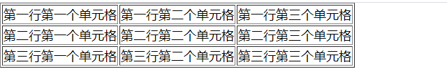
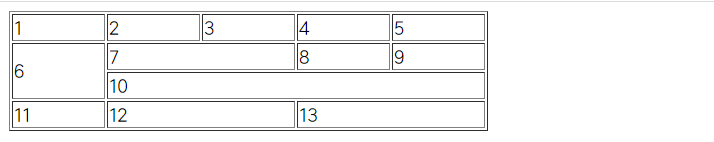
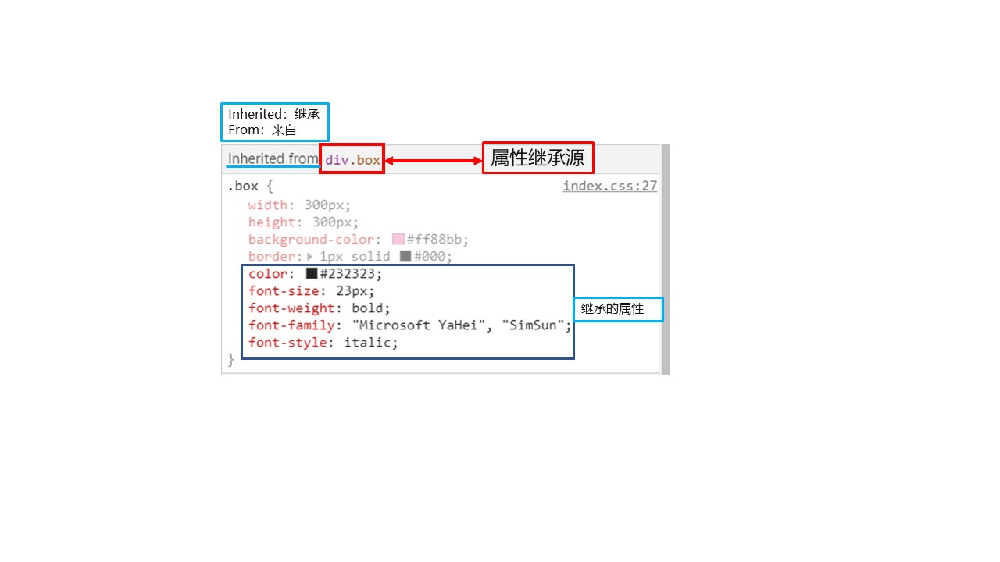
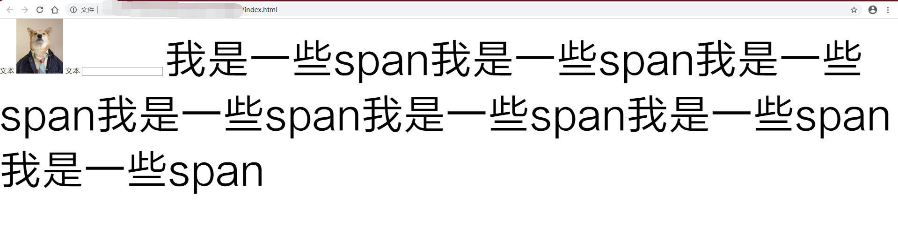
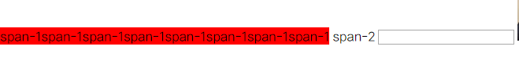
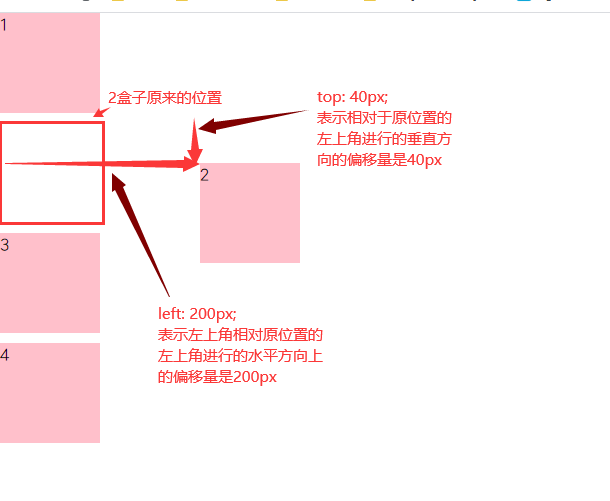

# Web前端之HTML+CSS+JavaScript视频讲解教程

# HTML

## 一、互联网的原理

​    HTML的作用：用来制作网页

​    互联网的原理：请求数据

​    数据：文字、图片、视频、音频等..

​    我们通过在浏览器上输入一个网址，通过http请求发传送到相应的服务器上，服务器根据相应文件将相应的数据传输到本地计算机上，在浏览器上渲染

#### 1.1    服务器

​    server：服务器

​    服务器作用：**存储数据**


服务器需要24小时在线！！！

如果服务器中断电路，这时用户就访问不到网址（**not found 404**）

我们可以通过本地计算机上某些软件远程控制服务器，常用软件 ftp

#### 1.2    浏览器

​    browser：浏览器

​    浏览器的作用：**http请求的发送和接收**

​    全球五大浏览器的厂商：IE、火狐（Firefox）、谷歌（chrome）、苹果（safari）、欧朋（opera）

​    同一个浏览器有不同的版本 IE6、IE7、IE8

​    缓存文件的作用：当第二次访问同一个网站时，加载速度变快。因为本地计算机有缓存文件夹

#### 1.3    http协议

​    **HTTP**：Hypertext Transfer protocol，超文本传输协议

​    

​    HTTP协议包含了**请求**和**响应**两个部分。都是要依赖浏览器

​    **HTTP请求发送的方法**：直接输入网址，点击超级链接

​    **请求**：request，浏览器根据网址向对应的服务器发送请求

​    **响应**：response，服务器根据请求响应文件，将页面传输给客户端，在浏览器中进行网页的渲染。访问页面时，会同时发出多个http请求，包含网页的图片、视频、音频等文件

## 二、纯文本和HTML

#### 2.1    纯文本

​        扩展名：.txt    (text 的简写)记事本就是最简单的纯文本

​        显示文件的扩展名的方法：文件资源管理器-工具-文件夹选项-查看-去除（隐藏文件扩展名）勾选

​        .txt 和 word文档区别：

​        纯文本只保存文本内容，不保存文本的格式。虽然纯文本可以更改样式，只是便于本机查看。文件大小只是文本的大小

​            word文档：不但可以保存文本内容还可以保存样式。word文档的大小要远大于纯文本文件的大小


纯文本文件可以用任意编辑器书写

最基本：记事本

其它编辑器：记事本，Editplus，nodepad++

HTML.CSS.JS 都是纯文本。可以使用这些编辑器书写

书写网页的编辑器：

1. DreamWeaver
2. Sublime：高效率网页编辑器
3. Webstorm：高级项目编辑器

#### 2.2    HTML

​    HTML：用来书写网页

​    HTML：超文本标记语言（HyperText Markup Language）

​    HTML语言使用**文本**来标记**文本**的，用到的这个文本就叫做超文本。超文本在页面中不显示

​    人类的语言有语义，有标题或者是段落等。但是计算机不认识人类的语义。这时需要使用超文本（标签）

​    HTML标签（元素）作用：就是用来**标记文本的语义**。也就是我们说的超文本

​    小题目：h1 标题的文本加粗，字号变大。这个效果是h1标签（元素）控制的吗？

​    答：不是，标签只能添加语义，样式是CSS控制


#### 2.3    sublime

​    快捷键：

1. 新建文件：CTRL + N
2. 保存：CTRL + S
3. 快速生成HTML骨架：html:xt + tab
4. 快速生成标签对：标签关键字 + tab
5. 快速生成多个标签对：标签关键字  * n + tab 
6. 同时控制多行代码：选中 + 鼠标滚轮的拖动
7. 复制：CTRL + C
8. 粘贴：CTRL + V
9. 剪切：CTRL + X
10. 后退：CTRL + Z
11. 前进：CTRL + Y
12. 字号变大：CTRL + "+"
13. 字号变小：CTRL + "-"
14. 选中行上移：CTRL + shift + ⬆
15. 选中行下移：CTRL  + shift + ⬇

## 三、HTML骨架

#### 3.1    HTML骨架基础

​    语法：

```html
<html>
    <head>
        <title>网页标题</title>
    </head>
    <body>
        网页主题部分
    </body>
</html>
```

​    html：表示给整个网页（根元素）

​    head：给浏览器看的

​    body：网页的主体部分，面向用户

#### 3.2    DTD

​    DTD：文档类型定义（doctype definition）

​    

```html
<!DOCTYPE html>
```

DTD作用：规定了我们书写的网页使用的是是那个版本的规范，声明定义文档类型

html版本：html1 - html5

html4 版本是在XHTML1.0 版本上的一个升级。

要求：

1. 标签内部的引号比必须使用双引号
2. 标签必须使用小写字母
3. 结束标签必须书写关闭符号（ **/** ）

html4 或者 XHTML4.0 下面还有3个小规范：

1. strict    严格版：不能使用font/b/u/i    等废弃标签，不能使用框架集
2. transitional    过渡板（通用版）：可以使用font 等废弃标签，不能使用框架集
3. framesetl    框架集版：可以使用框架集

html5    版本：不再区分3个小规范

1. DTD：<!DOCTYPE html>（html5不再区分3个小规范）

#### 3.3     html标签

​    语法：

```html
<html xmlns="http://www.w3.org/1999/xhtml" xml:lang="en"></html>
```

1. html标签（根元素）是双标签，表示我们的整个网页
2. html标签有一个属性，xmlns表示的是命名空间（namespace）
3. 因为我们制作的网页给不同的用户来浏览，命名空间规定我们的标签代表的含义，必须将命名空间进行统一
4. language：语言规范，所有标签用的都是英文

#### 3.4    head标签

作用：对html文件进行了一些配置

字符集：定义了当前文件使用的字库

中文字库：

1. UTF-8：国际标准字库。包含了人类所有语言的文字，一个汉字3个字节
2. GBK/gb2312：中国字库，国家标准。包含所有的简体中文，大部分繁体，一些特殊符号，片假名。一个汉字2个字节

分情况使用：

1. 网页是外文网站，用UTF-8字库。
2. 有大量的中文，要求网页加载速度快，用gbk字库

**注意**：必须保证设置的字符集和软件保存的字符集类型一致

title标签内部放的是网页的名字

里面的内容可以帮我们提高搜索引擎优化（SEO）

#### 3.5    body标签

作用：body部分是我们的网页主题，给客户浏览的区域

内容：里面放置的是我们的html标签书写的网页结构

## 四、HTML语法

#### 4.1    标签之间对空格、换行、缩进不敏感。对标签之间的嵌套关系敏感

​    语法：

```html
    <h1>浪淘沙</h1>

                <p>作者：刘禹锡</p>


    <p>九曲黄河万里沙，浪淘风簸自天涯。</p><p>如今直上银河去，同到牵牛织女家。</p>

    <ul>
        <li>列表1</li>
        <li>列表2</li>
        <li>列表3</li>
    </ul>
```

#### 4.2    文本内容之间有空白折叠现象

1. 文本内容之间有多个空格、缩进、换行在网页中渲染时只显示一个空格。这种现象就是空白折叠现象。（也就是将多个空格、缩进、换行折叠成了一个空格）
2. 文本内容区域内如果有一个或多个空格或者缩进或者换行，在浏览器中显示的时候,只显示个空格。即将所有空白区域折叠为一个空格。


#### 4.3    标签语法

1. 标签必须书写在**一对尖括号**里面，里面书写的是标签
   
   语法：
   
   ```html
   <li>列表</li>
   ```

2. 双标签必须成对出现，单标签除外
   
   语法：
   
   ```html
   <p></p>as
   ```

3. 标签的语法
   
   1. 标签必须写在一对尖括号里面，里面写的是我们的标签关键字
   2. 双标签必须成对出现
   3. 结束标签必须写关闭符号（ **/** ）
   4. 标签分类：容器级标签、文本级标签
   
   容器级标签：h1标签
   
   ​                        容器级标签内部可以盛放任何标签和文本
   
   文本级标签：p标签
   
   ​                        文本标签内部只能盛放文本、图片、表单元素、font等废弃标签

#### 4.4    标签的属性

​    写法：k="v"

​    k：key    属性名称

​    v：value    属性值（属性值必须使用双引号）

​        语法：

```html

```

注：标签身上可以有多个属性，属性之间用空格隔开

## 五、标签

#### 5.1    h系列标签

​    h系列的标签（headline）表示标题标签

​    分为 h1 - h6 六个等级

​    分别为： h1、h3、h4、h5、h6

​    表示一级标题 -- 六级标题

​        语法：

```html
    <h1>这是一级标题</h1>
    <h2>这是二级标题</h2>
    <h3>这是三级标题</h3>
    <h4>这是四级标题</h4>
    <h5>这是五级标题</h5>
    <h6>这是六级标题</h6>
```


​        作用：给文本添加标题的语义

​        h1 标签一般给logo使用。因为标签有权重，h1 标签的权重最高，一个网页中只能出现一个 h1 标签，如果页面中有多个 h1 标签，浏览器会认为你降了标签的权重（提高搜索引擎优化SEO）

​        注意：h    系列的标签之间不能互相嵌套

​    语法：

```html
<!--
    <h4>
        <h5>不能互相嵌套</h5>
    </h4>
-->
```

#### 5.2    p标签

​    p（paragraph 的简写）：段落

​    作用：声明文本的语义这是一个段落

​    p标签是文本级标签。标签内部只能书写文本、图片、表单元素、font等废弃标签

​    语法：

```html
<p></p>
```

#### 5.3    img标签

​    img：表示插入图片（image的简写）

​    img标签是单标签，本身相当于文本

​    语法：

```html

```

​    **src**：source（资源、来源、路径）表示图片所在的位置

​    alt：图片不能正常加载时（文件丢失）提示的内容

​        语法：

```html

```


​        语法：

```html

```

​    

​    width：设置图片宽度，单位px（像素），可以省略不写px

​    heihgt：设置图片高度，单位px（像素），可以省略不写px

​    我们可以同时设置图片的 width 和 height，也可以只设置其中一个，只设置一个width/height会锁定宽高比

​        语法：

```html

```


#### 5.4    路径

​    我们可以通过路径查找到目标文件

- **相对路径：**（目前常用）
  
  - 从html文件出发进行查找
  
  - 同级查找：只需要书写目标的名字+扩展名
    
    - 语法：
      
      ```html
      
      ```

- 子级查找：书写文件夹名称使用左斜杠（/）分隔，一直查找到目标文件+扩展名
  
  - 语法：
    
    ```html
    
    
    
    ```

- 上级查找：跳出当前文件夹使用（../），一直查找到目标文件+扩展名
  
  - 语法：
    
    ```html
    
    
    
    ```
  
  注意：相对路径不能跨盘符查找，../ 为开头

- **绝对路径**
  
  - 第一种写法
    
    - 语法：
      
      ```html
      
      ```

- 第二种写法：直接将目标文件拖拽到浏览器中
  
  - 语法：
    
    ```html
    
    ```

- http开头的网址形式的也是绝对路径（工作中使用）
  
  - 语法：
    
    ```html
    
    ```
  
  练习：
  
  ​        

注：练习文件在学习文件夹中，名字：路径

#### 5.5    a标签

​    超级链接标签（anchor简写：锚的意思）

​    语法：

```html
<a href="https://www.baidu.com">百度</a>
```

​    

href：超级链接跳转后的路径，相对路径和绝对路径都可以书写

- target：设置新页面的打开方式
  
  - 默认值：在当前窗口打开
  
  - _blank：表示在新窗口打开
  
  - 语法：
    
    ```html
    <a href="https://www.baidu.com" target="_blank">百度</a>
    ```

- title：鼠标悬停提示文本
  
  - 语法：
    
    ```html
    <a href="https://www.baidu.com" target="_blank" title="BaiDu">百度</a>
    ```

- 页面内锚点的跳转：可以通过 a 标签 **name 属性** 进行设置或者其它标签的 **id 属性**
  
  - 语法：（**#name** 属性值 / id 属性值）
    
    ```html
        <a href="#A">早年经历</a><br>
        <a href="#B">演艺经历</a><br>
        <a href="#C">个人生活</a><br>
        <p>文字</p>
        <p>文字</p>
        <p>文字</p>
        <p>文字</p>
        <a name="A"></a>
        <p>A </p>
        <p>文字</p>
        <p id="B">文字</p>
        <p>B</p>
        <p>文字</p>
        <p>文字</p>
        <p>文字</p>
        <p>文字</p>
        <p>文字</p>
        <p>文字</p>
    ```

- 跨页面锚点的跳转：可以通过 a 标签 **name 属性** 进行设置或者其它标签的 **id 属性**
  
  - 语法：（**文件名称#name** 属性值 / id 属性值
    
    ```html
    <a href="./test/study.html#B">演艺经历</a><br>
        <p>文字</p>
        <p>文字</p>
        <p>文字</p>
        <p>文字</p>
        <a name="A"></a>
        <p>A </p>
        <p>文字</p>
        <p id="B">文字</p>
        <p>B</p>
        <p>文字</p>
        <p>文字</p>
    ```

## 六、div 和 span 标签

#### 6.1    div 和 span 含义

​    div：表示大的区域    span：表示小的范围跨度

- div：division（范围，区域），是一个容器级标签。
  
  - 独占一行
  
  - 可以盛放任何标签和内容，没有任何默认样式
  
  - div一般用于将相同或者相近标签存放在 div 中，表示一个小的区域

- span：表示小区域小范围。小跨度，
  
  - span 是文本级标签，只能盛放文本、图片、表单元素、font等废弃标签
  - 不独占一行

#### 6.2    div + css简单布局

​                之前书写网页 table 布局，没有做到结构和样式分离，书写繁琐，不便于更改

​                现在网页绝大部分使用 div + css 布局

​                        优点：结构和样式分离，便于书写/更改

## 七、列表

#### 7.1    无序列表

​    语法:

```html
    <ul>
        <li>华为</li>
        <li>小米</li>
        <li>三星</li>
        <li>苹果</li>
    </ul>
```

​    作用：给文本添加无序列表语义

​    ul：unordered list    无序列表

​    li：list item    列表项

​    ul 和 li：是我们见到的第一组对标签，必须同时出现

​    ul 只里只能出现 li ，不能出现其它任何标签（元素）

​    li 是容器级标签，里面可以书写任何标签，甚至可以书写 ul li

​    

```html
    <h4>服装分类</h4>
    <ul>
        <li>
            <h4>男装</h4>
            <ul>
                <li>外套</li>
                <li>皮带</li>
                <li>皮鞋</li>
            </ul>
        </li>
        <li>
            <h4>女装</h4>
            <ul>
                <li>高跟鞋</li>
                <li>羽绒服</li>
                <li>连衣裙</li>
            </ul>
        </li>
        <li>
            <h4>童装</h4>
            <ul>
                <li>连体服</li>
                <li>帽子</li>
            </ul>
        </li>
    </ul>
```

#### 7.2    有序列表

​    作用：给文本添加有序列表的语义， 每一项之间有顺序之分

​    ol：ordered list（有序列表）

​    li：list item    列表项

​    ol 和 li：是我们见到的第一组对标签，必须同时出现

​    语法：

```html
    <ol>
        <li>HTML</li>
        <li>CSS</li>
        <li>JavaScript</li>
    </ol>
```

​    ul 只里只能出现 li ，不能出现其它任何标签（元素）

​    语法：

```html
    <h3>学习进度</h3>
    <ol>
        <li>HTML</li>
        <li>CSS</li>
        <li>JavaScript</li>
    </ol>
```

​    li 是容器级标签，里面可以书写任何标签，甚至可以书写 ol li

```html
    <h3>学习进度</h3>
    <ol>
        <li>
            <h4>HTML</h4>
            <ol>
                <li>100</li>
                <li>90</li>
                <li>80</li>
            </ol>
        </li>
        <li>
            <h4>CSS</h4>
            <ol>
                <li>100</li>
                <li>90</li>
                <li>80</li>
            </ol>
        </li>
        <li>
            <h4>JavaScript</h4>
            <ol>
                <li>100</li>
                <li>90</li>
                <li>80</li>
            </ol>
        </li>
    </ol>
```

#### 7.3    自定义列表

​    自定义列表：设置三个标签（ dl，dt，dd ）

​    作用：给文本添加自定义列表的语义

​    dl：definition list    自定义列表

​    dt：definition title    列表标题

​    dd：definition description    标题的描述

​    语法：

```html
    <dl>
        <dt>三星</dt>
        <dd>韩国手机品牌</dd>

        <dt>华为</dt>
        <dd>China</dd>

        <dt>小米</dt>
        <dd>永远相信美好的事情即将发生</dd>
    </dl>
```

dl    里面只能书写 dt 和 dd

dt    里面可以书写一组或者多组 dt 和 dd，dt 和 dd 是同级关系


dd 是对 dt 的解释说明可以有多个 dd 甚至可以不写表示没有说明

dt 和 dd 容器级标签，里面的内容没有限制

实际工作中通常将一组 dt 和 dd 放在一个 dl 便于样式设置

语法：

```html
<style>
        body {
        margin: 0;
        font-size: 18px;
        color: #000;
        font-family: 微软雅黑;
        /* text-align: center; */
    }

    dl {
        float: left;
        width: 400px;
        height: 300px;
        background-color: lightblue;
        color: #fff;
        margin-left: 20px;
    }
</style>

    <dl>
        <dt>三星</dt>
        <dd>韩国手机品牌</dd>
    </dl>
    <dl>
        <dt>华为</dt>
        <dd>China</dd>
    </dl>
    <dl>
        <dt>小米</dt>
        <dd>永远相信美好的事情即将发生</dd>
    </dl>
```

效果：


​    实际公共作中，具体使用哪一种列表根据语义

## 八、表格

​    **表格设计三个标签：table>tr>td**

#### 8.1    简单表格

​    table：表格

​    tr：行（table row）

​    td：单元格（table dock）

​    基础表格要求：每一行的单元格个数相同

​    语法：

```html
<table border="1">
    <tr>
        <td>第一行第一个单元格</td>
        <td>第一行第二个单元格</td>
        <td>第一行第三个单元格</td>
    </tr>
    <tr>
        <td>第二行第一个单元格</td>
        <td>第二行第二个单元格</td>
        <td>第二行第三个单元格</td>
    </tr>
    <tr>
        <td>第三行第一个单元格</td>
        <td>第三行第二个单元格</td>
        <td>第三行第三个单元格</td>
    </tr>
</table>
```



​    带 th 的表格

​    语法：

```html
    th,td {
        width: 100px;
    }
</style>
<table border="1">
    <tr>
        <th>姓名</th>
        <th>年龄</th>
        <th>性别</th>
    </tr>
    <tr>
        <td>张三</td>
        <td>30</td>
        <td>男</td>
    </tr>
    <tr>
        <td>二狗子</td>
        <td>28</td>
        <td>男</td>
    </tr>
</table>
```


#### 8.2    单元格合并

​    td / th 标签：有一个属性用于单元格的合并

1. rowspan：跨行合并

2. colspan：跨列合并
   
   属性值：书写数字（无单位，自己为1个），合并几个写几个
   
   **表格单元格合并练习**
   
   语法：

```html
<style>
    td {
    width: 80px;
}
</style>
<table border="1">
    <tr>
        <td>1</td>
        <td>2</td>
        <td>3</td>
        <td>4</td>
        <td>5</td>
    </tr>
    <tr>
        <td rowspan="2">6</td>
        <td colspan="2">7</td>
        <td>8</td>
        <td>9</td>
    </tr>
    <tr>
        <td colspan="4">
            10
        </td>
    </tr>
    <tr>
        <td>11</td>
        <td colspan="2">12</td>
        <td colspan="2">13</td>
    </tr>
</table>
```

   

​    

#### 8.3    三个划分区域的标签

1. caption：表格标题
2. thead：表格表头
3. tbody

```html
<style>

th,
td {
    width: 80px;
}

</style>
<table border="1">
    <!-- 表格标题 -->
    <caption>学员信息表</caption>
    <thead>
        <tr>
            <th>姓名</th>
            <th>年龄</th>
            <th>性别</th>
        </tr>
    </thead>
    <tbody>
        <tr>
            <td>小明</td>
            <td>18</td>
            <td>男</td>
        </tr>
        <tr>
            <td>小明</td>
            <td>18</td>
            <td>男</td>
        </tr>
        <tr>
            <td>小明</td>
            <td>18</td>
            <td>男</td>
        </tr>
    </tbody>
</table>
```


小练习：

​            

源码：

```html
<style>

    table {
        margin: 100px auto;
        border-collapse: collapse;
    }

    th,
    td {
        width: 160px;
    }

    .tdFontStyle {
        text-align: right;
    }

</style>
<table border="1">
    <!-- 表格标题 -->
    <caption><b style="font-size: 20px;">各地区固定资产投资情况</b></caption>
    <!-- 表格表头 -->
    <thead>
        <tr>
            <th rowspan="2">地区</th>
            <th colspan="2">按总量分</th>
            <th colspan="2">按比重分</th>
        </tr>
        <tr>
            <th>自年初累计(亿元)</th>
            <th>比去年同期增长(%)</th>
            <th>自年初累计(%)</th>
            <th>去年同期(%)</th>
        </tr>
    </thead>
    <!-- 表格主体 -->
    <tbody>
        <tr>
            <td>全国</td>
            <td class="tdFontStyle">187670.98</td>
            <td class="tdFontStyle">9.6</td>
            <td class="tdFontStyle">100.0</td>
            <td class="tdFontStyle">100.0</td>
        </tr>
        <tr>
            <td>东部地区</td>
            <td class="tdFontStyle">84509.91</td>
            <td class="tdFontStyle">10.9</td>
            <td class="tdFontStyle">45.0</td>
            <td class="tdFontStyle">44.5</td>
        </tr>
        <tr>
            <td>北京市</td>
            <td class="tdFontStyle">2200.84</td>
            <td class="tdFontStyle">7.0</td>
            <td class="tdFontStyle">1.2</td>
            <td class="tdFontStyle">1.2</td>
        </tr>
        <tr>
            <td>天津市</td>
            <td class="tdFontStyle">5151.28</td>
            <td class="tdFontStyle">10.5</td>
            <td class="tdFontStyle">2.7</td>
            <td class="tdFontStyle">2.7</td>
        </tr>
        <tr>
            <td>河北省</td>
            <td class="tdFontStyle">9745.35</td>
            <td class="tdFontStyle">11.0</td>
            <td class="tdFontStyle">5.2</td>
            <td class="tdFontStyle">5.1</td>
        </tr>
    </tbody>
</table>
```

## 九、表单

表单就是用户进行输入或者选择的控件

#### 9.1    form标签

1. 所有的表单元素必须书写在 form标签 内部

2. form标签 **功能性的标签**不是结构性标签

3. form标签 有两个属性，设置表单的提交方式和位置
   
   3.1  method（设置表单提交方式）
   
   ​        3.1.1    post
   
   ​        3.1.2    get
   
   3.2  action（设置表单提交位置）

#### 9.2    input

input：用户进行输入或者选择的控件

input是一个单标签（自封闭标签）

input属性：

- type：设置表单的类型
  
  - text：单行文本输入框
    
    - 语法
      
      ```html
      <input type="text">
      ```
  
  - value：设置默认文本、默认值
    
    - 语法：
      
      ```html
      <input type="text" value="请输入用户名">
      ```
      
      
  
  - **password**：密码框
    
    - 语法：
      
      ```html
      密码：0<input type="password" />
      ```
      
      
  
  - **radio**：单选框
    
    - 一组单选框只能选中一个需要设置**相同的 name 属性**
    
    - 语法：
      
      ```html
      请选择你的性别:
      <input type="radio" name="sex" />女
      <input type="radio" name="sex" />男
      ```
      
      

#### 9.4    label 标签

​    label 有一个 for属性，用于设置控制元素的 id属性值，获取焦点

​    小口语：label for id

​    语法：

```html
<form>
    <p>请选择你的性别:</p>
    <label for="nan">男
        <input type="radio" name="sex" id="nan">
    </label>
    <label for="nv">女
        <input type="radio" name="sex" id="nv">
    </label>
</form>
```

​    效果：


#### 9.5    复选框/多选框

- type="checkbox"
  
  - 同一组复选框 name属性值 必须一致
  
  - 语法：
    
    ```html
    <input type="checkbox" />
    ```

​    演示：

```html
<form>
    <p>请选择你的爱好:</p>
    <label for="dance">跳舞
        <input type="checkbox" name="love" id="dance">
    </label>
    <label for="sing">唱歌
        <input type="checkbox" name="love" id="sing">
    </label>
    <label for="run">跑步
        <input type="checkbox" name="love" id="run">
    </label>
    <label for="book">看书
        <input type="checkbox" name="love" id="book">
    </label>
</form>
```

- checked 属性
  
  - 表示被选中的状态
  
  - 语法：
    
    ```html
    <form>
        <p>请选择你的爱好:</p>
        <label for="dance">跳舞
            <input type="checkbox" name="love" id="dance">
        </label>
        <label for="sing">唱歌
            <input type="checkbox" name="love" id="sing">
        </label>
        <label for="run">跑步
            <input type="checkbox" name="love" id="run">
        </label>
        <label for="book">看书
            <input type="checkbox" name="love" id="book" checked="checked">
        </label>
    </form>
    ```
    
    

#### 9.6    textarea 标签

- 文本域/多行文本输入框

- 语法：
  
  ```html
  <textarea name="" id="" cols="30" rows="10"></textarea>
  ```

- 标签之间可以书写默认文本
  
  ```html
  <textarea name="" id="" cols="30" rows="10">这里是默认文本</textarea>
  ```

#### 9.7    按钮

按钮有三个类型：

- type="button"    普通按钮

- type="submit"    提交按钮

- type="reset"       重置按钮
  
  - 以上三个按钮类型都可以设置 value属性值，改变按钮的提示文字

- 语法：
  
  ```html
  <input type="button" value="普通按钮">
  <input type="submit" value="提交按钮">
  <input type="reset" value="重置按钮">
  ```

#### 9.8    下拉菜单

- select>option(项) 标签

- option标签 
  
  - selected="selected" 默认选中
  
  - 语法：
    
    ```html
    <label for="city">选择城市:
        <br>
        <select name="city" id="city">
            <option value="北京">北京</option>
            <option value="上海">上海</option>
            <option value="重庆" selected="selected">重庆</option>
        </select>
    </label>
    ```
    
    

​    

备注：实际工作中下拉菜单一般使用 ul>li 进行模拟

## 十、HTML杂项

#### 10.1    html注释

- 快捷键：ctrl + /（注释/取消）

- 语法：
  
  ```html
  <!-- 这里的内容是注释 可以是单行
  
      注释的内容便于维护
      注明代码的语义和用处
      注释的内容浏览器在解析的时候会直接跳过，给人看的，不是机器
      也可以多行 
  -->
  ```

#### 10.2    字符实体/特殊字符

​        我们的一些符号有特性的作用，如果直接在代码中书写不能正常显示我们想要的结果，这时需要使用**字符实体（特殊字符/转义字符）**

1. 无换行空格
   
   ```html
   
   ```

2. 大于符号
   
   ```html
   >
   ```

3. 小于符号
   
   ```html
   <
   ```

注：更多特殊字符请查看链接： https://www.jb51.net/onlineread/htmlchar.htm 

#### 10.3    废弃标签

- 废弃标签都是文本级标签，可用于 “ **小钩子** ” 的使用

- font、i、b、u、em、strong、b

- 语法：
  
  ```html
  <p>这是一个font标签<font></font><font>文字</font></p>
  <p>这是一个b标签<></><b>文字</b></p>
  <p><span>这是一个u标签<u></u><u>文本</u></span></p>
  <p>这是一个i标签<i></i><i>文本</i></p>
  <p>这是一个em标签<em></em><em>强调文本</em></p>
  <p>这是一个strong标签<strong></strong><strong>语气加重文本</strong></p>
  <span>这里演示的是换行标签: <br /></span><br />
  <span>这里演示的是换行标签: <br /></span><br />
  <span>这里演示的是换行标签: <br /></span><br />
  ```

- 效果图
  
  

#### 10.4    色值表示法

- 单词
  - red、blue、green、orange、lightblue
- RGB
  - rgb(红色, 蓝色, 绿色 );
  - 0 - 255
  - rgb( 255, 0, 0);
- hex（十六进制）
  - #红色蓝色绿色
  - 0、1、2、3、4、5、6、7、8、9、a（10）、b（11）、C（12）、D（13）、E（14）、F（15）
  - 红色：#ff0000
  - 绿色：#00FF00
  - 蓝色：#0000ff

**注：以上为HTML基础内容**

---

# CSS

## 一、CSS基础知识

#### 1.1    CSS概念

- CSS（Cascading Style Sheet）层叠式样式表

- 两个重要含义：
  
  - 层叠式
  - 样式表

- CSS维护更新组织 w3c 组织

- CSS3 最新版本

- CSS2.1 学习

- 前端分为三层：HTML/内容、CSS/布局、JavaScript/行为
  
  - HTML层/结构层：从HTML角度书写网页结构
  - 样式层/CSS：从美化角度书写样式
  - 行为层/JavaScript：从交互层面书写用户的行为

#### 1.2    CSS作用

- CSS组成部分：
  
  - 选择器（要设置样式属性的元素）
  
  - 样式属性（选中元素要设置的属性）

- CSS作用
  
  - 设置盒子的样式
    
    - 语法
      
      ```html
      <style>
          div {
              /* 盒子属性 */
              width: 300px;
              height: 300px;
              background-color: lightblue;
              border: 1px solid #000;
          }
      </style>
      ```

- 设置文字的样式
  
  - 语法
    
    ```html
    <style>
    p {
        /* 文字属性 */
        font-size: 20px;
        color: red;
        font-family: "微软雅黑";
    }
    </style>
    ```

#### 1.3    CSS属性

- 盒子属性
  
  - width（宽度）：单位 px (像素)
  
  - height（高度）：单位 px (像素)
  
  - background-color: 背景颜色。 background是复合属性（背景），书写复合属性中的小属性使用短横连接
  
  - border（边框）：复合属性
    
    - 语法：
      
      ```html
      <style>
      border: 1px solid #ddd;
      </style>
      ```
      
      - 1px：边框的宽度，单位是 px
      
      - solid：边框的类型：solid（实线）、dashed（虚线）、dotted（点线）
      
      - #ddd：边框的颜色，三种色值表示法都可以使用

- **属性语法：**
  
  ```html
  <style>
      /* 盒子属性 */
      width: 300px;
      height: 300px;
      background-color: lightblue;
      border: 1px solid #000;
  </style>
  ```

- 文字属性
  
  - 文字颜色：color，三种色值表示法都可以
  
  - 字号：font-size     font也是复合属性，单位 px（像素）
  
  - 字体：font-family
    
    - 每一个字体用双引号包裹，每一种字体之间使用逗号分隔
    
    - 每个人计算机自带的字体不相同，为了保证所有用户的效果一样，我们尽量使用计算机默认的字体
    
    - 英文
      
      1. Arial（黑体）
    
    - 中文：
      
      1. Microsoft YaHei（微软雅黑）
      2. SimSun（宋体）
    
    - 语法：
      
      ```html
      <style>
          font-family: "Arial", "微软雅黑", "宋体";
      </style>
      ```
    
    - ​      书写字体时先写英文字体再写中文字体。字体可以使用中文书写，但是为了提高网站的加载速度要求所有哦字体名称书写单词
    
    - 语法：
      
      ```html
      <style>
          font-family: "Arial", "Microsoft YaHei", "SimSun";
      </style>
      ```

- 字体加粗：font-weight:      bold(加粗)，normal(正常，不加粗)

- **属性语法：**
  
  ```html
  <style>
      /* 文字属性 */
      color: red;
      font-size: 20px;
      font-family: "Arial", "微软雅黑", "SimSun";
      font-weight: bold;
  </style>
  ```

#### 1.4    CSS书写位置

- 行内/ 内联式
  
  - 直接书写在**标签内部的一个style 属性**里，包含CSS全部属性
  
  - 语法：
    
    ```html
    <div style="width: 200px; height: 200px; background-color: lightblue;">一个div盒子</div>
    ```
  
  - 行内式我们前端人员一般不使用，是给后台人员书写的

- 外链/ 外部式
  
  - 通过 **link标签** 在HTML页面的外部引入一个 **css文件**。书写在 head标签内部
  
  - 语法：
    
    ```html
    <head>
        <link rel="stylesheet" type="text/css" href="mystyle.css" />
    </head>
    ```
    
    - rel="stylesheet"：表示html和css文件的关系。样式表
    - type="text/css"：表示css文件的类型。纯文本的css文件，可书写可不写，写了就要书写正确
    - href="mystyle.css"：表示css文件的路径
    - css文件名扩展名是  fileName.css

- mystyle.css内部书写
  
  ```css
  hr {color: sienna;}
  p {margin-left: 20px;}
  body {background-image: url("images/01.gif");}
  ```

- 内嵌/ 内部/嵌入式
  
  - 书写在 **head标签** 内部的一个 **style标签** 里
  
  - 语法：
    
    ```html
    <head>
    <style>
        p {
            width: 300px;
            height: 300px;
            background-color: #ffff00;
            border: 10px double #000;
            color: red;
            font-size: 20px;
            font-family: "Arial", "微软雅黑", "SimSun";
            font-weight: bold;
        }
    </style>
    </head>
    ```
    
    


#### 1.5    CSS杂项

- css注释
  
  - 快捷键：ctrl + / （注释和去除）
    
    - 语法：
      
      ```css
      / * 这里的内容是注释  */
      ```

- css键值对的写法
  
  - k:v
  
  - 语法：
    
    ```css
    width: 200px;
    ```

- css分号的重要性：每一条属性以分号 " ; " 结尾 ，即使是最后一个属性
  
  - 语法：
    
    ```css
    .box {
        width: 100px;
        height: 100px;
        border: 3px dashed #ff0000;
    }
    ```

- css对空格、缩进、换行也是不敏感，要求大家每一条属性换行书写，提高代码可读性，为了提高网站的加载速度，在上传代码之前将所有代码的空格、缩进、换行去除即可（有专用工具：css美化器）

## 二、基础选择器

#### 2.1    标签(tag)选择器

- 标签选择器直接书写标签名，不用添加任何符号

- 标签选择器能够选中页面所有同种标签，不受嵌套影响

- **实际使用中很少用**

- **通常用于清除默认样式或者重置默认样式**

- 语法：
  
  ```html
  <style>
  /* 下面使用的是标签选择器，选中页面中所有的 div标签 */
      div {
          color: red;
          font-size: 18px;
      }
  </style>
  <div>这里演示的是标签选择器内容div</div>
  <div>
      <div>
          <div>
              <div>
                  <div>多层嵌套</div>
              </div>
          </div>
      </div>
  </div>
  ```

#### 2.2    id选择器

- id选择器通多标签的 id属性 进行选择

- 命名规范：
  
  - 区分大小写（BOX 和 box 是两个不同的属性值），首字母必须是英文，其它部分可以是数字、下划线、短横
  - 驼峰命名法
  - id属性值是唯一的，即使为不同标签也不行

- 语法：
  
  ```html
  <style>
  /*    以 # 开头 加设置的名称 
   *    #号 和 值 之间不得有空格
   *    k = "v"
   */
  #box {
      width: 100px;
      height: 100px;
      background-color: red;
  }
  </style>
  
  <div id="box">我设置了id选择器</div>
  ```

**注：标签选择器会选中所有同种元素。id选择器只会选中一个元素，不太好用**

#### 2.3    类(class)选择器

- 通过标签 class（类）属性 选择元素，可以给任意元素添加类选择器

- 一个标签可以拥有多个类名，类名之间用空格分隔

- 语法：
  
  ```html
  <style>
  /*    以 . 点开头 加设置的名称 
   *    .号 和 值 之间不得有空格
   *    k = "v"
   */
  .box {
      width: 100px;
      height: 100px;
      background-color: red;
  }
  </style>
  
  <div class="box">我设置了class选择器</div>
  ```

#### 2.4    通配符(*)

- 通配符会选中页面上的所有元素（element）/标签（tag）

- 语法：
  
  ```css
  * {
      margin: 0px;
      padding: 0px;
      font-family: "Microsoft YaHei";
      color: red;
  }
  ```

- 作用：
  
  - 用于快速清除默认样式，实际工作中不使用通配符，为了提高网站加载速度

#### 2.5    CSS层叠性的体现

- p元素通过标签选择器设置文字颜色，通过类名设置字体，同元素不同属性会叠加，这就是**CSS层叠性的体现**

- 语法：
  
  ```css
      p {
          color: red;
      }
  
      .para {
          font-size: 30px;
      }
  ```

- 效果图
  
  

- 原子类
  
  - 设置页面相同的属性为一个类名，那个元素具有该样式直接添加类名即可，一般原子类只设置一个属性
  
  - 语法：
    
    ```html
    <style>
        .fs24 {
            font-size: 24px;
        }
    
        .fs28 {
            font-size: 28px;
        }
    
        .fs36 {
            font-size: 36px;
        }
    
        .fColorRed {
            color: red;
        }
    
        .fColorBlue {
            color: blue;
        }
    </style>
    
    <p class="para fs24">我是一个段落</p>
    <p class="para fColorRed">我是一个段落</p>
    <p>我是一个段落</p>
    ```

**注：id通常使用（JS）上行为，类（class）上样式**

## 三、高级选择器

- 高级选择器就是基础选择器的延申

#### 3.1    后代选择器

- 有**嵌套关系**的标签、通过类名或者标签选择器确定大的范围，然后在大范围内进行选择（可以多次选择）

- 后代选择器能够选中子、孙子、曾孙子等等元素（只要是它的后代都会被选中）

- 写法：每一层之间用空格隔开
  
  ```html
  <style>
      div p {
          color: red;
      }
  </style>
  <div>
      <p>我是div内部段落</p>
      <p>我是div内部段落</p>
      <p>我是div内部段落</p>
      <p>我是div内部段落</p>
  </div>
  <div>
      <div>
          <p>我是div内部段落</p>
          <p>我是div内部段落</p>
          <p>我是div内部段落</p>
          <p>我是div内部段落</p>
      </div>
  </div>
  ```

- 后代选择器可以补全写法，补全写法可以精确到每一层范围

- 语法：
  
  ```html
  <style>
      .box div p {
          color: red;
      }
  </style>
  <!-- 下面的结构不会选中  因为整个后代中的关系缺少了div -->
  <div class="box">
      <p>我是div内部段落</p>
      <p>我是div内部段落</p>
      <p>我是div内部段落</p>
      <p>我是div内部段落</p>
  </div>
  <!-- 下面的结构符合补全写法，会应用上css -->
  <div class="box">
      <div>
          <p>我是div内部段落</p>
          <p>我是div内部段落</p>
          <p>我是div内部段落</p>
          <p>我是div内部段落</p>
      </div>
  </div>
  ```

#### 3.2    交集选择器

- 交集选择器能够选中选择器都具有的元素

- 写法：每一个选择器直接书写，之间不要任何空格
  
  ```html
  <style>
      div.box {
          width: 100px;
          height: 100px;
          background-color: red;
      }
  </style>
  
  <div class="box">我是使用交集选择器选中的</div>
  ```

- 可连续交集
  
  - 选中的元素必须满足 多个条件即可应用样式
  
  - 语法
    
    ```html
    <style>
        p.para.fs20 {
            font-size: 20px;
        }
    </style>
    
    <p class="para fs20">连续交集选择器</p>
    ```

- 图示
  
  - 左圈为 p标签选择器，右为 class选择器，中间相交的就是交集选择器，即同时满足 pTag 和 className 

- 小提示：
  
  ```css
  .para.fs20 {}  /* 正确 */
  #box.fs20 {}    /* 不正确，因为id是唯一可以直接选中该元素 */
  ```

#### 3.3    并集选择器

- 可以同时选中多个元素，每个元素之间使用逗号分隔

- 语法：
  
  ```css
  h3,
  p,
  span {
      color: red;
  }
  /* 可以看作以下 */
  
  h3 { color: red; }
  p { color: red; }
  span { color: red; }
  ```

## 四、CSS的继承性和层叠性

#### 4.1    继承性

- ​    CSS具有继承性
  - 后代元素(标签)可以从祖先元素继承某些样式属性
  - 文字属性可以继承：font-系列、line-系列、text-系列、color
  - 盒子属性不能继承：width、height、background-系列、border、浮动等
  - 继承性是CSS非常好用的一个特性，有些属性我们可以直接给祖先元素设置，它的后代都将继承这个样式属性，简化代码、冗余



```html
<style>
    .box {
        /* 文本属性 */
        width: 300px;
        height: 300px;
        background-color: #ff88bb;
        border: 1px solid #000;

        /* 文本属性 */
        color: #232323;
        font-size: 23px;
        font-weight: bold;
        font-family: "Microsoft YaHei", "SimSun";
        font-style: italic;
        }
</style>

<div class="box">
    <p>这是一些段落，会继承祖先的属性</p>
    <p>这是一些段落，会继承祖先的属性</p>
    <p>这是一些段落，会继承祖先的属性</p>
    <p>这是一些段落，会继承祖先的属性</p>
</div>
```

#### 4.2    层叠性

- 层叠性
  
  - 同一个元素被不同选择器选中，相同属性权重高会层叠（覆盖）掉权重低的
  
  - 层叠性的体现：
    
    - 同元素不同属性会叠加
    - CSS的继承性
    - 同一元素的相同属性。权重大的会层叠掉权重小的元素的属性
  
  - 权重
    
    - 选择器的针对性越强权重越大
    - id选择器 > 类选择器 > 标签选择器
      - 1个 id选择器 = 255个 类选择器，1个 类选择器 = 255个 标签选择器
  
  - 元素权重的比较
    
    - 选中元素
      - 权重的计算：比较 id选择器数量、类选择器数量、标签选择器数量
      - 比较小方法：
        - （idNumber、classNumber、tagNumber）高至低比较各自数量
      - 首先比较 id选择器数量、id选择器数量多权重最大
      - id数量相同比较类选择器
      - 类数量相同比较标签选择器
      - 如果标签数量也相同看CSS书写顺序，后写的会层叠（覆盖）先写的
  
  - 源码：
    
    ```css
    p {
        color: pink;
    }
    
    .para {
        color: red;
        font-size: 20px;
    }
    ```

- 图示：
  
  

- 演示
  
  

- **!important 关键字**
  
  - 选中元素时，!important 它权重更大/优先级最高
  
  - 样式：
    
    ```css
        .box1 #box2 div { /* (1， 1， 1) */
            color: yellow !important;
            font-size: 30px;
        }
    
        #box1 .box2 .box3 {/* (1， 2， 0) */
            color: blue;
            font-size: 20px;
        }
    ```

- 说明：
  
  - 字体颜色：黄色。因为选中了该元素且设置了 **!important 语法**，权重更大且最高优先级
  - 字体大小：20px。因为 **!important 语法** 只能提升设置过的属性的优先级并不是提高选择器内所有的属性

- 没有选中元素，**不影响就近原则**
  
  ```css
      .box1 { /* (0， 1， 0) */
          color: yellow !important;
      }
  
      #box1 .box2 {/* (1， 1， 0) */
          color: blue;
      }
  ```

- 字体颜色：蓝色

- 没有选中元素
  
  - 看继承性（没有选中元素，他们的权重是0，没有办法比较）
  
  - 直接比较继承元素距离（HTML结构），就近原则
  
  - 语法：
    
    ```css
        body {
            color: red;
            font-size: 30px;
        }
    
        #box1 {
            color: blue;
        }
    
        .box1 .box2 {
            color: pink;
        }
    ```
  
  - 文本颜色：粉色（就近原则）
    
    - 如果距离相同，比较所继承元素的权重，继承权重大的元素
    
    - 语法：
      
      ```css
          body {
              color: red;
              font-size: 30px;
          }
      
          #box1 .box2 {/* (1, 1, 0) */
              color: blue;
          }
      
          .box1 .box2 {/* (0, 2, 0) */
              color: pink;
          }
      ```
    
    - 文字颜色：蓝色（因距离相同，比较权重为 #box .box2 ，id数量大于其它）

- 如果距离和权重都相同，比较CSS书写顺序

- 语法：
  
  ```css
      #box1 .box2 {/* (1, 1, 0) */
          color: blue;
      }
  
      .box1 #box2 {/* (1, 1, 0) */
          color: pink;
      }
  ```

- 字体颜色：粉色（在同权重条件下后书写的层叠掉先书写的）
  
  

- 并集选择器权重的比较直接拆开来看

#### 4.3    !important 关键字

- 书写：写在属性值后面，使用空格分隔

- !important  关键字只能提升单个属性值的权重（最高优先级）

- 语法：
  
  ```css
      .box1 .box2 .box3 {/* (0, 3, 0) */
          color: red !important;
          font-size: 20px;
      }
  
      #box1 .box2 div {/* (1, 1, 1) */
          color: blue;
          font-size: 50px;
      }
  ```
  
  - 字体颜色：红色。（因为 important语法权重最高）、
  - 字体大小：50px。（因为 important语法 只能提高单个属性值，字体大小看的是权重）

- important 不影响就近原则

- 语法：
  
  ```css
      .box1 {/* (0, 1, 0) */
          color: red !important;
          font-size: 50px;
      }
  
      .box1 .box2 {/* (0, 2, 0) */
          color: blue;
      }
  ```
  
  - 字体颜色：蓝色。（important 不影响就近原则）

------

## CSS主要属性

<br />

## 五、文字属性（fontAttribute）

#### 5.1    颜色

- **color：**文字颜色
  - 三种颜色设置表达式（英文单词、rgb、hex）
  - 工作中直接根据设计图设计颜色

#### 5.2    字号

- **font-szie：**字体大小
  
  - 单位：px（像素）
  
  - 工作中根据设计图设置（打字匹配字体大小）
  
  

#### 5.3    字体

- **font-family：**字体类型
  
  - 先写英文字体，再写中文字体
  
  - 每个字体之间用逗号（,）分隔，每一个字体使用双引号包裹
  
  - 语法：
    
    ```css
    font-family: "Arial", "Microsoft Yahei", "SimSun";
    ```

#### 5.4    行高

- **line-height：**行高
  
  - 表示一行文字实际占有的高度，文字在在行高内垂直居中
    
    
  
  - 练习过程中使用匹配法：
    
    1. 书写两行文字匹配（不太常用，需使用带行高的软件：Adobe fireworks）
    
    2. 上一行文字底部到下一行文字的底部
       
       图示
       
       

- 行高的单位：
  
  - 像素
  
  - 百分数（相对于字号）
  
  - 注意：行高需要书写在字号后面
  
  - 语法：
    
    ```css
    div {
        width: 300px;
        height: 40px;
        border: 1px solid #000;
        color: #888;
        font-size: 20px;
        line-height: 200%;
        font-family: "Microsoft YaHei";
    }
    ```
  
  - 图示
    
    - 
  
  - 设置单行文本的垂直居中
    
    - 让文字的行高等于盒子高度
      
      ```css
      /* value 相同 */
      height: 40px;
      linie-height: 40px;
      ```

- **字号、行高、字体可以书写复合写法**

- 语法：
  
  ```css
      /* 字体大小/行高 字体类型*/
  font: 20px/40px "Microsoft YaHei","SimSun";
  ```

#### 5.5    文字加粗

- **font-weight：**文字加粗

- 属性值：
  
  - 单词：bold/bo'l'de'r（加粗）、normal（正常）
  - 数字：100 - 900

- 语法：
  
  ```css
  font-weight: 700;
  font-weight: bold;
  font-weight: bolder;
  ```

#### 5.6    文字样式

- **font-style：**文字样式，是否倾斜

- 属性值
  
  - normal（正常）
  - italic（斜体的（倾斜）：对于英文，会去找有倾斜字体的字母进行替换）**常用**
  - oblique（普通倾斜）

- 语法：
  
  ```html
  <style>
      p {
          font-size: 30px;
          line-height: 150%;
          font-family: "Consolas", "Arial", "Microsoft YaHei";
      }
  
      p.italic {
          font-style: italic;
      }
  
      p.oblique {
          font-style: oblique;
      }
  </style>
  
      <p>一些文字normal</p>
      <p class="italic">一些文字italic</p>
      <p class="oblique">一些文字normal</p>
  
      <p>this is normal</p>
      <p class="italic">this is italic</p>
      <p class="oblique">this is oblique</p>
  ```

- 图示（中文）
  
  

- 图示（英文）
  
  

#### 5.7    文本控制属性

- **text-align：**文本左中右居中

- 属性值
  
  - left（默认，左居中）
  - center（中心居中）
  - right（右居中）

- 语法：
  
  ```css
  p {
      font-size: 30px;
      line-height: 150%;
      font-family: "Consolas", "Arial", "Microsoft YaHei";
      text-align: left;
  }
  
  p.center {
      text-align: center;
  }
  
  p.right {
      text-align: right;
  }
  ```

- 图示
  
  

#### 5.8    文本的缩进

- **text-indent：**文本缩进

- 属性值单位
  
  - px（像素）
    
    ```css
    text-indent: 40px;
    ```
    
    

- **em（倍率）**
  
  - em是相对长度单位。相对于当前对象内文本的字体尺寸。如当前对行内文本的字体尺寸未被人为设置，则相对于浏览器的默认字体尺寸 
  
  - 语法
    
    ```css
    p {
        width: 400px;
        height: 500px;
        border: 10px solid #333;
        font-size: 30px;
        line-height: 60px;
    
        text-indent: 2em;
    
    }
    ```

- **%（百分数）**
  
  - 相对于父盒子宽度的百分数
  
  - 语法：
    
    ```css
    .box {
        width: 400px;
        height: 600px;
        border: 5px solid #333;
        margin: 100px auto;
    }
    
    .box p {
        font-size: 40px;
        /* 下面的 10% 相当于 40px 缩进 */
        text-indent: 10%;
    }
    ```

#### 5.9    文本修饰

- **text-decoration：**

- 属性值：
  
  - none（默认值）除 a 标签外
  - underline（下划线）
  - overline（上划线）
  - line-through（中划线）

- 语法
  
  ```css
  p,a {
      text-decoration: none;
      text-decoration: overlinie;
      text-decoration: line-through;
      text-decoration: underline;
  }
  ```

## 六、盒模型的初步认识

- **盒模型**（boxModel ）
  
  - 一个真正的盒子占有区域的几个属性：**width、height、padding、border、margin**
  
  - 图示
    
    
  
  - 语法：
    
    ```css
        .box {
            width: 300px;
            height: 300px;
            padding: 20px;
            border: 10px solid pink;
            margin: 30px;
        }
    ```
  
  - 图示
    
    

#### 6.1    padding

- padding（内边距，内容区域到内边框的距离）

- padding 是复合属性，根据方向进行拆分

- 书写顺序不管，值可以不同或者不写
  
  1. **padding-；top：**上内边距
  
  2. **padding-right：**右内边距
  
  3. **padding-bottom：**下内边距
  
  4. **padding-left：**:左内边距
  - 语法：
    
    ```css
    padding-top: 10px;
    padding-right: 20px;
    padding-bottom: 30px;
    padding-left: 40px;
    ```
  
  - 图示
    
    

- 复合写法（顺时针）
  
  1. 四值法
     
     ```css
     /* 顺序依次是 上、右、下、左 */
     padding: 10px 20px 30px 40px;
     ```
  
  2. 三值法
     
     ```css
     /*    顺序依次是 上、右、下
         左内边距的值会取相对的值
     */
     padding: 10px 20px 30px;
     ```
  
  3. 二值法
     
     ```css
     /*    顺序依次是 上、右、下
         下、左内边距的值会取相对的值
     */
     padding: 10px 20px;
     ```
  
  4. 单值法
     
     ```css
     /* 四个方向内边距相同 */
     padding: 10px;
     ```

- 一般工作中我们将大部分相同的内边距用单值法表示，特殊方向的值用单一属性表示（层叠性）
  
  ```css
  /* 下面设置了四个方向的内边距为：10px */
  padding: 10px;
  /* 下面设置了 左内边距 单一的属性和值来层叠（覆盖）单一方向的值 */
  padding-left: 20px;
  ```

#### 6.2    margin

- margin：外边距（盒子和盒子之间的距离）

- 按方向划分
  
  ```css
  margin-top: ;
  margin-right: ;
  margin-bottom: ;
  margin-left: ;
  ```

- 复合写法（顺时针），**同padding**
  
  ```css
  margin: 10px 20px 30px 40px;
  margin: 10px 20px 30px;
  margin: 10px 20px;
  margin: 10px;
  ```

- 图示
  
  

#### 6.3    border

**边框：border**    ：也是复合属性

1. **按照类型划分：**（三种属性要写全）
   
   1. 边框的宽度（border-width）    单位：px（像素）
   
   2. 边框的类型（border-style）
      
      1. solid        实线
      
      2. dashed   虚线
      
      3. dotted    点线
      
      4. double    双线，取决于线宽（最小宽度是3px）
      
      5. groove    边框凹槽效果
      
      6. ridge       边框凸起效果
      
      7. inset       内容区域凹陷效果
      
      8. outset    内容区域凸出效果

2. 边框的颜色（border-color）：三种颜色表示法（英文单词、rgb、hex）
- 语法：
  
  ```css
  border-color: lightblue;
  border-style: double;
  border-width: 3px;
  ```
2. **按照方向划分：**(三个属性要写全)
   
   1. 语法
      
      ```css
      border-top:    10px solid #000;
      border-right: 10px double #ff0;
      border-bottom: 10px inset #0ff;
      border-left: 10px outset #ffff00;
      ```

3. **以上两种方式的结合：**（先写方向再写边框类型）
   
   ```css
   .box {
       width: 300px;
       height: 300px;
       margin: 10px 20px 30px 40px;
       border: 10px solid #333;
       border-left-color: yellow;
       border-bottom-width: 30px;
   }
   ```

4. **复合写法：**
   
   ```css
   border: 5px solid #eee;
   ```

5. **border-collapse：**（制作单线表格）
   
   - 属性值
     
     - seperate（默认值）：分离
     - collapse（制作单线表格）：塌陷
   
   - 语法：
     
     ```css
     table,tr,td {
         border: 1px solid #000;
         border-collapse: collapse;
     }
     ```
   
   - 图示
     
     
- 小练习：利用边框书写三角形
  
  - 没有边框属性值为 none；
  
  - 语法
    
    ```css
    .box {
        width: 0;
        height: 0;
        margin: 100px;
        border: 40px solid #fff;
        border-top-color: red;
        border-bottom: none;
    }
    ```

- **小说明**
  
  - 背景颜色和背景图片渲染在 border内
  
  - 图示
    
    

## 七、盒模型的扩展知识

#### 7.1    清除默认样式

- 书写网页时：
  
  - body、ul、dl、p、li 等这些标签有默认内边距（padding）、外边距（margin）
  
  - ul、ol 有默认的小圆点和数字排序
  
  - a标签 有默认的下划线和颜色
  
  - **以上样式在书写的时候是需要清除的**
  
  - 语法
    
    ```
    /* 清除默认样式 */
    * {
        margin: 0;
        padding: 0;
    }
    
    /* 清除小圆点和数字排序 */
    ul, ol { list-style: none; }
    
    /* 清除默认下划线和字体颜色 */
    a {
        text-decoration: none;
        color: inherit;
    }
    ```

#### 7.2    宽度剩余法

- 盒子的左内边距是确定的，右内边距根据文字的多少不同。我们只需要给盒子设置足够宽度，左内边距设置固定值，右内边距设置为 0
  
  - 语法
    
    ```css
    padding-left: 20px;
    padding-right: 0;
    ```

#### 7.3    height

- 一般新闻页面的内容或多或少，我们不用设置盒子的高度，直接让内容撑开盒子

- 语法：
  
  ```css
  .box {
      width: 300px;
      padding-left: 20px;
      padding-right: 0;
      border: 1px solid #333;
  }
  ```

- 图示
  
  

#### 7.4    margin 特性

**7.4.1    垂直方向的塌陷**

- 模型：有两个垂直排列的盒子，上盒子有一个下边距，下盒子有一个上边距，最终两个盒子之间的距离是小盒子距离塌陷在大距离里面

- 语法：
  
  ```css
  .box1,
  .box2 {
      width: 200px;
      height: 200px;
      border: 1px solid #333;
  }
  
  .box1 { 
      margin-bottom: 50px;
      background-color: red;
  }
  .box2 { 
      margin-top: 80px;
      background-color: blue;
  }
  ```

- 图示
  
  

**7.4.2    不能用子级去踹（margin）父级**

- 语法：
  
  ```css
  .box {
      width: 300px;
      height: 300px;
      background-color: lightblue;
  }
  
  .box .son {
      width: 150px;
      height: 150px;
      background-color: pink;
      margin-top: 50px;
  }
  ```

- 图示
  
  
  
  - 想设置子级与父级之间有一个上边距，不能用子级 margin-top 设置（因为子级会带着父级一起距离浏览器有一个距离）

- **解决方法**
  
  1. **强制父盒子的区域：border**
     
     - 语法：
       
       ```css
       .box {
           width: 300px;
           height: 300px;
           background-color: lightblue;
           /* 实际中不建议使用 */
           border: 1px solid transparent;
       }
       ```
     
     - 图示
       
       
2. **使用父级的内边距 padding 撑开间距而不使用子级的 margin**
   
   - 语法
     
     ```css
     .box {
         width: 300px;
         height: 300px;
         background-color: lightblue;
         padding-top: 30px;
     }
     ```
     
     - 图示
       
       

3. **触发bfc(块级格式上下文),改变父级的渲染规则**
   
   ```css
   /*  
      改变父级的渲染规则有以下四种方法,给父级盒子添加
   
      (1)position:absolute/fixed
   
      (2)display:inline-block;
   
      (3)float:left/right
   
      (4)overflow:hidden
   
      这四种方法都能触发bfc,但是使用的时候都会带来不同的麻烦,具体使用中还需根据具体情况选择没有影响的来解决margin塌陷
   */
   ```

**7.4.3    子盒子的水平居中**

- auto：自动（自动将盒子撑开到最大的范围）

- 语法：**margin: 0 auto;**

- 注意：子盒子必须设置宽度
  
  ```css
  .box {
      /* 宽度是必须的 */
      width: 150px;
      height: 150px;
      background-color: pink;
      border: 1px solid #eee;
      /* 垂直居中语法 */
      margin: 0 auto;
  }
  ```

- 图示
  
  

#### 7.5    居中

**7.5.1    文本居中：**

- 单行文本的垂直居中
  
  - 行高值 = 盒高值
  
  - 语法
    
    ```css
    height: 40px;
    line-height: 40px;
    ```
  
  - 图示
    
    

- 多行文本的垂直居中
  
  - 设置相同上下 padding
  
  - 盒子不设置高度使用内容撑开
  
  - 语法
    
    ```css
    .para {
        width: 300px;
        font-size: 30px;
        line-height: 40px;
        border: 1px solid #333;
        padding: 30px 0;
    }
    ```
  
  - 图示
    
    

- 文本水平居中
  
  - 语法
    
    ```css
        p {
            width: 300px;
            height: 100px;
            line-height: 100px;
            font-size: 30px;
            border: 1px solid #000;
            text-align: center;
        }
    
        .para {
            width: 300px;
            font-size: 30px;
            line-height: 40px;
            border: 1px solid #333;
            padding: 30px 0;
            text-align: center;
        }
    ```

- 图示
  
  

**7.5.2    盒子居中**

- 盒子的垂直居中
  
  - 设置父盒子相同的上下相同的 padding
  
  - 不设置高度
  
  - 语法
    
    ```css
        .box {
            width: 500px;
            padding: 20px;
            background-color: #ff88bb;
        }
    
        .box .son {
            width: 200px;
            height: 200px;
            background-color: lightblue;
        }
    ```
  
  - 图示
    
    

- 盒子水平居中
  
  - 子盒子必须有宽度
  
  - 设置 margin: 0 auto;
  
  - 语法
    
    ```css
    .box {
        width: 1200px;
        margin: 0 auto;
    }
    ```

#### 7.6    父子盒模型

- 有嵌套关系的两个盒子，子盒子的实际占有位置（宽高）不能超过父盒子的内容区域

- 当子盒子有 padding 或者是 border，注意子盒子宽度需要**内减**

- 语法：
  
  ```css
  .box {
      width: 700px;
      height: 700px;
      background-color: lightblue;
  }
  
  .box .son {
      height: 100px;
      padding: 0 30px;
      background-color: #ff88bb;
      border: 10px outset #000;
      margin-bottom: 50px;
  }
  ```

- 图示
  
  

- 小练习：计算一下代码的占有的宽高
  
  ```css
  width: 200px;
  height: 300px;
  paddig: 5px;
  border: 10px solid #000;
  ```

- **占有宽度：内容宽 + （2 * padding）+ （2 * border）**
  
  - 宽 = 200px + 10px + 20p x= 230px

- **占有高度：内容高 + （2 * padding）+ （2 * border）**
  
  - 高 = 300px + 10px + 20px = 330px

- 工作中一般给出的是盒子的占有区域 ，需要自己计算出盒子的内容宽（width）和高（height）

- 一个盒子真实的宽度是 400px，高度 300px，有 10px 内边距， 5px 边框，求盒子的内容宽和内容高
  
  - **内容宽** = 真是宽：400px - padding * 2 - border * 2
  
  - **内容宽**= 真实高：300px - padding * 2 - border * 2

- **width** = 400 - (10 * 2) - (5 *2)：370px

- **height** = 300 - (10 * 2) - (5 *2)：270px

## 八、标准文档流

- 标准文档流：类似于 word 文档
  
  - 书写文字只能在光标位置
  - 光标前面的文字变大或者是图片变大光标会下移

- word 文档是标准文档流：
  
  - 只能从上到下从左到右书写

- 网页也是标准文档流：
  
  - 只能从上到下书写

### 8.1    标准文档流的特点

- 标准文档流不能制作非常精美的网页，需要让元素脱离标准文档流
  
  - 脱标（脱离标准文档流）的方法：
    1. 浮动
    2. 绝对定位
    3. 固定定位

- 在微观上的特点
  
  - 文本内容有空白折叠现象
  
  - 图示
    
    

- 文本高低不齐，显示的效果是底边对齐
  
  - 图示
    
    

- 文本内容并排显示，到达父盒子宽度时自动换行
  
  - 图示
    
    

### 8.2    标签分类

​    在标准文档里中标签也有自己的分类，块级元素和行内元素、行块

- **块级元素（block）：**所有容器级标签都是块级元素：p（虽然是文本级）也是块级元素
  
  - div、h系列、ul > ol、dl、li、p等

- **行内元素（inline）：**所有的文本级标签都是行内元素是
  
  - img、span、input、b、u、i、a、q、small、mark、abbr等

- **行块（inline-block）：**行内元素与块元素的结合
  
  - input、button、select、textarea

#### 8.2.1    块级元素的特点

- 块级元素独占一行

- 块级元素可以设置宽高
  
  - 语法
    
    ```css
    div {
        width: 300px;
        height: 300px;
        background-color: #ff88bb;
    }
    ```

- 块级元素不设置宽度时撑满整个父盒子，也就是父盒子的 100%（父盒子的内容宽）

#### 8.2.2    行内元素的特点

- 行内元素不独占一行、含有其它元素时并排在一行显示
  
  - 图示
    
    

- 行内元素不能设置宽高

- 行内元素的宽度由内容撑开
  
  - 图示
    
    

#### 8.2.3    行块的特点

- 不独占一行具备block属性（宽高）

- 图示
  
  

#### 8.2.4    display 属性

- 块级元素和行内元素可以相互转换 **display** （显示模式）

- 属性值
  
  - block：元素转换为块级元素
  - inline：元素转换为行内元素
  - inline-block：元素转换为行块

- 语法：
  
  ```css
  span { display: block; }
  p { display: inline; }
  div { display: inline-block; }
  ```

## 九、浮动

**float**：漂浮，浮动

- 属性值：
  1. left（左浮动）
  2. right（右浮动）
- 浮动的元素会脱离文档标准流
- 作用：可以让元素在一行显示，还可以设置宽高

### 9.1    浮动的性质

#### 9.1.1    浮动的元素贴边显示

- 浮动的元素会依次贴边显示，以左浮动为例
  
  - 子盒子1 紧贴 父盒子 左侧
  
  - 子盒子 2 **紧贴上一个元素**，依次贴边下去
  
  - 语法
    
    ```html
    <style>
        .box p {
            float: left;
            width: 100px;
            height: 100px;
            background-color: pink;
        }
    </style>
    
    <div class="box">
        <p>1</p>
        <p>2</p>
        <p>3</p>
        <p>4</p>
    </div>
    ```

- 图示
  
  

- 父盒子宽度不够时子盒子会掉下去，向前一个元素继续贴边直到宽度值不够继续向父级贴边
  
  - 语法：
    
    ```html
    <style>
        * {
            margin: 0;
            padding: 0;
      }
    
        .box {
            width: 600px;
            height: 600px;
            background-color: lightblue;
        }
    
        .box p {
            float: left;
            width: 100px;
            height: 100px;
            background-color: pink;
        }
    
        .box p.sonBox-1 {
            height: 400px;
        }
    
        .box p.sonBox-2 {
            width: 300px;
            height: 300px;
            background-color: orange;
        }
    
        .box p.sonBox-3 {
            width: 150px;
            height: 200px;
            background-color: red;
        }
    
        .box p.sonBox-4 {
            /* width: 60px; */
            width: 400px;
            background-color: yellow;
        }
    </style>
    
    <div class="box">
        <p class="sonBox-1">1</p>
        <p class="sonBox-2">2</p>
        <p class="sonBox-3">3</p>
        <p class="sonBox-4">4</p>
    </div>
    ```
  
  

- 浮动的元素会依次贴边显示，但是不会钻盒子
  
  - 语法
    
    ```html
    <!DOCTYPE html>
    <html>
    <head>
        <meta charset="UTF-8">
        <meta name="viewport" content="width=device-width, initial-scale=1.0">
        <title>Document</title>
        <link rel="stylesheet" href="./css/index.css">
        <style>
            * {
        margin: 0;
        padding: 0;
    }
    
    .box {
        width: 600px;
        height: 600px;
        background-color: lightblue;
    }
    
    .box p {
        float: left;
        width: 100px;
        height: 100px;
        background-color: pink;
    }
    
    .box p.sonBox-1 {
        height: 400px;
    }
    
    .box p.sonBox-2 {
        width: 300px;
        height: 200px;
        background-color: orange;
    }
    
    .box p.sonBox-3 {
        width: 150px;
        height: 300px;
        background-color: red;
    }
    
    .box p.sonBox-4 {
        /* width: 60px; */
        height: 200px;
        width: 60px;
        background-color: yellow;
    }
        </style>
    </head>
    <body>
        <div class="box">
            <p class="sonBox-1">1</p>
            <p class="sonBox-2">2</p>
            <p class="sonBox-3">3</p>
            <p class="sonBox-4">4</p>
        </div>
    </body>
    </html>
    ```

- 图示
  
  

#### 9.1.2    浮动的元素没有 margin塌陷

- 语法
  
  ```html
  <!DOCTYPE html>
  <html>
  <head>
      <meta charset="UTF-8">
      <meta name="viewport" content="width=device-width, initial-scale=1.0">
      <title>Document</title>
      <style>
              * {
          margin: 0;
          padding: 0;
          }
  
          html {
              height: 100%;
          }
  
          .box {
              width: 300px;
              height: 600px;
              background-color: lightblue;
          }
  
          .box p {
              float: left;
              width: 200px;
              height: 200px;
              background-color: pink;
          }
  
          .box p.spn1 {
              margin-bottom: 50px;
          }
  
          .box p.son2 {
              margin-top: 80px;
          }
  </style>
  </head>
  <body>
      <div class="box">
          <p class="son1"></p>
          <p class="son2"></p>
      </div>
  </body>
  </html>
  ```

- 图示
  
  

​    

#### 9.1.3    浮动的元素会让出标准流的位置

- 子盒子1 左浮动，子盒子2 在标准流中，浮动的元素会让出标准流的位置形成一种压盖效果（但是书写网页时压盖效果不用浮动而是定位）

- 语法
  
  ```html
  <!DOCTYPE html>
  <html>
  <head>
      <meta charset="UTF-8">
      <meta name="viewport" content="width=device-width, initial-scale=1.0">
      <title>Document</title>
      <style>
          * {
              margin: 0;
              padding: 0;
          }
  
          html {
              height: 100%;
          }
  
          .box {
              width: 300px;
              height: 600px;
              border: 1px solid #ddd;
              margin: 50px auto;
          }
  
          .box .son1 {
              float: left;
              width: 100px;
              height: 100px;
              background-color: lightblue;
          }
  
          .box .son2 {
              width: 200px;
              height: 200px;
              background-color: pink;
          }
  </style>
  </head>
  <body>
      <div class="box">
          <p class="son1">1</p>
          <p class="son2">2</p>
      </div>
  </body>
  </html>
  ```

- 图示
  
  

#### 9.1.4    字围效果

- 文字和和盒子不一样，没有压盖效果。是围绕在浮动的一周进行渲染

- 语法
  
  ```html
  <!DOCTYPE html>
  <html>
  <head>
      <meta charset="UTF-8">
      <meta name="viewport" content="width=device-width, initial-scale=1.0">
      <title>Document</title>
      <style>
          * {
              margin: 0;
              padding: 0;
          }
  
          html {
              height: 100%;
          }
  
          .box {
              width: 300px;
              height: 600px;
              border: 1px solid #ddd;
              margin: 50px auto;
          }
  
          .box .son1 {
              float: left;
              width: 100px;
              height: 100px;
              margin-right: 10px;
              background-color: lightblue;
          }
  
          .box .son2 {
              width: 600px;
              height: 600px;
              background-color: pink;
          }
  </style>
  </head>
  <body>
      <div class="box">
          <p class="son1">1</p>
          <p class="son2">开始文字文字文字文字文字文字文字文字文字文字文字文字文字文字文字文字文字文字文字文字文字文字文字文字文字文字文字文字文字文字文字文字文字文字文字文字文字文字文字文字文字文字文字文字文字文字文字文字文字文字文字文字文字文字文字文字文字文字文字文字文字文字文字文字文字文字文字文字文字文字文字文字文字文字文字文字文字文字文字文字文字文字文字文字文字文字文字文字文字文字文字文字文字文字文字文字文字文字文字文字文字文字文字文字文字文字文字文字文字文字文字文字文字文字文字文字结束</p>
      </div>
  </body>
  </html>
  ```

- 图示
  
  

**练习**：表格项

- 语法
  
  ```html
  <!DOCTYPE html>
  <html>
  <head>
      <meta charset="UTF-8">
      <meta name="viewport" content="width=device-width, initial-scale=1.0">
      <title>Document</title>
      <style>
          * {
              margin: 0;
              padding: 0;
          }
  
          html {
              height: 100%;
          }
  
          ul {
              list-style-type: none;
          }
  
          .box {
              width: 280px;
              height: 80px;
              border: 1px solid #eee;
              background-color: lightblue;
              margin: 50px auto;
          }
  
          .box ul {
              padding-top: 5px;
              padding-left: 10px;
          }
  
          .box ul li {
              float: left;
              width: 80px;
              height: 20px;
              background-color: pink;
              margin: 0 10px 5px 0;
              text-align: center;
              line-height: 20px;
              color: #fff;
          }
  </style>
  </head>
  <body>
      <div class="box">
          <ul>
              <li>1</li>
              <li>2</li>
              <li>3</li>
              <li>4</li>
              <li>5</li>
              <li>6</li>
              <li>7</li>
              <li>8</li>
              <li>9</li>
          </ul>
      </div>
  </body>
  </html>
  ```

- 图示
  
  

- 浮动的元素双向贴边
  
  - 语法
    
    ```html
    <!DOCTYPE html>
    <html>
    <head>
        <meta charset="UTF-8">
      <meta name="viewport" content="width=device-width, initial-scale=1.0">
        <title>Document</title>
      <style>
            body {
                margin: 0;
                font: 18px "Microsoft YaHei";
            }
        a:link,
        a:visited {
            color: inherit;
            text-decoration: none;
        }
    
        ul {
            margin: 0;
            padding: 0;
            list-style: none;
        }
    
        .box {
            width: 450px;
            height: 500px;
            background-color: lightblue;
            margin: 0 auto;
            padding: 5px 0 0 10px;
        }
    
        ul.box li {
            width: 120px;
            height: 50px;
            line-height: 50px;
            text-align: center;
            margin-right: 10px;
            margin-bottom: 5px;
            background-color: pink;
        }
    
        .box .fl { float: left; }
        .box .fr { float: right; }
    
    </style>
    </head>
    <body>
        <ul class="box">
            <li class="fl">1</li>
            <li class="fl">2</li>
            <li class="fr">3</li>
            <li class="fr">4</li>
            <li class="fl">5</li>
            <li class="fr">6</li>
            <li class="fl">7</li>
            <li class="fr">8</li>
            <li class="fr">9</li>
        </ul>
    </body>
    </html>
    ```

- 图示
  
  
  ```

### 9.2    浮动存在的问题

1. 浮动的元素不能撑高父级

2. 浮动的元素会影响后面浮动的元素
- 语法
  
  ```html
  <!DOCTYPE html>
  <html>
  <head>
      <meta charset="UTF-8">
      <meta name="viewport" content="width=device-width, initial-scale=1.0">
      <title>Document</title>
      <style>
          body {
              margin: 0;
              font: 18px "Microsoft YaHei";
          }
  
          .box1,
          .box2 {
              width: 800px;
              padding: 10px;
              border: 5px solid #eee;
              margin-bottom: 10px;
          }
  
          div p {
              float: left;
              width: 100px;
              height: 100px;
              background-color: lightblue;
          }
  
      </style>
  </head>
  <body>
      <div class="box1">
          <p>1</p>
          <p>2</p>
          <p>3</p>
          <p>4</p>
      </div>
      <div class="box2">
          <p>1</p>
          <p>2</p>
          <p>3</p>
          <p>4</p>
      </div>
  </body>
  </html>
  ```

- 图示
  
  

### 9.3    清除浮动造成的问题

#### 9.3.1    父盒子设置高度

- 语法
  
  ```html
  <style>
      .box1, .box2 {
          width: 800px;
          border: 5px solid #eee;
          margin-bottom: 10px;
          height: 400px;
      }
  
      div p {
          float: left;
          width: 100px;
          height: 100px;
          background-color: pink;
      }
  </style>
      <div class="box1">
          <p>1</p>
          <p>2</p>
          <p>3</p>
          <p>4</p>
      </div>
      <div class="box2">
          <p>1</p>
          <p>2</p>
          <p>3</p>
          <p>4</p>
      </div>
  ```

- 图示
  
  

- 解决了
  
  1. 浮动对后面元素的影响
  2. margin生效

- 未解决
  
  1. 父盒子高度自适应

#### 9.3.2     clear 属性

- 给后面影响的元素添加clear属性

- clear：清除

- 属性值
  
  1. left：清除左浮动造成的影响
  2. right：清除右浮动造成的影响
  3. both：清除左右变量造成的影响

- 给后面影响的元素添加clear属性

- 语法
  
  ```html
  <style>
      /* 清除默认样式 工作中不适用 */
      * {
          margin: 0;
          padding: 0;
      }
  
      html,
      body {
          height: 100%
      }
  
      .box1, .box2 {
          width: 800px;
          border: 5px solid #eee;
          margin-bottom: 10px;
      }
  
      div p {
          float: left;
          width: 100px;
          height: 100px;
          background-color: pink;
      }
  
      .box2 {
          clear: both;
      }
  
  </style>
      <div class="box1">
          <p>1</p>
          <p>2</p>
          <p>3</p>
          <p>4</p>
      </div>
      <div class="box2">
          <p>1</p>
          <p>2</p>
          <p>3</p>
          <p>4</p>
      </div>
  ```

- 图示
  
  

- 解决了
  
  1. 对后面浮动元素造成的影响

- 没解决
  
  1. 高度自适应
  2. margin 失效

#### 9.3.3    隔墙法

- **内墙法**：在浮动元素的最后面加一堵清除浮动的墙

- 语法
  
  ```html
  <style>
      /* 清除默认样式 工作中不适用 */
      * {
          margin: 0;
          padding: 0;
      }
  
      html,
      body {
          height: 100%
      }
  
      .box1, .box2 {
          width: 800px;
          border: 5px solid #eee;
          margin-bottom: 10px;
      }
  
      div p {
          float: left;
          width: 100px;
          height: 100px;
          background-color: pink;
      }
  
      div.cl {
          clear: both;
      }
  </style>
  <div class="box1">
      <p>1</p>
      <p>2</p>
      <p>3</p>
      <p>4</p>
      <div class="cl"></div>
  </div>
  <div class="box2">
      <p>1</p>
      <p>2</p>
      <p>3</p>
      <div class="cl"></div>
  </div>
  ```

- 图示
  
  

- 解决了
  
  1. 高度自适应
  
  2. 后面浮动元素的影响
  
  3. margin 生效
  
  . 未解决：无
  
  - 注：虽然内墙法解决了所有的问题，但是我们不使用这种方法，因为给页面增加了很多无意义的标签，影响加载速度
  
  - 

. 外墙法：**在两个父盒子之间加一堵“有高度”清除了浮动的墙

- 语法
  
  ```html
  <style>
      /* 清除默认样式 工作中不适用 */
      * {
          margin: 0;
          padding: 0;
      }
  
      html,
      body {
          height: 100%
      }
  
      .box1, .box2 {
          width: 800px;
          border: 5px solid #eee;
          margin-bottom: 10px;
      }
  
      div p {
          float: left;
          width: 100px;
          height: 100px;
          background-color: pink;
      }
      div.cl {
          height: 10px;
          clear: both;
      }
  </style>
      <div class="box1">
          <p>1</p>
          <p>2</p>
          <p>3</p>
          <p>4</p>
      </div>
      <div class="cl"></div>
      <div class="box2">
          <p>1</p>
          <p>2</p>
          <p>3</p>
          <p>4</p>
  </div>
  ```
1. 

2. 

3. 123
- 图示
  
  

- 解决了
  
  1. 对后面浮动元素的影响
  2. 视觉上有了间距

- 未解决
  
  1. 高度自适应

#### 9.3.4    overflow: hidden

- overflow：溢出隐藏处理的方法

- 属性值：
  
  1. **auto：**溢出出现滚动条
     
     - 当文本内容超出父级高度时会出现滚动条，拉动滚动条可查看全部内容
     
     - 语法
       
       ```css
               .box {
                   width: 400px;
                   height: 400px;
                   margin: 50px auto;
                   border: 1px solid #333;
                   /* 溢出自动 */
                   overflow: auto; 
       
               }
       
               .box p {
                   font-size: 20px;
                   line-height: 40px;
               }
       ```
     
     - 图示
       
       
2. **hidden**：溢出隐藏
   
   - 当文本内容超出父级发高度时直接将文字隐藏（忽视父级的**padding-bottom**）
   
   - 语法
     
     ```css
     .box {
         width: 400px;
         height: 400px;
         margin: 50px auto;
         border: 1px solid #333;
         /* 溢出隐藏 */
         overflow: hidden; 
         padding: 20px;
     }
     
     .box p {
         font-size: 20px;
         line-height: 40px;
     }
     ```
     
     - 图示
       
       
- 使用 **overflow：hidden** 解决浮动的问题
  
  - 语法
    
    ```css
    .box1, .box2 {
        width: 800px;
        border: 5px solid #eee;
        margin-bottom: 10px;
        overflow: hidden;
    }
    ```

- 图示
  
  

- 解决了：三个问题都解决了，不用增加任何其它标签
  
  1. 高度自适应
  
  2. margin 生效
  
  3. 对后面浮动元素影响也解决

- overflow: hidden; 引申含义
  
  1. 当父级添加 overflow: hidden; 这个属性时会**自动检测子盒子的高度**，将子级高度作为自己的高度从而实现自适应效果（只要看看父级高度自适应就添加 overflow：hidden;）
  2. 检测子级是否浮动，当存在浮动会管理子级的浮动不影响其它元素也不会被影响

## 十、背景

- **background**   属性
  1. background-color: 颜色表达式;
  2. background-image: url("../1.jpg;");
  3. background-repeat: no-repeat;
  4. background-attachment: scroll(默认值); （fixed）

### 10.1    background-position

- **背景定位**：表示背景图片在整个大背景中的位置

#### 10.1.1    像素表示法

- 语法：
  
  ```css
  background-position: 100px 150px;
  ```
  
  - 第一个参数：100px
    
    - 表示背景图的左上角相对于大背景左上角的水平方向偏移量
  
  - 第二个参数：150px
    
    - 表示背景图的左上角相对于大背景左上角的垂直方向偏移量

- 图示
  
  

#### 10.1.2    精灵图技术

- 像素表示法的应用是**精灵图（雪碧图）技术**

- **精灵图技术（css sprite）：**网页上很多小图片，不管图片多小都会发起一次**http请求**，所以这些小图片会发起多次http请求，降低网站的加载速度，将小碎图片放在一张图片上，这是只需要加载一次 **http请求** 就可以了

- 精灵图得到小图片只需要两个：
  
  1. 通过宽高设置盒子大小
  2. 通过 **background-position**属性（背景定位）得到想要的小图片

- 语法
  
  ```css
  .box {
      width: 181px;
      height: 60px;
      background: transparent url(https://sqimg.qq.com/qq_product_operations/im/2015/icons.png) no-repeat 0 -122px;
          }
  ```

- 图示
  
  

#### 10.1.3    单词表示法

- 第一个参数：left/center/right

- 第二个参数：top/center/bottom

- 语法
  
  ```html
    <style>
      div {
        width: 400px;
        height: 400px;
        padding: 50px;
        border: 5px solid #333;
        margin: 50px auto;
        background-image: url("https://ss3.bdstatic.com/70cFv8Sh_Q1YnxGkpoWK1HF6hhy/it/u=1727419106,246668203&fm=26&gp=0.jpg");
        background-repeat: no-repeat;
        background-position: left bottom;
        background-position: center;
      }
    </style>
    <div class="box">
  
    </div>
  ```

- 图示
  
  

- 应用：大背景居中（居中/留白填充色）

- 语法：
  
  ```html
   <style>
     body {
       background-image: url('./web.png');
       background-repeat: no-repeat;
       background-position: center top;
       background-color: #ccc;
     }
   </style>
  ```

- 图示
  
  

- 通栏大    banner    居中

- 语法
  
  ```html
    <style>
      * {
        margin: 0;
        padding: 0;
      }
  
      .banner {
        height: 500px;
        background: url("https://ss0.bdstatic.com/70cFvHSh_Q1YnxGkpoWK1HF6hhy/it/u=1244619172,2021425562&fm=26&gp=0.jpg") no-repeat center top #000;  /* 不要留白 */
        background-size: contain;
      }
    </style>
    <div class="banner">
  
    </div>
  ```

- 图示
  
  

#### 10.1.4    百分比表示法

- 语法
  
  ```html
    <style>
      * {
        margin: 0;
        padding: 0;
      }
  
      .box {
        width: 400px;
        height: 400px;
        padding: 50px;
        border: 1px solid #000;
        margin: 50px auto;
        background-image: url("./img/guoqingjieicon1.png");
        background-repeat: no-repeat;
        background-position: 100% 0%;
      }
    </style>
      <div class="box">
  
      </div>
  ```

- 图示
  
  

- ```css
  background-position: 100% 40%;
  ```

- 将百分数换算成像素
  
  - 100%像素（宽） = （大背景的宽度 - 图片的宽度） * 100%
  - 40%像素   （高） = （大背景的高度 - 图片的高度） * 100%

- 百分数设置背景图片居中

- ```css
  background-position: 50% 50%;
  ```

- 图示
  
  

- **background 复合写法：**
  
  ```css
  background: url("./1.jpg") no-repeat fixed center top;
  ```

#### 10.1.5    背景的应用

- **文字换图片**
  
  - 语法
    
    ```html
      <style>
        /* 清楚默认样式，工作中不适用 */
        * {
          margin: 0;
          padding: 0;
        }
    
        /* header 开始 */
    
        header {
          height: 80px;
          background-color: #ccc;
        }
        header .inner {
          width: 1000px;
          margin: 0 auto;
        }
        header .inner .logo {
          float: left;
          width: 160px;
          padding-top: 10px;
        }
        header .inner .logo a {
          display: block;
          height: 60px;
          background: url("./img/logo.jpg") no-repeat center top #000;
          background-size: cover;
          color: #fff;
          /* 常用 */
          text-indent: -999em;
    
          /* line-height: 150px; */
          overflow: hidden;
        }
        header .nav {
          float: right;
          width: 800px;
          height: 80px;
          background-color: skyblue;
        }
        /* header end */
      </style>
        <!-- header 开始 -->
      <header>
        <div class="inner">
          <h1 class="logo">
            <a href="#">HTML</a>
          </h1>
          <div class="nav"></div>
        </div>
      </header>
      <!-- header end -->
    ```
  
  - 图示
    
    

- **先导符号**
  
  - 一般列表都有先导符号，先导符号一般使用背景图书写（使用padding寄出空间或其它
  
  - 语法
    
    ```html
      <style>
        /* 清楚默认样式，工作中不适用 */
        * {
          margin: 0;
          padding: 0;
        }
    
        /* 清除默认样式 */
        a:link,
        a:visited {
          color: inherit;
          text-decoration: none;
        }
    
        .box {
          width: 400px;
          margin: 50px auto;
          border: 1px solid #000;
          font-family: "SimSun", "Arial", "Helvetica", "sans-serif";
          font-weight: bold;
        }
    
        .box ul {
          list-style: none;
          padding-left: 5px;
        }
    
        .box li {
          height: 40px;
          line-height: 40px;
        }
    
        .box ul li a::before {
          content: "";
          width: 18px;
          height: 12px;
          background-image: url("./img/cn.png");
          display: inline-block;
          margin-right: 5px;
        }
    
        .box ul li span {
          color: red;
        }
    
        .box ul li a:hover {
          color: skyblue;
          text-decoration: underline;
        }
      </style>
        <div class="box">
        <ul>
          <li>
            <span>♥</span>
            <a href="#">中华人民共和国万岁</a>
          </li>
          <li>
            <span>♥</span>
            <a href="#">中华人民共和国万岁中华人民共和国万岁</a>
          </li><li>
            <span>♥</span>
            <a href="#">中华人民共和国万岁</a>
          </li><li>
            <span>♥</span>
            <a href="#">中华人民共和国万岁中华人民共和国万岁</a>
          </li><li>
            <span>♥</span>
            <a href="#">中华人民共和国万岁</a>
          </li>
        </ul>
      </div>
    ```

- 图示
  
  

## 十一、定位（Position）

- **CSS布局**
  
  1. 盒模型
  
  2. 浮动
  
  3. 定位

- **CSS辅助属性**
  
  1. a 标签
  2. 背景（background）
  3. ...等属性让网页更加美观

- **脱标**
  
  1. 浮动
  2. 绝对定位
  3. 固定定位

- **定位（Position）：定位**
  
  - 属性值：
    1. relative; /* 相对定位 */
    2. absolute; /* 绝对定位 */ 
    3. fixed; /* 固定定位 */

#### 11.1    相对定位

position: relative;

相对定位是相对于元素**原位置**进行的偏移

- 语法：
  
  ```css
  div {
              width: 100px;
              height: 100px;
              margin-bottom: 10px;
              background-color: pink;
          }
  
          div.box2 {
              position: relative;
              top: 40px;
              left: 200px;
          }
  ```

- 图解：

​    

注：**相对定位没有脱离标准流，原位置保留**，新盒子是相对于原位置进行的偏移（形影分离）

- 相对定位有4个方向的值可以偏移：
  
  - 水平：left right
  
  - 垂直：top bottom

- 元素偏移时需要水平和垂直方向的值任选其一

- 四个顶点：
  
  1. 左上角
     
     - 语法：
       
       ```css
       .box1 {
           position: relative;
           top: 40px;
           left: 40px;
       }
       ```
  
  2. 右上角
     
     - 语法：
       
       ```css
       .box1 {
           position: relative;
           top: 40px;
           right: 40px;
       }
       ```
  
  3. 左下角
     
     - 语法：
       
       ```css
       .box1 {
           position: relative;
           bottom: 40px;
           left: 40px;
       }
       ```
  
  4. 右下角
     
     - 语法：
       
       ```css
       .box1 {
           position: relative;
           bottom: 40px;
           right: 40px;
       }
       ```

- 正数表示
  
  ```css
  left: 40px;//表示向右偏移40px
  right: 40px;//表示向左偏移40px
  top: 40px;//表示像下偏移40px
  bottom: 40px;//表示像上偏移40px
  ```

- 负数表示
  
  ```
  left: -40px;//表示向左偏移40px
  right: -40px;//表示向右偏移40px
  top: -40px;//表示像上偏移40px
  bottom: -40px;//表示像下偏移40px
  ```

- 正负等价写法
  
  - 语法
    
    ```css
    div.box2 {
                position: relative;
                right: -150px;
                top: -50px;
            }
    
            /* 等价写法 */
            div.box2 {
                position: relative;
                left: 150px;
                bottom: 50px;
            }
    ```

- 相对定位应用
  
  1. 元素的微调
     
     - 语法
       
       ```css
       span {
           position: relative;
           left: 2px;
           bottom     : 10px;
       }
       ```
  
  2. **作为绝对定位的参考盒子（子绝父相）**

#### 11.2    绝对定位

position: absolute;

绝对定位是**相对于浏览器**进行的偏移

1. 绝对定位脱离标准流，原来的位置让给其它标准流的元素

2. 绝对定位也是有四个方向的偏移：left/right，top/bottom
- 相对页面左上角偏移案例
  
  - 语法：
    
    ```css
    div.box2 {
        position: absolute; /* 绝对定位 */
        top: 40px;
        left: 200px;
        background-color: lightblue;
    }
    ```
  
  - 图示
    
    

#### 11.3    不针对祖先元素的参考点

- **有top参与时，相对于页面的首屏左(右)上角偏移**
  
  - 语法
    
    ```html
    <style>
        /* 绝对定位练习 */
        body {
            /* margin: 0; */
            height: 3000px;
            background-color: #ddd;
        }
    
        .box {
            width: 100px;
            height: 100px;
            background-color: lightblue;
            /* 绝对定位 */
            position: absolute;
            /* 有top参与的情况相对页面的首屏左上角进行偏移 */
            /* left: 50px; */
            /* 有right参与的情况相对页面的首屏右上角进行偏移 */
            right: 50px;
            top: 100px;
        }
    </style>
    <div class="box"></div>
    ```
  
  -   图示
    
     

  

- **有bottom参与时，相对于页面的首屏左（右）下角偏移**
  
  - 语法
    
    ```html
    <style>
        /* 绝对定位练习 */
        body {
            /* margin: 0; */
            height: 3000px;
            background-image: linear-gradient(red, blue, green);
        }
    
        .box {
            width: 100px;
            height: 100px;
            background-color: lightblue;
            /* 绝对定位 */
            position: absolute;
            /* 有bottom参与的情况相对页面的首屏左（右）下角进行偏移 */
            bottom: 50px;
            /* left: 100px; */
            right: 100px;
        }
    </style>
    <div class="box"></div>
    ```
  
  - 图示
    
    

- **绝对定位的进一步讲解**
  
  - **如下图所示：**
    
    1. 黑色的显示器就是我们所看到的屏幕，页面或许刚好占满显示器大小，但是多数情况下页面会超出显示器实际大小
    
    2. 绿色区域就是页面渲染的大小，页面的左（右）上角标注了绝对定位的上（左右）属性的位置
    
    3. 红色框的元素就是一个绝对定位的案例，当页面滚动超出元素占据首屏位置的时候就会看不见那个元素，元素始终定位在首屏的位置
    
    4. 说明：下图说明的是元素设置了绝对定位样式且是有top属性参与的情况，与bottom参与也是以首屏定位为参考点
  
  - 图示


#### 11.4    针对祖先元素的参考元素

- **参考元素：“距离最近”且有“定位”的元素**
  
  - 语法
    
    ```html
    <style>
        /* 清楚默认样式，工作中不适用 */
        * {
            margin: 0;
            padding: 0;
        }
    
        ul,
        ol {
            list-style: none;
        }
    
        a {
            text-decoration: none;
        }
    
        .box1 {
            width: 500px;
            height: 500px;
            padding: 50px;
            border: 1px solid #eee;
            position: absolute;
            left: 0;
            top: 0;
        }
    
        .box2 {
            width: 398px;
            height: 398px;
            padding: 50px;
            border: 1px solid #eee;
        }
    
        .box3 {
            width: 296px;
            height: 296px;
            padding: 50px;
            border: 1px solid #eee;
        }
    
        .box4 {
            width: 194px;
            height: 194px;
            padding: 50px;
            border: 1px solid #eee;
            position: relative;
        }
    
        p {
            width: 50px;
            height: 50px;
            background-color: lightblue;
            position: absolute;
            left: 40px;
            top: 100px;
        }
    </style>
    <div class="box1">
        <!-- 绝对定位 -->
        <div class="box2">
            <!-- 没有定位 -->
            <div class="box3">
                <!-- 没有定位 -->
                <div class="box4">
                    <!-- 相对定位 -->
                    <!-- 只针对最近的一个元素作为定位的参考点 -->
                    <p></p>
     <!-- 绝对定位 -->
                </div>
            </div>
        </div>
    </div>
    ```

- 说明
  
  - 最终p元素只会根据就近的一个祖先元素且有定位来作为定位的参考点

- **参考顶点**
  
  1. 绝对定位参考顶点是父盒子border以内的四个顶点（背景的四个顶点，无视父盒子的padding ）

#### 11.5    压盖效果

- **压盖效果用绝对定位书写（不用浮动）**
  
  - 语法
    
    ```html
    <style>
        /* 清楚默认样式，工作中不适用 */
        * {
            margin: 0;
            padding: 0;
        }
    
        ul,
        ol {
            list-style: none;
        }
    
        a {
            text-decoration: none;
        }
    
        .box {
            width: 400px;
            height: 400px;
            padding: 50px;
            border: 10px solid #000;
            margin: 50px auto;
            position: relative;
        }
    
        .box .son1 {
            width: 400px;
            height: 400px;
            background-color: orange;
        }
    
        .box .son2 {
            position: absolute;
            width: 200px;
            height: 50px;
            background-color: lightblue;
            /* top: 100px; */
            /* left: 50px; */
            right: 50px;
            bottom: 50px;
        }
    </style>
    <div class="box">
        <div class="son1"></div>
        <div class="son2"></div>
    </div>
    ```

#### 11.6    绝对定位的元素水平居中

- **绝对定位的元素 margin: 0 auto;失效**
  
  - 当定位四个方向的属性和值存在一个时，margin: 0 auto; 失效， margin的边距值不失效 
  
  - 语法
    
    ```html
    <style>
      /* 清楚默认样式，工作中不适用 */
      * {
          margin: 0;
          padding: 0;
      }
    
      ul,
      ol {
          list-style: none;
      }
    
      a {
          text-decoration: none;
      }
    
     .box {
            width: 400px;
            height: 400px;
            padding: 50px;
            border: 10px solid #000;
            margin: 50px auto;
            position: relative;
        }
    
        .box .son1 {
            width: 400px;
            height: 400px;
            background-color: orange;
        }
    
        .box .son2 {
            position: absolute;
            width: 200px;
            height: 50px;
            background-color: lightblue;
            left: 100px;
            top: 100px;
            /* 当定位四个方向的属性和值存在一个时，margin: 0 auto; 失效， margin设置的边距值不失效 */
            margin: 100px auto;
        }
    
    </style>
    <div class="box">
        <div class="son1"></div>
        <div class="son2"></div>
    </div>
    ```

- **水平居中案例一：使用百分比和margin负值为子元素宽度的一半**
  
  1. 优点：元素通过定位和自减元素像素值的方式实现了水平居中
  
  2. 缺点：元素水平居中需要自减元素的一半像素值，很不灵活
     
     - 语法
       
       ```html
       <style>
         /* 清楚默认样式，工作中不适用 */
           * {
              margin: 0;
              padding: 0;
           }
       
           ul,
           ol {
              list-style: none;
           }
       
            a {
              text-decoration: none;
           }
           .box {
               width: 400px;
               height: 400px;
               padding: 50px;
               border: 10px solid #000;
               margin: 50px auto;
               position: relative;
           }
       
           .box .son1 {
               width: 400px;
               height: 400px;
               background-color: orange;
           }
       
           .box .son2 {
               position: absolute;
               width: 200px;
               height: 50px;
               padding: 50px;
               border: 5px solid rgb(130, 13, 184);
               border-radius: 15px;
               background-color: lightblue;
               top: 100px;
               left: 50%;
               margin-left: -155px;
           }
       </style>
       <div class="box">
           <div class="son1"></div>
           <div class="son2"></div>
       </div>
       ```
     
     - 图示
       
       

#### 11.7    应用

- **相对定位作为绝对定位的参考盒子（子绝父相）**
  
  - 子盒子设置为绝对定位，父盒子设置为相对定位，等于子盒子定位的参考点为父盒子
  
  - 语法（简单的导航栏）
    
    ```html
    <!DOCTYPE html>
    <html lang="CH">
    
    <head>
        <meta charset="UTF-8">
        <meta http-equiv="X-UA-Compatible" content="IE=edge">
        <meta name="viewport" content="width=device-width, initial-scale=1.0">
        <title>Document</title>
        <style>
            /* 清楚默认样式,工作中不适用 */
            * {
                margin: 0;
                padding: 0;
            }
    
            ul,
            ol {
                list-style: none;
            }
    
            a {
                text-decoration: none;
            }
    
            .header {
                width: 800px;
                background-color: green;
                margin: 100px auto 0;
            }
    
            .header ul {
                height: 40px;
            }
    
            .header ul li {
                float: left;
                width: 80px;
                height: 40px;
                text-align: center;
                margin: 0 10px;
                line-height: 40px;
                position: relative;
            }
    
            .header ul li a {
                color: #fff;
                width: 80px;
                display: block;
            }
    
            .header ul li a:hover {
                border-top: 3px solid gold;
                position: absolute;
                top: -3px;
            }
        </style>
    </head>
    
    <body>
        <div class="header">
            <ul>
                <li><a href="http://huawei.com" target="_blank" rel="noopener noreferrer">首页</a></li>
                <li><a href="http://huawei.com" target="_blank" rel="noopener noreferrer">首页</a></li>
                <li><a href="http://huawei.com" target="_blank" rel="noopener noreferrer">首页</a></li>
                <li><a href="http://huawei.com" target="_blank" rel="noopener noreferrer">首页</a></li>
                <li><a href="http://huawei.com" target="_blank" rel="noopener noreferrer">首页</a></li>
                <li><a href="http://huawei.com" target="_blank" rel="noopener noreferrer">首页</a></li>
                <li><a href="http://huawei.com" target="_blank" rel="noopener noreferrer">首页</a></li>
                <li><a href="http://huawei.com" target="_blank" rel="noopener noreferrer">首页</a></li>
            </ul>
        </div>
    </body>
    
    </html>
    ```

### 11.8    固定定位

**position: absolute**

1. 固定定位的元素脱离标准流

2. 参考点是浏览器的四个顶点，偏移位置和其它定位一样（static除外）top/right/bottom/left
   
   - 语法
     
     ```html
     <!DOCTYPE html>
     <html lang="CN">
     
     <head>
         <meta charset="UTF-8">
         <meta http-equiv="X-UA-Compatible" content="IE=edge">
         <meta name="viewport" content="width=device-width, initial-scale=1.0">
         <title>Document</title>
         <style>
             /* 清除默认样式，工作中不适用 */
             * {
                 margin: 0;
                 padding: 0;
             }
     
             ul,
             ol {
                 list-style: none;
             }
     
             a {
                 text-decoration: none;
             }
     
             ul {
                 height: 2000px;
                 padding: 30px;
                 background-color: #ccc;
             }
     
             ul li {
                 line-height: 30px;
             }
     
             span {
                 /* 固定定位 */
                 position: fixed;
                 bottom: 30px;
                 right: 30px;
                 width: 50px;
                 height: 50px;
                 text-align: center;
                 line-height: 50px;
                 background-color: goldenrod;
                 border-radius: 15px;
             }
         </style>
     </head>
     
     <body id="TOP">
         <ul>
             <li>文字内容</li>
             <li>文字内容</li>
             <li>文字内容</li>
             <li>文字内容</li>
             <li>文字内容</li>
             <li>文字内容</li>
             <li>文字内容</li>
             <li>文字内容</li>
             <li>文字内容</li>
             <li>文字内容</li>
             <li>文字内容</li>
             <li>文字内容</li>
             <li>文字内容</li>
             <li>文字内容</li>
             <li>文字内容</li>
             <li>文字内容</li>
             <li>文字内容</li>
             <li>文字内容</li>
             <li>文字内容</li>
             <li>文字内容</li>
         </ul>
         <a href="#top"><span>TOP</span></a><!-- 锚点跳转 -->
     </body>
     
     </html>
     ```

### 11.9    定位的应用

#### 呼吸轮播图（京东）

1. 布局关键：所有图片摆在一起，然后消失（display: none;）

2. 那一张图片出现设置（display: block;）
   
   - 语法
     
     ```html
     <!DOCTYPE html>
     <html lang="CN">
     
     <head>
         <meta charset="UTF-8">
         <meta http-equiv="X-UA-Compatible" content="IE=edge">
         <meta name="viewport" content="width=device-width, initial-scale=1.0">
         <title>Document</title>
         <style>
             /* 清除默认样式，工作中不适用 */
             * {
                 margin: 0;
                 padding: 0;
             }
     
             ul,
             ol {
                 list-style: none;
             }
     
             a {
                 text-decoration: none;
             }
     
             .box {
                 width: 800px;
                 height: 480px;
                 border: 1px solid #333;
                 margin: 100px auto 0;
                 position: relative;
             }
     
             .box .banner-container ul li {
                 position: absolute;
                 top: 0;
                 left: 0;
                 display: none;
             }
     
             /* 谁有类名 cur就显示 */
             .box .banner-container ul li.cur {
                 display: block;
             }
     
             .box .btn-container a {
                 width: 30px;
                 height: 40px;
                 color: #fff;
                 font-size: 30px;
                 line-height: 40px;
                 text-align: center;
                 position: absolute;
                 top: 50%;
                 margin-top: -20px;
     
             }
     .box .btn-container a.leftBtn {
                  left: 10px;
              }
     
              .box .btn-container a.rightBtn {
                  right: 10px;
              }
     
              .box .circles {
                  width: 110px;
                  position: absolute;
                  left: 50%;
                  margin-left: -55px;
                  bottom: 15px;
              }
     
              .box .circles ol li {
                  float: left;
                  width: 20px;
                  height: 20px;
                  margin-right: 10px;
                  background-color: rgba(255, 255, 255, .4);
                  /* CSS3属性 */
                  border-radius: 50%;
                  cursor: pointer;
              }
     
              .box .circles ol li.lastCircle {
                  margin-right: 0;
              }
     
              .box .circles ol li.cur {
                  background-color: #fff;
              }
     
              .box .circles ol li:hover {
                  background-color: #fff;
              }
          </style>
      </head>
     
      <body>
          <!-- 呼吸轮播图实例 -->
          <!-- 规范布局，存放素所有轮播图的元素 -->
          <div class="box">
              <div class="banner-container">
                  <ul>
                      <li class=""><a href="https://huawei.com" target="_blank"></a></li>
                      <li class=""><a href="https://huawei.com" target="_blank"></a></li>
                      <li class="cur"><a href="https://huawei.com" target="_blank"></a></li>
                      <li class=""><a href="https://huawei.com" target="_blank"></a></li>
                      <li class=""><a href="https://huawei.com" target="_blank"></a></li>
                  </ul>
              </div>
              <!-- 上下翻页按钮 -->
              <div class="btn-container">
                  <a class="leftBtn" href="javascript: void(0);"><</a>
                  <a class="rightBtn" href="javascript: void(0);">></a>
              </div>
              <!-- 点击切换图片小圆点 -->
              <div class="circles">
                  <ol>
                      <li class="cur"></li>
                      <li></li>
                      <li></li>
                      <li class="lastCircle"></li>
                  </ol>
              </div>
          </div>
      </body>
     
      </html>
     ```
- 图示
  
  

#### 滚动轮播图（淘宝）

1. 有一个火车头概念，整个火车头带着所有图片一起移动

2. 每一张图片浮动
   
   - 语法
     
     ```html
     <!DOCTYPE html>
     <html lang="CN">
     
     <head>
         <meta charset="UTF-8">
         <meta http-equiv="X-UA-Compatible" content="IE=edge">
         <meta name="viewport" content="width=device-width, initial-scale=1.0">
         <title>Document</title>
         <style>
             /* 清除默认样式，工作中不适用 */
             * {
                 margin: 0;
                 padding: 0;
             }
     
             ul,
             ol {
                 list-style: none;
             }
     
             a {
                 text-decoration: none;
             }
     
             .box {
                 width: 800px;
                 height: 480px;
                 margin: 100px auto 0;
                 border: 1px solid #000;
                 position: relative;
                 overflow: hidden;
             }
     
             .box .banner-container ul {
                 width: 9999px;
                 height: 480px;
                 position: absolute;
                 top: 0;
                 left: 0px;
             }
     
             .box .banner-container ul li {
                 width: 800px;
                 height: 480px;
                 float: left;
             }
     
             .box .btn-container a {
                 width: 30px;
                 height: 40px;
                 color: #fff;
                 font-size: 30px;
                 text-align: center;
                 line-height: 40px;
                 position: absolute;
                 top: 50%;
                 margin-top: -20px;
             }
     
             .box .btn-container a.leftBtn {
                 left: 10px;
             }
     
             .box .btn-container a.rightBtn {
                 right: 10px;
             }
     
             .box .circles {
                 width: 110px;
                 height: 20px;
                 position: absolute;
                 left: 50%;
                 margin-left: -55px;
                 bottom: 10px;
                 overflow: hidden;
             }
     
             .box .circles ol {
                 width: 120px;
     
             }
     
             .box .circles ol li {
                 float: left;
                 width: 20px;
                 height: 20px;
                 background-color: rgba(255, 255, 255, .4);
                 margin-right: 10px;
                 border-radius: 50%;
                 overflow: hidden;
             }
     
             .box .circles ol li.cur {
                 background-color: #fff;
             }
     
             .box .circles ol li:hover {
                 background-color: #fff;
             }
         </style>
     </head>
     
     <body>
         <!-- 呼吸轮播图实例 -->
         <!-- 规范布局，存放素所有轮播图的元素 -->
         <div class="box">
             <div class="banner-container">
                 <ul>
                     <li class=""><a href="https://huawei.com" target="_blank"></a></li>
                     <li class=""><a href="https://huawei.com" target="_blank"></a></li>
                     <li class="cur"><a href="https://huawei.com" target="_blank"></a></li>
                     <li class=""><a href="https://huawei.com" target="_blank"></a></li>
                     <li class=""><a href="https://huawei.com" target="_blank"></a></li>
                 </ul>
             </div>
             <!-- 上下翻页按钮 -->
             <div class="btn-container">
                 <a class="leftBtn" href="javascript: void(0);"><</a>
                 <a class="rightBtn" href="javascript: void(0);">></a>
             </div>
             <!-- 点击切换图片小圆点 -->
             <div class="circles">
                 <ol>
                     <li class="cur"></li>
                     <li></li>
                     <li></li>
                     <li class="lastCircle"></li>
                 </ol>
             </div>
         </div>
     </body>
     
     </html>
     ```
   
   - 图示
     
     

### 11.10    z-index

- **默认压盖顺序**
  
  1. 定位的元素会压盖住没有定位的元素
  
  2. 都有定位的元素html结构后写的元素会压盖住结构之前的元素
     
     - 语法
       
       ```html
       <!DOCTYPE html>
       <html lang="CH">
       
       <head>
           <meta charset="UTF-8">
           <meta http-equiv="X-UA-Compatible" content="IE=edge">
           <meta name="viewport" content="width=device-width, initial-scale=1.0">
           <title>Document</title>
           <style>
               * {
                   margin: 0;
                   padding: 0;
               }
       
               ul,
               ol {
                   list-style: none;
               }
       
               a {
                   text-decoration: none;
               }
       
               .box {
                   width: 500px;
                   height: 500px;
                   background-color: #eee;
                   border: 1px groove #000;
                   margin: 100px auto 0;
                   position: relative;
               }
       
               .box .son1 {
                   width: 300px;
                   height: 300px;
                   background-color: lightblue;
               }
       
               .box .son2 {
                   width: 200px;
                   height: 200px;
                   background-color: lightgreen;
                   position: absolute;
                   top: 30px;
                   left: 150px;
               }
       
               .box .son3 {
                   width: 220px;
                   height: 30px;
                   background-color: lightpink;
                   position: absolute;
                   top: 15px;
                   left: 150px;
               }
           </style>
       </head>
       
       <body>
           <div class="box">
               <!-- 默认压盖效果，html结构式，后写的会层叠先写的 -->
               <div class="son1">1</div>
               <div class="son3">3</div>
               <div class="son2">2</div>
           </div>
       </body>
       
       </html>
       ```
     
     - 图示
       
       

- **自定义压盖顺序**
  
  1. 自定义压盖顺序使用 z-index 属性
  
  2. 只有**定位的元素**可以使用 z-index
  
  3. 浮动的元素不可以使用 z-index
  
  4. z-index属性值是 number（数字），数字越大表示压盖顺序越靠近上
  
  5. 没有单位，纯数字
  
  6. z-index属性值相同的情况下，后写的会压盖先前的元素
     
     - 语法
       
       ```html
       <!DOCTYPE html>
       <html lang="CH">
       
       <head>
           <meta charset="UTF-8">
           <meta http-equiv="X-UA-Compatible" content="IE=edge">
           <meta name="viewport" content="width=device-width, initial-scale=1.0">
           <title>Document</title>
           <style>
               * {
                   margin: 0;
                   padding: 0;
               }
       
               ul,
               ol {
                   list-style: none;
               }
       
               a {
                   text-decoration: none;
               }
       
               .box {
                   width: 500px;
                   height: 500px;
                   background-color: #eee;
                   border: 1px groove #000;
                   margin: 100px auto 0;
                   position: relative;
               }
       
               .box .son1 {
                   width: 300px;
                   height: 300px;
                   background-color: lightblue;
                   position: absolute;
                   top: 10px;
                   left: 20px;
                   z-index: 3;
               }
       
               .box .son2 {
                   width: 200px;
                   height: 200px;
                   background-color: lightgreen;
                   position: absolute;
                   top: 30px;
                   left: 150px;
                   /* 数值越大层级越高，和PPT里的置于顶层逻辑相同 */
                   z-index: 10;
               }
       
               .box .son3 {
                   width: 220px;
                   height: 30px;
                   background-color: lightpink;
                   position: absolute;
                   top: 15px;
                   left: 150px;
                   /* 当 z-index 属性值相同时，后写的会压盖先写的 */
                   z-index: 10;
               }
       
               .box .son4 {
                   width: 300px;
                   height: 300px;
                   background-color: red;
                   /* 添加浮动 */
                   float: left;
                   /* 设置 z-index且属性值大于其它所有同级元素,经实列确认浮动的元素设置 z-index无效 */
                   z-index: 20;
               }
           </style>
       </head>
       
       <body>
           <div class="box">
               <div class="son1">1</div> <!-- 绝对定位：z-index: 3 -->
               <!-- 调换 son3 son2位置 -->
               <div class="son3">3</div> <!-- 绝对定位：z-index: 10 -->
               <div class="son2">2</div> <!-- 绝对定位：z-index: 10 -->
               <div class="son4">4</div> <!-- 浮动：z-index: 20，z-index不生效 -->
           </div>
       </body>
       
       </html>
       ```
     
     - 图示
       
       

- **父子关系 z-index应用**
  
  父级元素和子级元素都设置了定位且添加了 z-index属性，无论父级元素的属性值多小，子级元素属性值再大都不会压盖过父级
  
  - 语法
    
    ```html
    <!DOCTYPE html>
    <html lang="CH">
    
    <head>
        <meta charset="UTF-8">
        <meta http-equiv="X-UA-Compatible" content="IE=edge">
        <meta name="viewport" content="width=device-width, initial-scale=1.0">
        <title>Document</title>
        <style>
            * {
                margin: 0;
                padding: 0;
            }
    
            ul,
            ol {
                list-style: none;
            }
    
            a {
                text-decoration: none;
            }
    
            body {
                height: 2000px;
            }
    
            .dog {
                width: 200px;
                height: 200px;
                border: 1px solid #000;
                position: relative;
                margin-bottom: 30px;
                z-index: 5;
            }
    
            .dog .dog-son {
                width: 100px;
                height: 100px;
                background-color: red;
                position: absolute;
                top: 50px;
                left: 50px;
                z-index: 5555;
            }
    
            .cat {
                width: 200px;
                height: 200px;
                border: 1px solid #000;
                position: relative;
                z-index: 3;
            }
    
            .cat .cat-son {
                width: 180px;
                height: 180px;
                background-color: blue;
                position: absolute;
                left: 80px;
                top: -100px;
                z-index: 5555;
            }
        </style>
    </head>
    
    <body>
        <div class="dog">
            <!-- z-index: 4; -->
            <div class="dog-son">dog-son</div> <!-- z-index: 4444; -->
        </div>
        <div class="cat">
            <!-- z-index: 3; -->
            <div class="cat-son">cat-son</div> <!-- z-index: 5555; -->
        </div>
    </body>
    
    </html>
    ```
  
  - 图示
    
    

## 十二 、hack

hacker（黑客）

hack：就是不同浏览器对于同一个页面显示相同的效果，书写不同版本的 html 或者 css。让所有浏览器显示效果一样

hack分为：html hack 和 css hack

### 12.1    html hack

IE浏览器兼容性问题非常多，给我们提供了很多端口

- 语法
  
  ```html
  <!--[if lte IE 9]>
      <!-- 内容 -->
  <![endif]-->
  ```
  
  - 表示 Hack 符里面的内容只在 IE9 及以下的浏览器内显示，IE10 及以上或者高级浏览器会认为这是注释
    
    - if 是如果、lte是 less than or equal，小于或者等于、IE 浏览器、9代表版本
    
    - lte：less than or equal，表示小于或等于
    
    - lt：less than，表示小于
    
    - gt：greater than，表示大于
  
  - 语法
    
    ```html
    <!DOCTYPE html>
    <html lang="CH">
    
    <head>
        <meta charset="UTF-8">
        <meta http-equiv="X-UA-Compatible" content="IE=edge">
        <meta name="viewport" content="width=device-width, initial-scale=1.0">
        <title>html hack</title>
        <style>
            * {
                margin: 0;
                padding: 0;
            }
    
            ul,
            ol {
                list-style: none;
            }
    
            a {
                text-decoration: none;
            }
    
            div {
                width: 300px;
                height: 300px;
                background-color: #ff88b2;
            }
        </style>
    </head>
    
    <body>
        <!--[if lte IE 9]>
            <h3>你的浏览器版本过低，请进行升级！！！</h3>
        <![endif]-->
        <div>我是div元素</div>
    </body>
    
    </html>
    ```
  
  - 图示
    
    

    

- **固定某一个版本，比如 IE6，里面的内容只有 IE6 认识**
  
  - 语法
    
    ```html
    <!--[if ie 6]>
        <p>这段内容只会在IE6浏览器里面显示</p>
    <![endif]-->
    ```
    
    - 用途
      
      1. 给低版本浏览器写一些特殊的代码
      
      2. 只在 IE6 里加载这个JS文件 
         
         ```html
         <!--[if ie 6]>
             <script src="index.js"></script>
         <![endif]-->
         ```

### 12.2    CSS hack

css hack：css值的hack 和 css选择器的hack 

##### css hack

```css
/* IE6 */
    .selector { _color: red; }
    .selector { -color: red; }

/* 

Hack符：-、_
在属性名的前面加下划线或横线
表示这个属性只有 IE6认识，其它浏览器都不认识这个属性

 */

/* IE 6/7

Hack符：! $ & * () = % + @ ,./`[]#~?:<> |
表示这个属性只有 IE6/7 认识，其它的都不认识这个属性

 */


/* IE 8/9 */
    .selector { color: blue\0/; }
/* 

Hack符号：\0/。
需要写在属性值的后面
只在 IE8、9 浏览器生效

*/


/* IE 6/7/8/9/10 */
    .selector { color: blue\9; }
/* 

Hack符号：\9。
需要写在属性值的后面，分号前
只在 IE 6/7/8/9/10 浏览器生效

*/
```

- **IE6Hack 浏览器语法**
  
  ```html
  <style>
      div {
              width: 300px;
              height: 300px;
              background-color: #ff88b2;
              font-size: 36px;
              font-weight: bold;
              color: gold;
              /* CSS Hack：ie6 才会显示下面两个属性 */
              -color: red;
              _color: blue;
              /* 别忘记后写的会层叠之前的 */
              !color: green; /* 这个是IE6 或者 IE7才会显示 */
   }
  </style>
   <div>我是div元素</div>
  ```

- **IE 8/9Hack 浏览器语法**
  
  ```html
  <style>
      div {
              width: 300px;
              height: 300px;
              background-color: #ff88b2;
              font-size: 36px;
              font-weight: bold;
              color: gold;
              /* CSS Hack：ie8/9 才会显示下面两个属性 */
              color: black\0/;
              color: white\0/;
  
   }
  </style>
   <div>我是div元素</div>
  ```

- **IE 6/7/8/9/10Hack 浏览器语法**
  
  ```html
  <style>
      div {
              width: 300px;
              height: 300px;
              background-color: #ff88b2;
              font-size: 36px;
              font-weight: bold;
              color: gold;
              /* CSS Hack：ie 6/7/8/9/10 才会显示下面两个属性 */
              color: orange\9;
              color: red\9;
  
   }
  </style>
   <div>我是div元素</div>
  ```

##### css选择器hack

```css
    /* IE 6 and below */
    * html .selector {}

    /* 

这种选择器只在IE6里加载，其它的浏览器认为你的选择器是错的
高级浏览器认为 html 已经是根标签，* 不是它的祖先元素

*/

    /* IE 7 and below */
    .selector,{
        color: red;
    }

/* 这种选择器只在IE7以下版本里加载，其它的浏览器认为你的选择器是错的 */ 

    /* 除了 IE6 */
        html > body .selector {}

/* >子级选择器：只选择儿子级，后代其他级别不选
    IE6 不认识子级选择器
    除了 IE6 都能正常加载

 */
```

- **IE 6 and below**
  
  ```html
  <style>
      /* IE 6 and below */
      * html .box {
          width: 300px;
          height: 300px;
          margin: 0 auto;
          background-color: #ccc;
          color: black;
      }
  </style>
  <div class="box">我是div标签</div>
  ```

- **IE 7 and below**
  
  ```html
  <style>
      /* IE 7 and below */
      .box,
      {
      color: red;
      width: 300px;
      height: 300px;
      background: blue;
      }
  </style>
  <div class="box">我是div标签</div>
  ```

- **除了 IE6**
  
  ```html
  <style>
      /* 除了 IE6 */
      html>body .selector {
          color: red;
          width: 200px;
          height: 300px;
          text-align: center;
          background-color: orange;
          margin: 100px auto 0;
      }
  </style>
  <div class="selector">我是div标签</div>
  ```

### 12.3 IE6 浏览器的兼容问题

IE6 不支持类选择器的连续交集

```css
div.box.inear {} /* 不支持 */
div.box {}  /* 支持 */


/* 以下的7种选择器都支持 */


/* 标签选择器 */
div {}
/* 类选择器 */
.box {}
/* id选择器 */
#box {}
/* 通配符 */
* {}
/* 后代选择器 */
div span {}
/* 交集选择器，不支持连续交集 */
div.box {}
/* 并集选择器 */
div,span {}
```

#### IE6 不支持类选择器的连续交集

- 语法
  
  ```html
  <style>
      /* IE6 不支持类选择器的连续交集 */
      div.box.fL {
          color: blueviolet;
          width: 200px;
          height: 200px;
          background-color: #ff88b2;
          margin: 100px auto;
      }
  </style>
  <div class="box fL">我是div标签</div>
  ```

- 经测试 IE6 浏览器可以解析出来
  
  - 图示
    
    

#### DTD问题

- **IE6 不书写DTD时盒模型是内减，其它浏览器是外扩的**
  
  解决方法：必须书写DTD
  
  - 语法
    
    ```html
    <style>
        div.box {
            color: blue;
            width: 200px;
            height: 200px;
            padding: 50px;
            background-color: aqua;
        }
    </style>
    <div class="box">我是div标签</div>
    ```
  
  - 图示
    
    

#### 浮动的问题

##### IE6 不会钻盒子

模型：两个同级盒子，一个盒子浮动，一个盒子不浮动。不浮动的盒子不会钻到浮动的盒子下面

解决方法：压盖效果必须用定位实现不用浮动。（**同级元素要浮动都浮动，要不浮动都不浮动**）

- 语法
  
  ```html
  <style>
      div.box {
          width: 400px;
          height: 400px;
          border: 1px solid #000;
      }
  
      div.box .son-1 {
          width: 100px;
          height: 100px;
          background-color: gold;
          float: left;
      }
  
      div.box .son-2 {
          width: 200px;
          height: 200px;
          background-color: aquamarine;
      }
  </style>
  <div class="box">
      <div class="son-1">1</div>
      <div class="son-2">2</div>
  </div>"son-2">2</div>
  </div>
  ```

- 图示
  
  

##### 3px 的问题

模型：两个同级盒子，一个盒子浮动，一个盒子不浮动。两个盒子并排显示，它们之间有一个 3像素 的距离

- 语法
  
  ```html
  <!DOCTYPE html>
  <style>
      div.box {
          width: 400px;
          height: 400px;
          border: 1px solid #000;
      }
  
      div.box .son-1 {
          width: 100px;
          height: 100px;
          background-color: gold;
          float: left;
          /* 生效 */
          margin-right: -3px;
   }
  
    .son-2 {
        width: 200px;
        height: 200px;
        background-color: lightblue;
        margin-left: -3px;
        /* 失效*/
    }
  </style>
  <div class="box">
      <div class="son-1">1</div>
      <div class="son-2">2</div>
  </div>
  ```

- 图示
  
  

- ##### 双倍 margin 问题
  
  当浮动的元素有一个和浮动方向相同的 margin 值时，第一个元素 margin 会加倍
  
  - 语法
    
    ```html
    <!DOCTYPE html>
    <style>
     * {
     margin: 0;
     padding: 0;
     } 
    ul,
     ol {
     list-style: none;
     } 
    .box {
     width: 500px;
     height: 100px;
     border: 1px solid #333;
     } 
    .box li {
     float: left;
     width: 100px;
     height: 100px;
     background-color: pink;
     margin-left: 10px;
     } 
    </style>
    <div class="box"> 
    <ul> 
        <li class="firstLi">1</li>
        <li>2</li>
        <li>3</li>
        <li>4</li> </ul>
    </div>
    ```
  
  - 图示
    
    
    
    - 解决方法
      
      1. 父子盒子之间的间距尽量不用 margin，用父盒子的 padding 去撑开
         
         - 语法
           
           ```html
           <!DOCTYPE html>
           <style>
               * {
                   margin: 0;
                   padding: 0;
               }
           
               ul,
               ol {
                   list-style: none;
               }
           
               .box {
                   width: 490px;
                   height: 100px;
                   border: 1px solid #333;
               padding-left: 10px;
               }
           
               .box li {
                   float: left;
                   width: 100px;
                   height: 100px;
                   background-color: pink;
                   margin-left: 10px;
               }
           
               .box li.firstLi { 
               margin-left: 0px;
               }
           
           </style>
           <div class="box">
               <ul>
                   <li class="firstLi">1</li>
                   <li>2</li>
                   <li>3</li>
                   <li>4</li>
               </ul>
           </div>
           ```
         
         - 图示
           
           
      
      2. 直接让第一个元素间距减半
         
         - 语法
           
           ```css
           .box li.firstLi { 
           margin-left: 5px;
           }
           ```
      
      3. 让 margin 方向和浮动方向相反
         
         - 语法
           
           ```css
           .box li {
                  float: right;
                  width: 100px;
                  height: 100px;
                  background-color: pink;
                  margin-left: 10px;
              }
           ```

# HTML5

## 一、 HTML5插入视频和音频

### 1.1    HTML4插入视频

需要借助flash

```html
<embed type="video/webm" src="movie.mp4" width="400" height="300">
```

### 1.2    HTML5插入视频

不需要借助flash插件 直接使用 video 标签

- **Video 标签具有属性**
  
  - 1. src：插入视频路径
  
  - 2. 13controls：控制条
  
  - 3. autoplay：自动播放
  
  - 4. loop：循环播放

- **还可以通过 source标签 引入路径**
  
  - 语法 
    
    ```html
    <!-- controls 控制条，autoplay 自动播放，loop 循环 -->
    <!-- <video controls autoplay loop
        src="https://vd3.bdstatic.com/mda-ke83vea08iz588ms/sc/mda-ke83vea08iz588ms.mp4?v_from_s=hkapp-haokan-hna&auth_key=1658520068-0-0-9a2861c223192dbdbcd73174b1a34279&bcevod_channel=searchbox_feed&pd=1&cd=0&pt=3&logid=1868663564&vid=16458971067435150084&abtest=103525_1&klogid=1868663564">
    </video> -->
    
    <!-- 还可以使用 source标签 引入视频 -->
    <video controls autoplay loop>
        <source
            src="https://vd3.bdstatic.com/mda-ke83vea08iz588ms/sc/mda-ke83vea08iz588ms.mp4?v_from_s=hkapp-haokan-hna&auth_key=1658520068-0-0-9a2861c223192dbdbcd73174b1a34279&bcevod_channel=searchbox_feed&pd=1&cd=0&pt=3&logid=1868663564&vid=16458971067435150084&abtest=103525_1&klogid=1868663564"
            type="video/mp4"></video>
    ```

### 1.3    HTML5插入音频

- **Video 标签具有属性**
  
  - 1. src：插入音频路径
  
  - 2. controls：控制条
  
  - 3. autoplay：自动播放
  
  - 4. loop：循环播放

- **同样可以使用 source标签 引入路径**
  
  - 语法
    
    ```html
    <!-- controls 控制条，autoplay 自动播放，loop 循环 -->
    <!-- <audio controls autoplay loop
        src="./audio/海绵宝宝.m4a">
    </audio> -->
    
    <!-- 还可以使用 source标签 引入视频 -->
    <audio controls autoplay loop>
        <source src="./audio/海绵宝宝.m4a">
    </audio>
    ```

# CSS3

## 二、CSS3内容

css3 使用不需要任何声明，对于不认识的属性静默不报错

### 2.1    属性选择器

通过标签属性值进行选中

- **[]: 属性选择器**
  
  1. 开头匹配：^=
     
     - 语法
       
       ```css
       a[href ^= "./images"] { color: red; }
       ```
  
  2. 结尾匹配：$=
  - 语法
    
    ```css
    a[href $= ".jpg"] { color: red; }
    ```
  3. 任意匹配：*=
  - 语法
    
    ```css
    a[href *= "huawei"] { color: red; font-weight: bold; }
    ```
  4. 有匹配：不需要书写属性值
  - 语法
    
    ```css
    img[alt] { border-color: gold; border-radius: 10px; }
    ```
  5. 属性选择器可以不书写标签名，属性选择器可以连续交集
  - 语法
    
    ```css
    [alt][alt = "If images not here,Text show"] {
        width: 300px;
        height: 300px;
        border-color: orange;
        border-style: dashed;
    }
    ```
  
  **HTML5可以自定义属性，必须用 date- 开头**
  
  6. 短横匹配：|=
  - 语法
    
    ```html
    <style>
        div[date-xi |= "box"] {
         /* 1、box属性值必须在开头。 2、如果还有其它属性值必须以短横连接 */
         color: red;
         font-weight: bold;
         font-size: 32px;
        }
    </style>
    <div date-xi="box">box</div>
    <div date-xi="box box1">box box1</div>
    <div date-xi="box-box2">box-box2</div>
    ```
  
  8- 分组匹配：~=
  
  - 语法
    
    ```html
    <style>
        div[date-xi ~= "box"] {
         /* 1、box属性值存在。 2、如果还有其它属性值必须用空格分隔表示独立成分 */
         color: gold;
         font-weight: bold;
         font-size: 32px;
        }
    </style>
    <div date-xi="box">box</div>
    <div date-xi="box box1">box box1</div>
    <div date-xi="box-box2">box-box2</div>
    ```
  
      

### 2.2    儿子序选择器

选中某个元素所有儿子中的老几。关注的是所有**儿子中**的整体排名

1. :first-child 第一个儿子

2. :last-child 最后一个儿子

3. :nth-child(n) 第 n 个儿子

4. :nth-child(an + b) 连续多个

5. :nth-last-child(n) 表示倒数 n 个
   
   - 语法
     
     ```html
     <style>
         /* 清楚默认样式 */
     
         * {
             margin: 0;
             /* 外边距 */
             padding: 0;
             /* 内边距边距 */
         }
     
         ul,
         ol {
             list-style: none;
         }
     
         a {
             color: inherit;
             text-decoration: none;
         }
     
         .box {
             padding: 30px;
             background-color: rgba(204, 204, 204, .4);
         }
     
         .box p {
             margin-bottom: 30px;
         }
     
         .box p:first-child {
             color: red;
             background-color: lightblue;
         }
     
         .box p:last-child {
             color: blue;
             background-color: lightcoral;
         }
     
         .box p:nth-child(3) {
             color: pink;
             font-weight: bold;
             font-size: 20px;
         }
     
         .box p:nth-child(2n + 2) {
             /* 和 :nth-child(even) 相同*/
             color: green;
             font-size: 30px;
             font-style: italic;
         }
     
         .box p:nth-last-child(4) {
             color: gold;
             font-size: 35px;
             background-color: red;
             text-decoration: underline;
         }
     </style>
     <div class="box">
             <p>first-child1</p>
             <p>p元素2</p>
             <p>p元素3</p>
             <p>p元素4</p>
             <p>p元素5</p>
             <p>p元素6</p>
             <p>p元素7</p>
             <p>p元素8</p>
             <p>p元素9</p>
             <p>p元素10</p>
             <p>p元素11</p>
             <p>last-child12</p>
     </div>
     ```

### 2.3    儿子类型序选择器

选中某个元素所有同种标签类型儿子中的老几。关注的是同种**标签**中儿子的排名情况

1. :first-of-type 同种标签中的第一个儿子

2. :last-of-type 同种标签中的最后一个儿子

3. :nth-of-type(n) 同种标签中的第 n 个儿子

4. :nth-of-type(an + b) 同种标签中的连续多个

5. :nth-last-of-type(n) 同种标签中的表示倒数 n 个
   
   - 语法
     
     ```html
     <style>
         /* 清楚默认样式 */
     
         * {
             margin: 0;
             /* 外边距 */
             padding: 0;
             /* 内边距边距 */
         }
     
         ul,
         ol {
             list-style: none;
         }
     
         a {
             color: inherit;
             text-decoration: none;
         }
     
         hr {
             margin: 30px 0;
         }
          .box p {
              margin-bottom: 30px;
          }
     
          .box p:first-of-type {
              color: red;
              background-color: lightblue;
          }
     
          .box p:last-of-type {
              color: rosybrown;
              background-color: dimgray;
          }
     
          .box p:nth-of-type(4) {
              color: rgb(103, 152, 30);
              background-color: lightgrey;
          }
     
          .box p:nth-last-of-type(3) {
              font-weight: bold;
          }
     
          .test:nth-of-type(2n) {
              font-size: 50px;
              font-style: italic;
              text-decoration: line-through;
              background-color: yellow !important;
          }
      </style>
      <div class="box">
          <p>p元素4</p>
          <p>p元素5</p>
          <p class="test">p.test元素6</p>
          <p class="test">p.test元素7</p>
          <p class="test">p.test元素8</p>
      </div>
      <hr />
      <div class="box">
          <p>p元素4</p>
          <p class="test">p.test元素5</p>
          <p class="test">p.test元素6</p>
          <em>em</em>
          <p class="test">p.test元素7</p>
          <p>p元素8</p>
      </div>
     ```

### 2.4    关系节点选择器

div p {}

＞:  子级选择器    只能选中儿子节点不能选中其它后代元素

+:    选择后面第一个亲兄弟

~:    选择后面所有的亲兄弟

- 语法
  
  ```html
  <style>
      /* 清楚默认样式 */
  
      * {
          margin: 0;
          /* 外边距 */
          padding: 0;
          /* 内边距边距 */
      }
  
      ul,
      ol {
          list-style: none;
      }
  
      a {
          color: inherit;
          text-decoration: none;
      }
  
      /* > 只能选中儿子节点 */
      .box>p {
          color: red;
      }
  
      /* + 后面第一个亲兄弟 */
      h3+p {
          /* 注意因为权重的原因，颜色属性会被上面的 .box>p 选择器选用 */
          color: blue;
          font-weight: bold;
      }
  
      /* ~ 选中后面所有的亲兄弟 */
      h3~p {
          color: gold !important;
          background-color: brown;
      }
  </style>
  <div class="box">
      <h3>h3-1</h3>
      <p>儿子</p>
      <h3>h3-2</h3>
      <h3>h3-3</h3>
      <p>h3后的p元素</p>
      <p>h3后的p元素</p>
  </div>
  <div class="box">
      <div>
          <p>孙子</p>
      </div>
  </div>
  ```

## 三、伪类

### 3.1    hover 任何都具有

:hover 鼠标悬停伪类

- 语法
  
  ```html
      <style>
          /* 清楚默认样式 */
  
          * {
              margin: 0;
              /* 外边距 */
              padding: 0;
              /* 内边距边距 */
          }
  
          ul,
          ol {
              list-style: none;
          }
  
          a {
              color: inherit;
              text-decoration: none;
          }
  
          img {
              width: 300px;
              border: 5px solid #ff99b2;
              border-radius: 10px;
          }
  
          img:hover {
              height: 300px;
              /* 鼠标悬停 */
              border-color: orange;
              /* 鼠标光标样式 */
              cursor: pointer;
          }
      </style>
      <div></div>
      <div></div>
      <div></div>
  ```

### 3.2    表单伪类

:checked 被选中伪类

:focus  获取焦点伪类

:disabled 不可用表单伪类

:enabled  可用表单伪类

- 语法
  
  ```html
  <style>
      /* 清楚默认样式 */
  
      * {
          margin: 0;
          /* 外边距 */
          padding: 0;
          /* 内边距边距 */
      }
  
      ul,
      ol {
          list-style: none;
      }
  
      a {
          color: inherit;
          text-decoration: none;
      }
  
      p {
          height: 50px;
          line-height: 50px;
      }
  
      /* 选中谁谁的字体颜色发生改变，且字体变粗 */
      input[type="radio"]:checked+span {
          font-weight: bold;
          color: red;
      }
  
      /* :focus 获取焦点 */
      input:focus {
          /* 边框外轮廓 */
          outline: none;
          border: 1px solid red;
      }
  
      input:enabled,
      input:disabled {
          border: 5px solid;
      }
  
      input:enabled {
          border-color: violet;
          border-radius: 5px;
      }
  
      input:disabled {
          border-color: brown;
      }
  </style>
  <form action="">
      <p>
          <!-- 同一组单选框 name 必须统一 -->
          <input type="radio" name="only" /><span>A</span>
          <input type="radio" name="only" /><span>B</span>
          <input type="radio" name="only" /><span>C</span>
          <input type="radio" name="only" /><span>D</span>
      </p>
      <p>
          用户名：<input type="text" />
      </p>
      <p>
          搜索框：<input type="search" />
      </p>
      <p>
          <!-- disable 不可用表单属性 -->
          电子邮箱：<input type="email" disabled />
      </p>
  </form>
  ```

### 3.3    节点伪类

:only-child 选中元素必须是某一个元素唯一的子节点

:empty 空节点为类

- 语法
  
  ```html
  <style>
      /* 清楚默认样式 */
  
      * {
          margin: 0;
          /* 外边距 */
          padding: 0;
          /* 内边距边距 */
      }
  
      ul,
      ol {
          list-style: none;
      }
  
      a {
          color: inherit;
          text-decoration: none;
      }
  
      /* :only-child 唯一子节点 */
      li:only-child {
          color: red;
          font-weight: bold;
      }
  
      div {
          width: 100px;
          height: 100px;
          background-color: #ccc;
          margin-bottom: 10px;
      }
  
      div:empty {
          /* 空节点伪类：标签之间没有任何节点(内容)，空格、缩进、换行、标签、文字等都是节点 */
          background-color: gold;
      }
  
  </style>
  <ul>
      <!-- 唯一的元素会选中 :only-child 唯一子节点 -->
      <li>A</li>
  </ul>
  <ul>
      <!-- 不是唯一有多个不会选中 -->
      <li>B</li>
      <li>C</li>
  </ul>
  <ul>
      <li>
          <ul>
              <!-- 唯一 -->
              <li>D</li>
          </ul>
      </li>
      <li>E</li>
  </ul>
  <div>空</div>
  <!-- 元素内部没有任何节点（内容）会被 :empty 伪类选中 -->
  <div></div>
  <div> </div>
  <div>
  
  </div>
  <div>
      <p>节点</p>
  </div>
  ```

## 四、伪元素

### 4.1    ::before

在原有内容之前增加

必须设置 content: ; 属性值书写要增加的内容，可以是空 ""

默认是行内元素不可以设置宽高

### 4.2    ::after

在原有内容之后增加

必须设置 content: ; 属性值书写要增加的内容，可以是空 ""

默认是行内元素不可以设置宽高

- **语法**
  
  ```html
  <!--  ::before ::after 语法展示 -->
   <style>
      * {
          /* 清楚默认样式 */
          margin: 0;
          padding: 0;
      }
  
      a:link,
      a:visited {
          color: inherit;
          text-decoration: none;
      }
  
      ul,
      ol {
          list-style: none;
      }
  
      /* ::before 原有内容之前增加 */
      p::before {
          content: "在元素之前增加";
          color: red;
      }
  
      /* :after 原有内容之后填写 */
      p::after {
          /* content: "元素之后增加"; */
          content: "";
          color: blue;
      }
  </style>
  <p>这是我们的段落</p>
  ```

### 4.3    应用

- **先导符号**
  
  - 语法
    
    ```html
    <style>
        * {
            /* 清楚默认样式 */
            margin: 0;
            padding: 0;
        }
    
        a:link,
        a:visited {
            color: inherit;
            text-decoration: none;
        }
    
        ul,
        ol {
            list-style: none;
        }
    
        /* ::before 原有内容之前增加 */
        p::before {
            content: "在元素之前增加";
            color: red;
        }
    
        /* :after 原有内容之后填写 */
        p::after {
            /* content: "元素之后增加"; */
            content: "";
            color: blue;
        }
    
        .box {
            width: 500px;
            border: 5px double #000;
            margin: 80px auto 0;
        }
    
        .box ul li {
            height: 60px;
            line-height: 60px;
            font-size: 22px;
        }
    
        .box ul li a {
            display: block;
            padding-left: 35px;
            position: relative;
        }
    
        .box ul li a::before {
            /* 首要设置 content 属性，值可以为空 */
            content: "";
            /* 行内元素不可以设置宽高，但是我们需要调整大小且在同一行显示，我们可以转块和定位 */
            display: inline-block;
            width: 10px;
            height: 10px;
            background-color: #ccc;
            border-radius: 50%;
            position: absolute;
            left: 15px;
            top: 25px;
        }
    
        .box ul li a:hover {
            color: red;
        }
    
        .box ul li a:hover::before {
            background-color: red;
        }
    </style>
    <div class="box">
        <ul>
            <li><a href="http://huawei.com" target="_blank">文本信息文本信息文本信息</a></li>
            <li><a href="http://huawei.com" target="_blank">文本信息文本信息文本信息</a></li>
            <li><a href="http://huawei.com" target="_blank">文本信息文本信息文本信息</a></li>
            <li><a href="http://huawei.com" target="_blank">文本信息文本信息文本信息</a></li>
            <li><a href="http://huawei.com" target="_blank">文本信息文本信息文本信息</a></li>
            <li><a href="http://huawei.com" target="_blank">文本信息文本信息文本信息</a></li>
            <li><a href="http://huawei.com" target="_blank">文本信息文本信息文本信息</a></li>
        </ul>
    </div>
    ```

- **清除浮动**
  
  - 语法
    
    ```html
    <style>
        * {
            /* 清楚默认样式 */
            margin: 0;
            padding: 0;
        }
    
        a:link,
        a:visited {
            color: inherit;
            text-decoration: none;
        }
    
        ul,
        ol {
            list-style: none;
        }
    
        div {
            width: 500px;
            border: 10px double #000;
            margin-bottom: 10px;
        }
    
        div p {
            float: left;
            width: 100px;
            height: 100px;
            margin-right: 10px;
            background-color: #ccc;
        }
    
        div::after {
            content: "";
            /* 转块 */
            display: block;
            /* 清除浮动 */
            clear: both;
        }
    </style>
    <div>
        <p>1</p>
        <p>1</p>
        <p>1</p>
        <p>4</p>
    </div>
    <div>
        <p>1</p>
        <p>1</p>
        <p>1</p>
        <p>4</p>
    </div>
    ```

- **模拟交互效果**
  
  - 语法
    
    ```html
    <style>
        * {
            /* 清楚默认样式 */
            margin: 0;
            padding: 0;
        }
    
        a:link,
        a:visited {
            color: inherit;
            text-decoration: none;
        }
    
        ul,
        ol {
            list-style: none;
        }
    
        .box {
            width: 200px;
            height: 200px;
            padding: 10px;
            border: 1px solid #000;
            margin: 50px auto 0;
            font-size: 20px;
            line-height: 50px;
            position: relative;
            overflow: hidden;
        }
    
        .box::after {
            content: "查看更多";
            /* 压盖效果使用定位 */
            position: absolute;
            width: 220px;
            height: 220px;
            line-height: 220px;
            background-color: rgba(255, 255, 255, .7);
            text-align: center;
            left: 0px;
            top: 220px;
            color: black;
        }
    
        .box:hover::after {
            position: absolute;
            top: 0;
        }
    </style>
    <div class="box">
        <p>文字内容文字内容文字内容文字内容文字内容文字内容文字内容</p>
    </div>
    ```

### 4.4    其它

::first-letter 首个汉字

::first-line 首行文字

::selection 圈选

- 语法
  
  ```html
  <style>
      * {
          /* 清楚默认样式 */
          margin: 0;
          padding: 0;
      }
  
      a:link,
      a:visited {
          color: inherit;
          text-decoration: none;
      }
  
      ul,
      ol {
          list-style: none;
      }
  
      .box {
          width: 200px;
          height: 200px;
          padding: 10px;
          border: 1px solid #000;
          margin: 50px auto 0;
          font-size: 20px;
          line-height: 50px;
      }
  
      p::first-letter {
          /* 首个文字颜色发生变化 */
          color: red;
      }
  
      p::first-line {
          /* 首行文字颜色发生变化 */
          color: green;
          font-weight: bold;
      }
  
      p::selection {
          /* 圈选文字颜色发生变化 */
          color: blue;
          background-color: yellow;
      }
  </style>
  <div class="box">
      <p>文字内容文字内容文字内容文字内容文字内容文字内容文字内容</p>
  </div>
  ```

## 五、圆角

**简写属性:** border-radius

**复合属性**

1. border-top-left-radius

2. border-top-right-radius

3. border-bottom-right-radius

4. border-bottom-left-radius

### 5.1    像素表示法

- 语法
  
  ```css
  p:first-child {
      border-radius: 10px;
  }
  
  p:nth-child(2) {
      /* 圆形 边长一半 极限 */
      border-radius: 100px;
      background-color: orange;
  }
  
  p:nth-child(3) {
      /* 半圆 有些边不设置圆角极限可以是短边全部 */
      width: 400px;
      height: 200px;
      border-radius: 200px 200px 0 0;
      background-color: blue;
  }
  
  p:nth-child(4) {
      /* 胶囊形状 */
      width: 300px;
      height: 200px;
      /* 极限是短边的一半 */
      border-radius: 100px;
  }
  ```

### 5.2    百分数表示法

- 语法
  
  ```css
  p:nth-child(5) {
   /* 圆形 */
   border-radius: 50%;
  }
  p:nth-child(6) {
   /* 椭圆形 */
   width: 300px;
   height: 200px;
   border-radius: 50%;
  }
  p:nth-child(7) {
   /* 树叶形状 */
   width: 300px;
   height: 200px;
   background-color: green;
   border-radius: 100% 0 100% 0;
  }
  p:nth-child(8) {
   /* 依次分别是：左上角、右上角、右下角、左下角 */
   border-radius: 10px 30px 50px 70px;
   /* 左上角 */
   border-top-left-radius: 70px;
   /* 右上角 */
   border-top-right-radius: 50px;
   /* 右下角 */
   border-bottom-right-radius: 30px;
   /* 左下角 */
   border-bottom-left-radius: 10px;
  }
  ```

- 图示
  
  
  
  

## 六、盒子阴影

**参数介绍：**

1. 右偏移量

2. 下偏移量

3. 模糊半径

4. 延伸量（省略）

5. 颜色
   
   ```css
   box-shadow: 5px 10px 10px 10px #ccc;
   ```

### 6.1    一个元素可以设置多个阴影，用逗号隔开

- 语法
  
  ```css
  .no2 {
       /* 多个阴影使用逗号隔开 */
        box-shadow: -2px -2px 5px red,
                  2px 2px 5px greenyellow;
  }
  ```

### 6.2    内阴影:inset

- 语法
  
  ```css
  .no3 {
         /* 内阴影 */
         box-shadow: -3px -3px 10px 0px lightblue inset;
  }
  ```

### 6.3    文字阴影

类似于盒子阴影，只是没有内阴影和延伸量

- 语法
  
  ```css
  div {
       margin: 40px;
       width: 300px;
       height: 300px;
       line-height: 300px;
       text-align: center;
       border: 1px solid #000;
       /* 没有内阴影和延伸量 */
       text-shadow: 0px 0px 5px rgba(255, 0, 0, .5);
  }
  ```

## 七、背景

### 7.1    背景起源

```css
background-origin: content-box;
```

从**内容盒**左上角开始渲染

背景位置（background-position）：表示相对于背景起源位置进行偏移

- 语法
  
  ```css
  .box {
      color: red;
      text-shadow: 0px 0px 3px greenyellow;
      width: 300px;
      height: 300px;
      padding: 50px;
      border: 50px solid #000;
      background-size: 258px 258px;
      background-repeat: no-repeat;
      background-image: url("./img/banner-1.jpg");
      /* 内容盒 width*height */
      background-origin: content-box;
      background-position: -50px -50px; /* 背景起始位置相对文字的位置 */
  }
  ```

### 7.2    背景裁切

```css
background-clip: content-box;
```

表示将其它区域背景图裁切掉，只剩下内容盒区域的背景

- 语法
  
  ```css
  .box2 {
      width: 300px;
      height: 300px;
      padding: 50px;
      border: 50px solid #000;
      /* background-image: url("./img/banner-3.jpg");
      background-clip: content-box;
      background-origin: content-box; */
  
      /* 合并写法：背景路径、背景起源、背景裁切 */
      background: url("./img/banner-3.jpg") content-box;
      background-size: 200px 200px;
  }
  ```

### 7.3    背景尺寸

```css
background-size: width height;
```

- **像素表示法**
  
  - 语法
    
    ```css
    .box {
        width: 300px;
        height: 400px;
        padding: 50px;
        border: 50px solid #000;
        background-image: url("./img/banner-3.jpg");
        background-repeat: no-repeat;
        background-size: 400px 500px;
    }
    ```

- **百分数表示法**
  
  1. 第一个参数 ：背景图宽相对于大背景区域宽比值
  
  2. 第二个参数 ：背景图高相对于大背景区域高比值
  - 语法
    
    ```css
    .box {
        width: 300px;
        height: 400px;
        padding: 50px;
        border: 50px solid #000;
        background-image: url("./img/banner-3.jpg");
        /* 大背景区域宽：400px，图片显示的区域包含 padding */
        background-size: 50% 50%;
    }
    ```
    
    1

- **单词表示法**
  
  ```css
  background-size: cover;
  ```
  
  cover（覆盖，尽可能大）
  
  1. 背景图不变性
  
  2. 大背景区域不会留白
  
  3. 背景图有可能显示不完整
  - 语法
    
    ```css
    .box {
        color: red;
        width: 300px;
        height: 400px;
        padding: 50px;
        border: 50px solid #000;
        background-image: url("./img/banner-3.jpg");
        background-repeat: no-repeat;
        /* 大背景区域：4:5，图片会缩放到直至填满背景区域，某一边贴合后另一边会继续延伸直至填满*/
        background-size: cover;
    }
    ```
  
  ------
  
  ```css
  background-size: contain;
  ```
  
  contain（容纳，显示全部）
  
  1. 背景图不变形
  
  2. 背景图一定显示完整
  
  3. 大背景区域可能会有留白 
  - 语法
    
    ```css
    .box {
        color: red;
        width: 800px;
        height: 600px;
        padding: 50px;
        border: 50px solid #000;
        background-image: url("./img/banner-3.jpg");
        background-repeat: no-repeat;
        /* 图片一定显示完整，有一边重合就会停止缩放效果，大背景的大小不同会有不同显示效果的留白 */
        background-size: contain;
    }
    ```

- **背景尺寸和精灵图配合使用（减半）**
  
  1. 盒子宽高减半
  
  2. 背景定位：减半
  
  3. 背景尺寸：减半
  - 语法 
    
    ```html
    <style>
        * {
            margin: 0;
            padding: 0;
        }
    
        ul,
        ol {
            list-style: none;
        }
    
        a:link,
        a:visited {
            color: inherit;
            text-decoration: none;
        }
    
        .box {
            width: 138px;
            height: 132px;
            border: 1px solid #000;
            background-image: url("./img/ABC.png");
            background-repeat: no-repeat;
            /* 背景尺寸和精灵图配合使用（减半） */
            background-position: -593px -522px;
        }
    
        .box1 {
            width: 69px;
            height: 66px;
            border: 1px solid #000;
            background-image: url("./img/ABC.png");
            background-repeat: no-repeat;
            /* 背景尺寸和精灵图配合使用（减半）751*830 */
            background-size: 375.5px 415px;
            background-position: -296.5px -261px;
        }
    </style>
    <div class="box"></div>
    <div class="box1"></div>
    ```

- 图示
  
  

### 7.4    渐变背景

- **线性渐变**
1. 第一个参数：渐变开始方向

2. 其它参数：渐变颜色，根据顺序书写，多个使用逗号分隔

```css
background-image: -webkit-linear-gradient( top, red, green );
```

**CSS3 有些属性或者属性值处于试验阶段，需要浏览器前缀**

| Browser         | Prefix   |
| --------------- | -------- |
| chrome / safari | -webkit- |
| Firefox         | -moz-    |
| IE              | -ms-     |
| opera           | -o-      |

- 语法
  
  ```css
  .box1 {
      width: 200px;
      height: 200px;
      border: 1px solid #000;
      background-image: -webkit-linear-gradient(top, red, green); /* chrome safari */
      background-image: -moz-linear-gradient(top, red, green); /* Firefox */
      background-image: -ms-linear-gradient(top, red, green); /* IE */
      background-image: -o-linear-gradient(top, red, green); /* opera */
      background-image: linear-gradient(top, red, green);
  } 
  .box2 {
      /* 第一个参数：渐变开始方向 第二个参数：渐变的颜色，按顺序书写，多个颜色使用逗号分隔 */
      background-image: -webkit-linear-gradient(top left, red, green, blue);
  }
  ```

- **颜色后面可用空格隔开一个，表示该颜色在整体渐变中从出现的位置**
  
  - 语法
    
    ```css
    /* 颜色后面书写百分数，代表颜色在容器里的某个相对父级的位置 */
    .box4 {
        width: 300px;
        height: 200px;
        border: 1px solid #000;
        background-image: -webkit-linear-gradient(left, red, green 80%, blue);
    }
    ```

### 7.5    多背景

一个元素可以渲染多个背景用逗号隔开，其它单一属性也是用逗号隔开。一一对应背景图

- 语法
  
  ```css
  .box {
      width: 300px;
      height: 300px;
      padding: 50px;
      margin: 50px auto;
      border: 1px solid #000;
      background: url("./img/icons.png") content-box,
          url("img/xs2-nav.png");
      /* 单一属性使用逗号隔开，分别表示背景书写的顺序设置 */
      background-repeat: no-repeat, no-repeat;
      background-size: 100px 100px, cover;
  }
  ```

## 八、过渡

### 8.1    概述

**transition**: 过渡属性 过渡完成时间 缓冲描述 延迟时间;

| Attribute                  | Describe     |
| -------------------------- | ------------ |
| transition-property        | 过渡属性         |
| transition-duration        | 持续时间         |
| transition-timing-function | 过渡效果（动画时间函数） |
| transition-dealy           | 延迟时间         |

- 语法
  
  ```css
  .box {
      width: 300px;
      height: 100px;
      padding: 50px;
      border: 1px solid #000;
      background-color: lightblue;
      /* transition 过渡
          第一个参数：参与过渡属性 all代表所有属性，也可以单一属性 width或者其它
          第二个参数：持续时间 单位是 (秒)s
          第三个参数：缓冲描述，linear 匀速，ease 非匀速 贝塞尔曲线
          第四个参数：延迟时间，单位是 s，如果是0也必须设置单位 0s，否则样式不生效
      */
      transition: all 1s linear 0s;
      transition: all 1s cubic-bezier(0.175, 0.885, 0.32, 1.275) 0s;
  }
  
  /* 干蹦效果，闪现 */
  .box:hover {
      width: 700px;
      height: 500px;
  }
  ```

### 8.2    参与过渡属性

**一般数值型的样式都可以参与过渡**

```css
background-color: ; /* 可以 */
background-position: ; /* 可以 */
```

- 语法
  
  ```html
  <style>
      * {
          margin: 0;
          padding: 0;
      }
  
      ul,
      ol {
          list-style: none;
      }
  
      a:link,
      a:visited {
          color: inherit;
          text-decoration: none;
      }
  
      /* 学子26个字母 */
      a[href="http://huawei.com"] {
          color: #81FFEF;
          width: 250px;
          height: 80px;
          display: block;
          font-size: 30px;
          margin: 50px auto;
          line-height: 80px;
          text-align: center;
          border-radius: 10px;
          background-image: url("./img/ABC-removebg-preview.png"), -webkit-linear-gradient(top, #FFDB01, #0E197D);
          background-size: 150% 300%;
          transition-property: all;
          transition-duration: 2s;
          background-repeat: no-repeat;
          transition-timing-function: linear;
          transition-delay: 1s;
      }
  
      a:hover {
          background-position: right bottom;
      }
  </style>
  <a href="http://huawei.com" target="_blank">黑色的丑陋泡泡</a>
  ```

## 复习

### CSS2 选择器

1. **通配符**
   
   ```css
   * { key: value; }
   ```

2. **标签选择器**
   
   ```css
   div { key: value; }
   ```

3. **类选择器**
   
   ```css
   .box { key: value; }
   ```

4. **ID选择器**
   
   ```css
   #box { key: value; }
   ```

5. **后代选择器**
   
   ```css
   div p { key: value; }
   ```

6. **交集选择器**
   
   ```css
   div.box { key: value; }
   ```

7. **并集选择器（分组写法）**
   
   ```css
   div, p, a { key: value; }
   ```

### CSS3 选择器

1. **属性选择器**

```css
div[class = "boxFirst"] { key: value; }
```

2. **关系节点选择器**
   
   1. **>**：子级选择器（选中所有儿子）
      
      ```css
      /* 选择所有父级是 div 元素的 p 元素 */
      div > p { key: value; }
      ```
   
   2. +：后面第一个亲兄弟
      
      ```css
      div > p { key: value; }
      ```
   
   3. ~：后面所有的亲兄弟
      
      ```css
      div ~ p { key: value; }
      ```

3. **儿子序选择器**
   
   1. 选中元素中的第n个
      
      ```html
      <style>
          * {
              margin: 0;
              padding: 0;
          }
      
          ul,
          ol {
              list-style: none;
          }
      
          a:link,
          a:visited {
              color: inherit;
              text-decoration: none;
          }
      
          div p:nth-child(6) {
              /* 选中元素特点：
              1、div p，表示 p 是 div 的后代
              2、child() 表示该元素父节点所有子节点的整体排名
              (6) p元素父节点 div 中所有儿子排名第六个
              */
              color: red;
          }
      </style>
      <div class="box">
          <h3>h3</h3>
          <h3>h3</h3>
          <h3>h3</h3>
          <p>p</p>
          <p>p</p>
          <div>div我是父节点 .box 中的第6个子元素,因为选择器中的子集是p元素所以我不会被选中</div>
          <p>p</p>
          <p>p</p>
          <p>p</p>
          <h6>h6</h6>
          <h6>h6</h6>
          <h6>h6</h6>
          <h6>h6</h6>
          <h6>h6</h6>
          <h6>h6</h6>
      </div>
      ```

4. **儿子类型序选择器**
   
   1. 匹配同类型中的第n个同级兄弟元素
      
      ```html
      <style>
          * {
              margin: 0;
              padding: 0;
          }
      
          ul,
          ol {
              list-style: none;
          }
      
          a:link,
          a:visited {
              color: inherit;
              text-decoration: none;
          }
      
          body {
              line-height: 30px;
          }
      
          .box .sun:nth-of-type(4) {
              /* 
                  1、.sun必须是 .box元素的后代
                  2、nth-of-type 必须是 .box儿子节点 所有的p标签排名 所有的h3标签去排名
                  3、(4) 同标签中的老二，不带 ..sun类名的标签不会选中
              */
              color: blue;
              font-size: 25px;
          }
      </style>
      <div class="box">
          <p>p</p>
          <p class="sun">sun p</p>
          <p>p</p>
          <p class="sun">sun p</p>
          <p class="sun">sun p</p>
          <h3>h3</h3>
          <!-- 这是 h3标签中的老二，第二个，但是没有 .sun 类名不能选中 -->
          <h3>h3</h3>
          <h3>h3</h3>
          <h3>h3</h3>
          <h3>h3</h3>
          <h3>h3</h3>
          <h3>h3</h3>
          <p>p</p>
          <p class="sun">sun p</p>
          <p>p</p>
          <p class="sun">sun p</p>
      </div>
      ```

### 背景

**background：复合属性**

1. background-color：背景色

2. background-image：背景默认渲染起源边框以内左上角

3. background-position：背景图相对于大背景区域起源位置进行偏移

4. background-repeat：背景图是否平铺

5. background-attachment：卷动
   
   ---

6. background-origin: content-box;（内容盒：width * height）
   
   ```html
   <style>
       * {
           margin: 0;
           padding: 0;
       }
   
       ul,
       ol {
           list-style: none;
       }
   
       a:link,
       a:visited {
           color: inherit;
           text-decoration: none;
       }
   
       body {
           line-height: 30px;
       }
   
       div {
           width: 300px;
           height: 300px;
           padding: 50px;
           border: 50px solid #000;
           background-image: url("./img/xs2-nav.png");
           /* 以上源码图片显示效果在 border 以内 */
           background-repeat: no-repeat;
           background-position: 50px 50px;
           /* 因为上设置了图片的定位图片位置,图片显示效果在文字起始位置开始 */
           color: red;
           /* 以上源码的文字显示在 width和height值内 不包括padding的距离 */
   
       }
   
       .box1 {
           /* 内容盒：背景图起源位置从文本位置开始，width * height */
           background-origin: content-box;
           background-position: 50px 50px;
           /* 背景起源位置为文字内容盒的位置 */
   
       }
   </style>
   <div class="box">背景起源</div>
   <div class="box1">背景起源：content-box</div>
   ```

7. background-clip: content-box; 只剩下内容盒区域的背景
   
   ```html
   <style>
       * {
           margin: 0;
           padding: 0;
       }
   
       ul,
       ol {
           list-style: none;
       }
   
       a:link,
       a:visited {
           color: inherit;
           text-decoration: none;
       }
   
       body {
           line-height: 30px;
       }
   
       p {
           width: 300px;
           height: 300px;
           padding: 50px;
           border: 10px solid #000;
           /* 背景色也会被裁切掉 */
           background: orange url("./img/xs2-nav.png") content-box;
       }
   </style>
   <p>裁切</p> 
   ```

8. background-size: 背景图尺寸
   
   1. cover：覆盖，将整个大背景区域覆盖不会留白
   
   2. contain：容纳，背景图完全容纳不会留白，设置的元素大小不同会有不同程度上留白的效果

9. background-image: -webkit-linear-gradient(渐变开始方向、渐变颜色、渐变颜色...);

10. 多背景：一个元素可以设置多个背景，使用逗号分隔
    
    ```css
    background-image: url("img-1.jpg"), url("img-2.jpg");
    ```

## 九、2D变形

### 9.1    概述

**transform**：变形

### 9.2    旋转：transform: rotate;

- 语法
  
  ```css
  .box {
      width: 200px;
      border: 1px solid #000;
  }
  
  .box img {
      /* 图片去掉缝隙 */
      display: block;
      width: 200px;
      /* 过渡一般是配合其它属性使用 */
      /* 属性 持续时间 缓冲描述 延迟时间(如果是0单位也必须书写) */
      transition: all 2s ease-in-out 0s;
  }
  
  .box:hover img {
      /* 旋转 */
      /* 一周360deg，可以超过 */
      transform: rotate(400deg); 正方向，顺时针
      transform: rotate(-400deg); 反方向，逆时针
  }
  ```

### 9.3    缩放：transform: sacle(1);

- 语法
  
  - 0 - 1 缩小
  
  - 1 - 无穷 放大
  
  ```css
  .box {
      width: 200px;
      height: 112.5px;
      border: 1px solid #000;
      /* 溢出隐藏 */
      overflow: hidden;
  }
  
  .box img {
      /* 图片去掉缝隙 */
      display: block;
      width: 200px;
      /* 过渡一般是配合其它属性使用 */
      /* 属性 持续时间 缓冲描述 延迟时间(如果是0单位也必须书写) */
      /* height: 0px; */
      transition: all .3s ease-in-out 0s;
  }
  
  .box:hover img {
      /* 缩放 0 - 1 */
      transform: scale(.5);
      /* 放大 1 - 无穷 */
      transform: scale(1.2);
  }
  ```

### 9.4    斜切：transform: skew(水平, 垂直);

- 语法
  
  ```css
  .box {
      width: 200px;
      height: 112.5px;
      border: 1px solid #000;
  }
  
  .box img {
      /* 图片去掉缝隙 */
      display: block;
      width: 200px;
      /* 过渡一般是配合其它属性使用 */
      /* 属性 持续时间 缓冲描述 延迟时间(如果是0单位也必须书写) */
      transition: all .3s ease-in-out 0s;
  }
  
  .box:hover img {
      /* 斜切：水平，垂直 */
      /* 水平斜切 */
      transform: skew(50deg, 0);
      /* 垂直斜切 */
      transform: skew(0deg, 50deg);
      /* 水平垂直斜切 */
      transform: skew(50deg, 50deg);
  }
  ```

### 9.5    空间移动：transform: translate(水平px, 垂直px);

- 语法
  
  ```css
  .box {
      width: 200px;
      height: 200px;
      background-image: -webkit-linear-gradient(top, #ff88b2, #ffcca2);
      /* 水平方向正值：向右 */
      /* transform: translate(100px, 0px); */
      /* 垂直方向正值：向下 */
      transform: translate(300px, 300px);
      /* 脱标：浮动、决定定位、固定定位 */
  }
  
  .box1 {
      width: 200px;
      height: 200px;
      background-image: linear-gradient(to right, red, blue);
  }
  ```

- 应用：绝对定位水平居中
  
  ```css
  .box {
     left: 50%;
     transform: translateX(-50%); /* 拉回元素本身占有宽度的一半 */
  }
  ```

- **简写属性**
  
  ```css
  transform: none|transform-functions;
  ```
  
  - | 属性值                                       | 说明                     |
    | ----------------------------------------- | ---------------------- |
    | none                                      | 定义不进行转换。               |
    | matrix(n,n,n,n,n,n)                       | 定义 2D 转换，使用六个值的矩阵。     |
    | matrix3d(n,n,n,n,n,n,n,n,n,n,n,n,n,n,n,n) |                        |
    | translate(x,y)                            | 定义 2D 转换。              |
    | translate3d(x,y,z)                        | 定义 3D 转换。              |
    | translateX(x)                             | 定义转换，只是用 X 轴的值。        |
    | translateY(y)                             | 定义转换，只是用 Y 轴的值。        |
    | translateZ(z)                             | 定义 3D 转换，只是用 Z 轴的值。    |
    | scale(x[,y]?)                             | 定义 2D 缩放转换。            |
    | scale3d(x,y,z)                            | 定义 3D 缩放转换。            |
    | scaleX(x)                                 | 通过设置 X 轴的值来定义缩放转换。     |
    | scaleY(y)                                 | 通过设置 Y 轴的值来定义缩放转换。     |
    | scaleZ(z)                                 | 通过设置 Z 轴的值来定义 3D 缩放转换。 |
    | rotate(angle)                             | 定义 2D 旋转，在参数中规定角度。     |
    | rotate3d(x,y,z,angle)                     | 定义 3D 旋转。              |
    | rotateX(angle)                            | 定义沿着 X 轴的 3D 旋转。       |
    | rotateY(angle)                            | 定义沿着 Y 轴的 3D 旋转。       |
    | rotateZ(angle)                            | 定义沿着 Z 轴的 3D 旋转。       |
    | skew(x-angle,y-angle)                     | 定义沿着 X 和 Y 轴的 2D 倾斜转换。 |
    | skewX(angle)                              | 定义沿着 X 轴的 2D 倾斜转换。     |
    | skewY(angle)                              | 定义沿着 Y 轴的 2D 倾斜转换。     |
    | perspective(n)                            | 为 3D 转换元素定义透视视图。       |
    
    Css3 Transform 各种变形旋转：（[Css3 Transform 各种变形旋转 | 菜鸟工具 (runoob.com)](https://c.runoob.com/codedemo/3391/)）

## 十、动画

### 10.1    定义动画

**keyframes(关键帧)**

动画每一帧中样式属性必须一一对应

```css
@keyframes animationName {
    from {} /* 开始帧 */
    to {} /* 结束帧 */
}


/* 定义动画 */
@keyframes show {

    /* 开始状态 */
    from {
        width: 200px;
        background-color: lightblue;
    }

    /* 结束状态 */
    to {
        width: 600px;
        background-color: red;
    }
}
```

### 10.2    调用动画

**animation**

```css
 animation: show 1s linear 0s;
```

参数一：调用动画名称

参数二 ：一次动画完成时间，单位是 s

参数三：缓冲描述。linear、ease、贝塞尔曲线

参数四：延迟时间，单位是 s，一定注意如果是0s.单位也必须设置，延迟时间只有第一次动画有效

参数五：动画次数，infinite（无穷、无限）

参数六：是否补全反方向动画，不设置为干蹦效果，alternate（自动补全反方向动画），如果反方向也是动画也算动画次数

参数七：是否保持最后一帧状态，不设置即恢复CSS样式，设置属性值 forward（保持最后一帧状态）

- 语法
  
  ```css
  .box {
      width: 200px;
      height: 200px;
      background-color: lightblue;
      /* 调用动画
          第5个参数：动画的次数
          第6个参数：补全反方向动画：alternate
          第7个参数：保持最后一帧 forwards
      */
      animation: show 1s linear 3s 3 alternate forwards;
  }
  
  /* 定义动画 */
  @keyframes show {
  
      /* 开始状态 */
      from {
          width: 200px;
          background-color: lightblue;
      }
  
      /* 结束状态 */
      to {
          width: 600px;
          background-color: red;
      }
  }
  ```

### 10.3    百分数定义动画

%0 开始帧

n% {}

100% 结束帧

表示在一次动画中，百分数时间内达到的状态

- 语法
  
  ```html
  <style>
      * {
          margin: 0;
          padding: 0;
      }
  
      ul,
      ol {
          list-style: none;
      }
  
      a:link,
      a:visited {
          color: inherit;
          text-decoration: none;
      }
  
  .box {
      width: 200px;
      height: 200px;
      border-radius: 50%;
      background-color: black;
      position: relative;
      /* 调用动画 */
      animation-name: show;
      animation-duration: 3s;
      animation-timing-function: cubic-bezier(0.175, 0.885, 0.32, 1.275);
      animation-delay: 1s;
      animation-iteration-count: infinite;
      animation-direction: alternate;
  }
  
  .box span {
      position: absolute;
      top: 50%;
      left: 50%;
      transform: translate(-50%, -50%);
  }
  
  /* 定义动画 */
  @keyframes show {
      0% {
          width: 0px;
          height: 0px;
          background-color: red;
      }
  
      50% {
          width: 300px;
          height: 300px;
          background-color: blue;
      }
  
      100% {
          width: 600px;
          height: 600px;
          background-color: green;
      }
  }
  </style>
  <div class="box">
      <span>百分比动画</span>
  </div>
  ```

- **树叶掉落练习**
  
  ```html
  <style>
      * {
          margin: 0;
          padding: 0;
      }
  
      ul,
      ol {
          list-style: none;
      }
  
      a:link,
      a:visited {
          color: inherit;
          text-decoration: none;
      }
  
      html,
      body {
          height: 100%;
      }
  
      /* 相对body定位 */
      body {
          position: relative;
          background: url("./img/city.jpg") center/cover no-repeat;
          overflow: hidden;
      }
  
      .bgMask {
          width: 100%;
          height: 100%;
          background: url("./img/MaskBG.png");
          opacity: .4;
          position: absolute;
      }
  
      .leafBG {
          width: 239px;
          height: 150px;
          background: url("./img/page.png");
          position: absolute;
          left: 40%;
          bottom: 35%;
      }
  
      .leaf {
          width: 90px;
          height: 65px;
          background: url("./img/page.png") 0 -150px;
          position: absolute;
          top: 10%;
          left: 25%;
          /* 调用动画
          动画属性：动画名称 持续时间 时间函数 延迟时间 循环次数 */
          animation: leafShow 5s linear 0s infinite;
      }
  
      /* 定义动画 */
      @keyframes leafShow {
          0% {
              /* 透明 */
              opacity: 0;
              /* 起始位置 */
              transform: rotate(0deg) translate(0, 0);
          }
  
          60% {
              /* 不透明 */
              opacity: 1;
              /* 中途移动 */
              transform: rotate(20deg) translate(400px, 300px);
          }
  
          100% {
              opacity: 0;
              /* 结束位置 */
              transform: rotate(30deg) translate(700px, 500px);
          }
  
      }
  </style>
  <div class="bgMask"></div>
  <div class="leafBG"></div>
  <div class="leaf"></div>
  ```

### 10.4    动画暂停

paly: 播放

state: 状态

paused: 暂停

```css
element { animation-play-state: value; }
```

- 语法
  
  ```css
  * {
      margin: 0;
      padding: 0;
  }
  
  ul,
  ol {
      list-style: none;
  }
  
  a:link,
  a:visited {
      color: inherit;
      text-decoration: none;
  }
  
  html,
  body {
      height: 100%;
      overflow: hidden;
  }
  
  .box {
      width: 200px;
      height: 200px;
      margin: 300px auto;
      border-radius: 50%;
      border: 1px solid #000;
      background: url("./img/banner-1.jpg") center/230% 150% no-repeat;
      box-shadow: 0px 0px 25px 0px blueviolet;
      /* 动画属性：动画名称 持续时间 时间函数 延迟时间 循环次数 */
      animation: circleShow 5s linear 0s infinite;
  }
  
  .box:hover {
      animation-play-state: paused;
  }
  
  /* 定义动画 */
  @keyframes circleShow {
      0% {
          transform: rotate(0deg);
      }
  
      100% {
          transform: rotate(360deg);
      }
  }
  ```

## 十一、百分比布局

**标准流、浮动**

**width：表示相对于父盒子内容宽比值**

**height：表示相对于父盒子内容高比值**

**padding、margin：不管任何方向都是表示相对于父盒子内容宽比值**

**border：不能使用百分数**

- 语法
  
  ```css
  .box {
      /* 父盒子使用px */
      width: 300px;
      height: 400px;
      padding: 50px;
      border: 20px dashed #000;
  }
  
  .box p {
      /* 标准流和浮动 */
      /* width：相对于父盒子内容宽比值 */
      width: 50%;
      /* height：相对于父盒子内容高比值 */
      height: 30%;
      /* padding、margin：相对于父盒子内容宽比值 */
      padding: 10%;
      background-color: red;
  }
  ```

---

**绝对定位**

**width：表示相对于定位参考盒子盒子(内容宽 + padding)的比值**

**height：表示相对于定位参考盒子盒子(内容高 + padding)的比值**

**padding、margin：不管任何方向都是表示相对于(内容宽 + padding)的比值**

**border：不能使用百分数**

- 语法
  
  ```css
  .box {
      /* 父盒子使用px */
      width: 300px;
      height: 400px;
      padding: 50px;
      border: 20px dashed #000;
      /* 相对定位 */
      position: relative;
  }
  
  .box p {
      /* 绝对定位 */
      position: absolute;
      left: 0;
      top: 0;
      /* 参考边框以内的父盒子宽度：（300 + 50*2） * 50% = 200px */
      width: 50%;
      /* 参考的是边框以内的父盒子高度：（400 + 50*2） * 20% = 100px */
      height: 100px;
      /* padding、margin：边框以内宽度比值：（300 + 50*2）* 10% = 40px */
      padding: 10%;
      margin: 10%;
      background-color: burlywood;
  }
  ```

---

**页面均分布局**

- 语法
  
  ```html
  <style>
      * {
          margin: 0;
          padding: 0;
      }
  
      ul,
      ol {
          list-style: none;
      }
  
      a:link,
      a:visited {
          color: inherit;
          text-decoration: none;
      }
  
      html,
      body {
          height: 100%;
          overflow: hidden;
      }
  
      .box {
          width: 100%;
          overflow: hidden;
      }
  
      .box p {
          /* 浮动和标准流：百分比含义相同 */
          float: left;
          width: 40%;
          height: 200px;
          padding: 5%;
          background-color: green;
      }
  
      .box p:last-child {
          background-color: blueviolet;
      }
  </style>
  <!-- 内容自适应 -->
  <div class="box">
      <p>内容内容内容内容内容内容内容内容内容内容内容内容内容内容内容内容内容内容内容内容内容内容内容内容内容内容内容内容内容内容内容内容内容内容内容内容内容内容内容内容内容内容内容内容内容内容内容内容内容内容内容内容内容内容内容内容内容内容内容内容内容内容内容内容内容内容内容内容内容内容内容内容内容内容内容内容内容内容内容内容内容内容内容内容内容内容内容内容内容内容内容内容内容内容内容内容内容内容内容
      </p>
      <p>内容内容内容内容内容内容内容内容内容内容内容内容内容内容内容内容内容内容内容内容内容内容内容内容内容内容内容内容内容内容内容内容内容内容内容内容内容内容内容内容内容内容内容内容内容内容内容内容内容内容内容内容内容内容内容内容内容内容内容内容内容内容内容内容内容内容内容内容内容内容内容内容内容内容内容内容内容内容内容内容内容内容内容内容内容内容内容内容内容内容内容内容内容内容内容内容内容内容内容
      </p>
  </div>
  ```

### 11.1    双飞翼布局

左右两侧盒子宽度固定，中间盒子宽度自适应

浮动：margin 相对于上一个浮动元素位置偏移

- 语法
  
  ```css
  /* 双飞翼布局 */
  * {
      margin: 0;
      padding: 0;
  }
  
  ul,
  ol {
      list-style: none;
  }
  
  a:link,
  a:visited {
      color: inherit;
      text-decoration: none;
  }
  
  html,
  body {
      color: blueviolet;
      width: 100%;
      height: 100%;
      overflow: hidden;
  }
  
  .container {
      float: left;
      width: 100%;
      height: 80px;
      background-color: #ccc;
  }
  
  .container .main {
      /* 标准流 */
      /* 不设置盒子的宽度，mg占有左右位置，利用mg将左右两个盒子的空间挤出来 */
      height: 80px;
      margin: 0 210px;
      background-color: red;
  }
  
  /* 同级元素要浮动都浮动：container、left、right */
  .left {
      float: left;
      width: 200px;
      height: 80px;
      /* 
      同级浮动元素的其中一个margin相对上一个浮动元素
      利用 mgL负值将盒子移动到 container 最左侧 拉回一个屏幕宽度 100%
          */
      margin-left: -100%;
      background-color: green;
  }
  
  .right {
      float: left;
      width: 200px;
      height: 80px;
      background-color: blue;
      /* 拉回自身的宽度，位置处于上级元素的最右侧 */
      margin-left: -200px;
  }
  ```

### 11.2    圣杯布局

三个元素并排显示，高度不同，最高子盒子撑高父盒子，其它同级子盒子最终渲染高度和最高盒子相同

- 语法
  
  ```css
  /* 清楚默认样式 */
  * {
      margin: 0;
      padding: 0;
  }
  
  ol,
  ul {
      list-style: none;
  }
  
  a {
      text-decoration: none;
  }
  
  a:link {
      color: red;
  }
  
  a:visited {
      color: greenyellow;
  }
  
  .parent {
      background-color: lightblue;
      /* 自高的子盒子撑高父级高度 */
      border: 5px solid #000;
      /* 溢出隐藏：读取子盒子浏览器高度 */
      overflow: hidden;
  }
  
  .parent p {
      float: left;
      width: 20%;
      height: 200px;
  }
  
  .parent p:nth-child(1) {
      /* 利用 padding-bottom 拉长盒子 */
      padding-bottom: 500px;
      /* 利用 margin-bottom 负数让盒子变矮 */
      margin-bottom: -500px;
      background-color: red;
  }
  
  .parent p:nth-child(2) {
      width: 50%;
      height: 400px;
      background-color: green;
      /* 利用 padding拉长：只要>= 最高 - 自身高度  */
      padding-bottom: 2000px;
      /* 拉回相同数值 */
      margin-bottom: -2000px;
  }
  
  .parent p:nth-child(3) {
      width: 30%;
      height: 600px;
      background-color: blue;
  }
  ```

**结论：实现了三个子级元素高度统一，但是会存在超出部分被隐藏的问题，且高度不能超出其中一个子级元素的最高值**

### 11.3    多行文本截取（省略号）

- 语法
  
  ```css
  p {
      border: 1px solid #000;
      margin: 50px auto;
      font-size: 30px;
      line-height: 50px;
      /* 1、设置盒子宽高 */
      width: 500px;
      height: 100px;
      /* 2、设置两行文字为盒子 */
      display: -webkit-box;
      /* 3、两个盒子垂直排列 */
      -webkit-box-orient: vertical;
      /* 4、设置两行文字 */
      -webkit-line-clamp: 2;
      /* 5、文字溢出显示省略号 */
      text-overflow: ellipsis;
      /* 6、溢出隐藏 */
      overflow: hidden;
  }
  ```

## 复习

### 2D变形

**transform（变形）**：一个元素可以使用多个变形，用空格隔开

```css
element {  transform: rotate(10deg) scale(1.5) skew(10deg, 20deg) translate(100px, 200px) ;}
```

### 动画

**定义动画**

```css
@keyframes animationName {
    0% {}
    n% {}
    100% {}
}
```

注：每一个状态必须一一对应

**调用动画**

```css
animation: 动画名称 一次动画完成时间s 缓冲描述 延迟时间s 动画次数 infinite（无穷） 是否补全反方向动画 alternate 是否保持最后一帧 forwards;
```

### 百分比布局

- **标准流和浮动**
  
  - 当使用百分数进行单位设置
    
    1. width、padding、margin：参考的是父盒子内容宽比值
    
    2. height：参考父盒子内容高的比值
    
    3. border：不能使用百分数

## 十二、百分比布局

### 12.1    内减盒模型

    盒子设置 width、height，再设置 padding、border 盒子的占有区域变大，内容区域不变。这种称为外扩盒模型

    css3 增加的属性，内减盒模型

            盒子设置 width、height，再设置 padding、border 盒子的占有区域不变，内容区域变小

            width：盒子的占有宽度

            height：盒子的占有高度

- **box-sizing**
  
  - 定义如何计算一个元素的总宽度和总高度，主要设置是否需要加上内边距(padding)和边框等
  
  - 默认情况下，元素的宽度(width) 和高度(height)计算方式如下：
    
    1. width(宽度) + padding(内边距) + border(边框) = 元素实际宽度
    
    2. height(高度) + padding(内边距) + border(边框) = 元素实际高度
  
  - 语法
    
    ```css
    .box {
        width: 300px;
        height: 300px;
        background-color: lightblue;
        /* 后设置 padding border：盒子占有区域变大，内容区域不变 */
        padding: 50px;
        border: 20px solid #000;
        /* 默认值，内容区域保持，后续设置的 padding 和 border 增加到元素实际占有区域 */
        box-sizing: content-box;
    }
    
    .box1 {
        width: 300px;
        height: 300px;
        background-color: lightcoral;
        padding: 50px;
        border: 20px solid #000;
        /* 内减盒模型，设计内容区域为 width = padding - border，注：不包含margin */
        box-sizing: border-box;
    }
    ```
  
  - 实践到百分比布局
    
    ```css
    .box p {
        float: left;
        width: 50%;
        height: 100%;
        padding: 20px;
        border: 3px dashed #000;
        background-color: red;
        /* 内减盒模型 */
        box-sizing: border-box;
    }
    
    .box p:last-child {
        background-color: blue;
    }
    ```

### 12.2    弹性盒

父盒子设置弹性盒容器，子盒子自动并排显示不需要再设置浮动
父盒子利用弹性盒均分父盒子宽度
**弹性盒容器**

```css
.farther { display: flex; }
```

**子盒子均分**

```css
.farther .son { flex: 1; /* 填写数值，表示均分父盒子宽度的份数 */ }
```

- 语法
  
  ```css
  .box {
      width: 100%;
      /* hello */
      /* 未设置高度 */
      background-color: #eee;
      /* 设置弹性盒,子盒子并排显示 */
      display: flex;
  } 
  
  .box p {
      /* 子盒子利用 flex 设置宽度 */
      height: 300px;
      flex: 1;
      background-color: lightcoral;
  }
  
  .box p:nth-child(2) {
      flex: 2;
      background-color: lightblue;
  }
  
  .box p:nth-child(3) {
      flex: 3;
      background-color: lightgreen;
  }
  ```

### 12.3    固比固模型

第1部分和第3部分宽度固定值，第2部分宽度自适应

#### 12.3.1    浮动

- 语法
  
  ```css
  .box {
      width: 100%;
      overflow: hidden;
  }
  
  .box p {
      float: left;
      height: 200px;
  }
  
  .box p:first-child {
      width: 200px;
      background-color: red;
  }
  
  .box p:nth-child(2) {
      /* 元素宽度自适应，利用C3的 calc()函数计算
          1、需要注意的是，运算符前后都需要保留一个空格，例如：width: calc(100% - 10px)；
          2、任何长度值都可以使用calc()函数进行计算；
          3、calc()函数支持 "+", "-", "*", "/" 运算；
          4、calc()函数使用标准的数学运算优先级规则；
      */
      width: calc(100% - 400px);
      background-color: green;
  }
  
  .box p:last-child {
      width: 200px;
      background-color: blue;
  }
  ```

#### 12.3.2    弹性盒

- 语法
  
  ```css
  .box {
      /* 设置弹性盒容器,子盒子自动并排显示,不需要设置浮动 */
      display: flex;
      width: 100%;
  }
  
  .box p:first-child {
      width: 200px;
      height: 200px;
      background-color: lightblue;
  }
  
  .box p:nth-child(2) {
      /* 宽度自适应 */
      flex: 1;
      height: 200px;
      background-color: green;
  }
  
  .box p:last-child {
      width: 200px;
      height: 200px;
      background-color: orange;
  
  }
  ```

#### 12.3.3    绝对定位（推介）

- 语法
  
  ```css
  .box {
      /* width: 占有宽度 */
      width: 100%;
      /* 使用padding挤出1,3的位置 */
      padding: 0 200px;
      position: relative;
      /* 内减盒模型 */
      box-sizing: border-box;
  }
  
  .box p:first-child {
      /* 绝对定位：左上角 */
      position: absolute;
      left: 0;
      top: 0;
      width: 200px;
      height: 200px;
      background-color: lightblue;
  }
  
  .box p:nth-child(2) {
      /* 宽度自适应，父级的内容宽比值 */
      width: 100%;
      height: 200px;
      background-color: green;
  }
  
  .box p:last-child {
      /* 绝对定位：右上角 */
      position: absolute;
      top: 0;
      right: 0;
      width: 200px;
      height: 200px;
      background-color: orange;
  }
  ```

## 十三、响应式网页制作

### 13.1    概念

- 同一个网页根据**视口**的不同，显示不容的版式

- 响应式网页制作：**responsive web design（RWD）**
  
  - 图示
    
    

### 13.2    优缺点

- **优点：** 对于不同视口都可以显示非常饱满的网页结构，没有横向滚动条

- **缺点：** 制作复杂，同时对于移动端而言，需要加载非常多的PC端的样式和图片等资源，影响加载速度，同时费流量。国内流量非常贵。（这也是国内纯响应式网站不多的原因）

### 13.3    媒体查询

1. CSS3不需要借助JS也可以实现响应式网页（媒体查询）

2. 同一个html网页根据视口不同，显示不同的样式（加载不同的CSS）
- **外联式实现媒体查询**
  
  - screen：屏幕
  
  - media：媒体
  
  - min-width：最小值，视口大于或者等于该值加载这个css
  
  - max-width：最大值，视口小于或者等于该值加载这个css
    
    - 语法
      
      ```html
      <!-- 视口大于或者等于1200px均分 加载demo1.css -->
      <link rel="stylesheet" href="./css/demo1.css" media="screen and (min-width: 1200px)">
      <!-- 视口小于1200px p独占一行 加载demo2.css -->
      <link rel="stylesheet" href="./css/demo2.css" media="screen and (max-width: 1199px)">
      ```

- **媒体查询可以划分多个段口：使用 and 连接**
  
  - 语法
    
    ```html
    <!-- 视口大于或者等于1200px均分 加载demo1.css -->
    <link rel="stylesheet" href="./css/demo1.css" media="screen and (min-width: 1200px)">
    <!-- 视口小于1200px 同时大于700px p独占一行 加载demo2.css -->
    <link rel="stylesheet" href="./css/demo2.css" media="screen and (max-width: 1200px) and (min-width: 700px)">
    <!-- 视口小于700px 改变颜色 -->
    <link rel="stylesheet" href="./css/demo3.css" media="screen and (max-width: 699px)" />
    ```

- **IE8不认识 media，“留活口”**
  
  - 语法
    
    ```html
    <!-- 留活口：所有视口都会加载该CSS -->
    <!-- 视口大于1200px均分,加载demo1.css,保持基本样式 -->
    <link rel="stylesheet" href="./css/demo1.css" />
    <!-- 视口小于1200px,同时大于700px,p独占一行,加载demo4.css -->
    <link rel="stylesheet" href="./css/demo4.css" media="screen and (max-width: 1200px)" />
    ```

### 13.4    内嵌式实现媒体查询

- 语法
  
  ```css
  .box {
      width: 100%;
      overflow: hidden;
  }
  
  /* 媒体查询 and连接视口 */
  @media screen and (min-width: 1200px) {
      p {
          float: left;
          width: 50%;
          height: 200px;
          background-color: goldenrod;
      }
  
      .no2 {
          background-color: brown;
      }
  }
  
  /* 小于1200px 更改样式 */
  @media screen and (max-width: 1199px) {
      p {
          width: 100%;
          height: 200px;
          background-color: #66ff33;
      }
  
      .box .no2 {
          background-color: #ff88b2;
      }
  }
  ```

## 十四    Bootstrap

### 14.1    简介

- **官方介绍**
  
  - Bootstrap 是全球最受欢迎的前端组件库，用于开发响应式布局、移动设备优先的 WEB 项目。Bootstrap 是一套用于 HTML、CSS 和 JS 开发的开源工具集。利用我们提供的 Sass 变量和大量 mixin、响应式栅格系统、可扩展的预制组件、基于 jQuery 的强大的插件系统，能够快速为你的想法开发出原型或者构建整个 app 。

- **教程视频介绍**
  
  - Bootstrap，来自Twitter，是目前很受欢迎的前端框架。Bootstrap 是基于HTML、CSS、JAVASCRIPT，它简洁灵活，使web开发更加快捷。
  
  - 它对HTML、CSS、JAVASCRIPT进行了封装，使它们使用起来更方便，我们只需要使用它已经设定**好的类**，或规则，即可**快速应用它提供的服务**。
  
  - Bootstrap 使用了一些HTML5元素和CSS3属性（如媒体查询）.为了让这些正常工作，**需要使用HTML5文档类型<!DOCTYPE HTML>**。如果在 Bootstrap 创建的网页开头不适用HTML5的文档类型（DOCTYPE），可能会面临一些浏览器显示不一致的问题。
  
  - 框架是代码的**可重用设计**，体现为一些组件，或抽象的方法。

#### 14.1.1    Bootstrap是什么

- Bootstrap分为“**全局CSS样式**”、“**组件**”、“**JavaScript插件**” 这么几个主要的部分。
  
  - 设置全局CSS样式
    
    基本的HTML元素均可以通过 class 设置样式并得到增强效果；还有先进的**栅格系统**。
  
  - 组件
    
    无数可复用的组件，包括字体图标、下拉菜单、导航、警告框、弹出框灯更多功能。
  
  - JavaScript插件
    
    jQuery 插件为 Bootstrap 的组件赋予了“生命”。可以简单地一次性引入所有插件，或者逐个引入到你的页面中。

- **响应式设计**：bootstrap 的响应式 CSS 能够自适应于台式机、平板电脑和手机。
  
  

#### 14.1.2    怎么使用Bootstrap

1. 下载
   
   [Bootstrap中文网 (bootcss.com)](https://www.bootcss.com/) 点击 Bootstrap3中文文档，点击下载 Bootstrap3

2. 下载“**用于生产环境的**”
   
   下载完后它有三个文件夹

3. 在html文档中引入 Bootstrap
   
   - bootstrap.min.css
   
   - bootstrap.min.js
   
   - jquery

4. 使用HTML5的文档类型声明
   
   **<!DOCTYPE HTML>** ,Bootstrap 用到了H5，所以它包含一个HTML5版本的DOCTYPE

5. 添加适用于移动端的 meta 标签
   
   ```html
   <meta name="viewport" content="width=device-width,initial-scale=1.0">
   ```
   
   因为现在越来越多的用户使用移动设备，为了让 Bootstrap 开发的网站对移动设备友好，确保适当的绘制和触屏缩放，需要在网页的 head 之中添加 viewport meta 标签。
- **栅格系统**
  
  - Bootstrap 包含了一个响应式的、**移动设备优先**的、不固定的网格系统，可以随着设备或视口大小的增加而适当地扩展到**12**列。它包含了用于简单的布局选项的预定义类，也包含了用于生成更多语义布局的功能强大的混合类。
  
  - 1.Bootstrap3是移动设备优先 2.**Bootstrap的栅格系统最多12列** 3.Bootstrap中包含了许多预定义类。在通常我们写的页面里，浏览器缩小到一定程度，页面会错位、变形，这在Bootstrap中反而不会，因为它是自适应 。
  
  - 下面是栅格系统，它最多可分为12列，你可以按自己喜欢的比例来划分页面，只要它们加起来不超过12。
    
    
  
  - 不同设备参数说明
    
    | 设备       | 超小设备手机（<768px）    | 小型设备平板电脑（≥768px）  | 中型设备台式电脑(≥992px)  | 大型设备台式电脑(≥1200px) |
    |:-------- |:-----------------:| ----------------- |:-----------------:|:-----------------:|
    | 最大容器宽度   | None(auto)        | 750px             | 970px             | 1170px            |
    | Class 前缀 | .col-xs-          | .col-sm-          | .col-md-          | .col-lg-          |
    | 列数量和     | 12                | 12                | 12                | 12                |
    | 最大列宽     | Auto              | 60px              | 78px              | 95px              |
    | 间隙宽度     | 30px(一个列的每边分15px) | 30px(一个列的每边分15px) | 30px(一个列的每边分15px) | 30px(一个列的每边分15px) |
    
    - **类名说明**：
      
      1. 容器：**container（固定宽度）**
      
      2. 行：row
      
      3. 列：col-xs-5        col-sm        cok-md        col-lg
    
    - 语法
      
      ```html
      <link rel="stylesheet" href="./css/bootstrap.min.css">
      <style>
          .bg1 h1 {
              height: 200px;
              background-color: red;
          }
      
          .bg2 p {
              height: 200px;
              background-color: green;
          }
      
          .bg3 {
              height: 200px;
              background-color: blue;
          }
      </style>
      <!-- 版心：container -->
      <div class="container">
          <!-- 行：row row > 列：col-lg，行的里面放列 -->
          <div class="row">
              <!-- 列：col，必须书写在row内容，设备使用单词体现：lg、md、sm，移动端优先，设备后面书写盒子占有的列数,使用预定义的类来实现需要的效果 -->
              <div class="col-lg-4 bg1">
                  <h1>Hello World</h1>
              </div>
              <div class="col-lg-4 bg2">
                  <p>我是p元素,占有四列</p>
              </div>
              <div class="col-lg-1 bg3">4</div>
          </div>
      </div>
      ```
    
    - 小练习
      
      ```html
      <link rel="stylesheet" href="./css/bootstrap.min.css">
      <style>
          .bg6,
          .bg5,
          .bg4,
          .bg3,
          .bg2,
          .bg1 {
              height: 200px;
          }
      
          .bg1 {
              background-color: gold;
          }
      
          .bg2 {
              background-color: goldenrod;
          }
      
          .bg3 {
              background-color: green;
          }
      
          .bg4 {
              background-color: greenyellow;
          }
      
          .bg5 {
              background-color: aqua;
          }
      
          .bg6 {
              background-color: aquamarine;
          }
      </style>
          <!-- 大视口一行渲染6个均分盒子 -->
      <!-- 中等视口一行渲染3个均分盒子 -->
      <!-- 超小设备 -->
      <div class="container">
          <!-- row行：内部设置列 col -->
          <div class="row">
              <!-- 
                  大型设备-列数  中型设备-列数  小型设备-列数
                  col-lg-2      col-md-4     col-sm-6
                  -->
              <div class="col-lg-2 col-md-4 col-sm-6 bg1">1</div>
              <div class="col-lg-2 col-md-4 col-sm-6 bg2">2</div>
              <div class="col-lg-2 col-md-4 col-sm-6 bg3">3</div>
              <div class="col-lg-2 col-md-4 col-sm-6 bg4">4</div>
              <div class="col-lg-2 col-md-4 col-sm-6 bg5">5</div>
              <div class="col-lg-2 col-md-4 col-sm-6 bg6">6</div>
          </div>
      </div>
      ```

#### 14.1.3    排版

使用 Bootstrap 的排版特性，可以创建标题、段落、列表及其他内联元素，实际上它是把大部分在HTML的基本标签加了样式。

- **【标题】**
  
  - Bootstrap 中定义了所有的 HTML 标题（h1-h6）的样式
  
  - 语法
    
    ```html
    <link rel="stylesheet" href="./css/bootstrap.min.css">
    <!-- 版心 -->
    <div class="container">
        <!-- 标题h1-h6重新定义样式 Bootstrap：.h1-.h6 -->
        <h1>一级标题</h1>
        <h2>二级标题</h2>
        <p class="h3">三级标题</p> <!-- 仅作演示 -->
        <h4>四级标题</h4>
        <h5>五级标题</h5>
        <h6>六级标题</h6>
    </div>
    ```

- 使用 Bootstrap 时需要按照它的规则来创建相关元素，而不要自己去写一些样式，不然 Bootstrap 的使用就没有了意义，所以**需要记住一些Bootstrap的规则**。
  
  - **【对齐类】**
    
    - 简单方便将文字对齐的类，它们一般应用在**p标签上**（用在div上不符合规范，用在span标签则不能生效）。
    
    - .text-left          .text-center          .text-right
      
      - 语法
        
        ```html
        <!-- 对其类：text-left(居左) text-center(居中) text-right(居右) 一般设置p元素 -->
        <div>
            <p class="text-left">居左</p>
            <p class="text-center">居中</p>
            <p class="text-right">居右</p>
        </div>
        ```

- **【强调类】**
  
  - 这些强调类，通过颜色来表示强调。p元素加了这些类，会显示不同的颜色。
    
    | 类名           | 描述                  |
    | ------------ | ------------------- |
    | text-muted   | //muted减弱的，以#777来显示 |
    | text-warning | //这是警告色，橙灰色         |
    | text-danger  | //危险的，错误提示          |
    | text-info    | //信息                |
    | text-success | //正确的信息             |
  
  - 语法
    
    ```html
    <!-- 强调类：通过p元素设置文字颜色，增强语义 -->
    <div class="container">
        <p class="text-muted">muted减弱</p>
        <p class="text-danger">danger危险</p>
        <p class="text-success">success成功</p>
        <p class="text-info">info信息</p>
        <p class="text-warning">warning警告</p>
    </div>
    ```

#### 14.1.4    表格

- 默认样式
  
  - **.table**

- 可选样式
  
  | 类名               | 描述                             |
  | ---------------- | ------------------------------ |
  | .table-striped   | 为表格提供了**斑马线的样式**               |
  | .table-bordered  | 为表格增加边框(border)                |
  | .table-hover     | 为表格中的每一行赋予鼠标悬停样式。鼠标划过后会添加一个背景色 |
  | .table-condensed | 每个单元格的内补(padding)减半，可使表格更紧凑    |

- 状态类通过这些状态类可以为行或单元格设置背景色
  
  | 类名       | 描述                 |
  | -------- | ------------------ |
  | .active  | 鼠标悬停在行或单元格上时所设置的颜色 |
  | .success | 标识成功或积极的动作         |
  | .info    | 标识普通的提示信息或动作       |
  | .warning | 标识警告或需要用户注意        |

- 语法
  
  ```html
  <link rel="stylesheet" href="./css/bootstrap.min.css">
  <!-- 版心 -->
  <div class="container">
      <!-- 表格   基础类：默认样式 .table,可选样式：.table-striped
      odd 奇数：2n+1
      even 偶数：2n -->
      <table class="table table-bordered">
          <tr class="active">
              <!-- 状态类：设置tr,td背景色
                  active活跃的
                  success 成功
                  info 信息
                  warning 警告
                  danger 危险
              -->
              <td class="success">1</td>
              <td class="danger">1</td>
              <td class="info">1</td>
              <td class="warning">1</td>
              <td>1</td>
              <td>1</td>
              <td>1</td>
              <td>1</td>
              <td>1</td>
              <td>1</td>
          </tr>
          <tr>
              <td>1</td>
              <td>1</td>
              <td>1</td>
              <td>1</td>
              <td>1</td>
              <td>1</td>
              <td>1</td>
              <td>1</td>
              <td>1</td>
              <td>1</td>
          </tr>
      </table>
  </div>
  ```

#### 14.1.5    按钮

下面讲 Bootstrap 中可作为按钮使用的标签或元素。为<a>、<button>或<input>元素添加按钮类(btn)即可使用 Bootstrap 提供的样式。

```html
<a class="btn" href="#" role="button">Link</a> <!-- role="button"：增强文本的可读性和语义化，增强组件的可访问性、可用性和可交互性。 -->
<button class="btn" type="submit">Button</buton>
<input class="btn" type="button" value="input" />
<input class="btn" type="submit" value="submit" />


<!-- 语法演示 -->
<link rel="stylesheet" href="./css/bootstrap.min.css">
<div class="contianer">
    <!-- .btn 表示按钮基本样式,a、button、input都可使用 -->
    <a href="#" role="button" class="btn">按钮a元素</a>
    <input type="button" value="按钮input元素" />
    <button class="btn">按钮button元素</button>
</div>
```

Bootstrap 建议尽可能使用<button>元素来获得在各个浏览器上获得相同的显示效果

- **预定义样式**
  
  - 使用下面列出的类可以快速创建一个带有预定义样式的按钮。
    
    ```html
    <link rel="stylesheet" href="./css/bootstrap.min.css">
    <button type="button" class="btn btn-default">（默认样式）</button>
    <button type="button" class="btn btn-primary">（首选项）</button>
    <button type="button" class="btn btn-success">（成功）</button>
    <button type="button" class="btn btn-info">（一般信息）</button>
    <button type="button" class="btn btn-warning">（警告）</button>
    <button type="button" class="btn btn-danger">（危险）</button>
    <button type="button" class="btn btn-link">（链接）</button> 
    ```
    
    

- **按钮的尺寸**
  
  - 当你需要让按钮具有不同尺寸的时候，同样是使用.btn-lg、.btn-sm或.btn-xs 就可以获得不同尺寸的按钮。
    
    ```html
    <link rel="stylesheet" href="./css/bootstrap.min.css">
    <div class="container">
        <!-- 不同尺寸的按钮 -->
        <button type="button" class="btn btn-info btn-lg">尺寸lg</button>
        <button type="button" class="btn btn-info btn-lg">尺寸lg</button>
        <button type="button" class="btn btn-info btn-lg">尺寸lg</button>
        <button type="button" class="btn btn-info btn-sm">尺寸lg</button>
        <button type="button" class="btn btn-info btn-sm">尺寸lg</button>
        <button type="button" class="btn btn-info btn-sm">尺寸lg</button>
        <button type="button" class="btn btn-info btn-xs">尺寸lg</button>
        <button type="button" class="btn btn-info btn-xs">尺寸lg</button>
        <button type="button" class="btn btn-info btn-xs">尺寸lg</button>
    </div>
    ```
    
    

#### 14.1.6    Glyphicons 字体图标

- 所有图标都需要一个基类和对应每个图标的类。把下面的代码放在任何地方都可以正常使用。注意，为了设置正确的内边距(padding)，务必在图标和文本之间添加一个空格。

- 不要和其它组件混合使用（应该创建一个嵌套的<span>标签，并将图标类应用到这个<span>标签上）

- 只对内容为空的元素起作用（图标类只能应用在不包含任何文本内容或子元素的元素上）
  
  - 语法
    
    ```html
    <link rel="stylesheet" href="./css/bootstrap.min.css">
    <style>
        /* 字体图标可以通过字号改变大小不会失真，通过color设置颜色，可应用文字样式 */
        button span {
            font-size: 20px;
            transition: all .5s linear 0s;
        }
    
        button:hover span {
            color: blue;
        }
    </style>
    <!-- 版心 -->
    <div class="container">
        <!-- 按钮 -->
        <button type="button" class="btn btn-default">默认样式
            <!-- 字体图标：第一个类名是基类,第二个类名是图标对应名字
                span内部不要添加任何内容
            -->
            <span class="glyphicon glyphicon-repeat"></span>
        </button>
    </div>
    ```

#### 14.1.7    导航

- Bootstrap 中的导航组件都依赖同一个 .nav类，状态类也是共用的。改变修饰类可以改变样式。

- 标签页实例
  
  ```html
  <link rel="stylesheet" href="./css/bootstrap.min.css">
  <!-- 案例一 -->
  <div class="container">
      <!-- 注意：.nav-tabs类依赖.nav基类 -->
      <ul class="nav nav-tabs">
          <li role="presentation" class="active"><a href="#">Home</a></li>
          <li role="presentation"><a href="#">Profile</a></li>
          <li role="presentation"><a href="#">Messages</a></li>
      </ul>
  </div>
  
  <!-- 案例二 -->
  <!-- 版心 -->
  <div class="container">
      <!-- 导航(nav),可选样式：标签页 .nav-tabs -->
      <ul class="nav nav-tabs">
          <!-- .active 轮换类名 -->
          <li role="presentation"><a href="#">首页</a></li>
          <li role="presentation"><a href="#">栏目1</a></li>
          <li role="presentation" class="active"><a href="#">栏目2</a></li>
          <li role="presentation"><a href="#">栏目3</a></li>
      </ul>
  </div>
  
  <!-- 案例三 -->
  <div class="container">
      <!-- 导航(nav),胶囊.nav-pills,默认水平排列-->
      <ul class="nav nav-pills nav-stacked">
          <!-- .active 轮换类名 -->
          <li role="presentation"><a href="#">首页</a></li>
          <li role="presentation"><a href="#">栏目1</a></li>
          <li role="presentation" class="active"><a href="#">栏目2</a></li>
          <li role="presentation"><a href="#">栏目3</a></li>
      </ul>
  </div>
  ```

<!-- 案例三 -->

<!-- 版心 -->

## 十五、视口

手机的分辨率很大，直接渲染页面是下图的效果

手机真实渲染页面是按照980px宽度进行渲染

**这个宽度称为手机视口宽度**


- **JS语句**测试手机浏览器的视口宽度

```js
// 得到 h1元素对象
var h1 = document.getElementsByTagName('h1')[0];
// 读取视口宽度，且把获得的结果赋值给 h1元素内部显示
h1.innerHTML = document.documentElement.clientWidth;
```

也就是说，我们做前端开发的，完全没有必要关心手机的分辨率，只关心手机的视口宽度

**但是980对于手机页面来说，也大**

- **前端开发者可以自定义移动设备的视口宽度**

```html
<meta name="viewport" content="width=300px" />  <!-- 自定义移动端视口宽度,不影响PC端 -->
```

一旦设置了，浏览器就会按照300px的宽度来渲染页面

为了让手机页面看起来的效果和PC端一样，需要设置：

```html
<meta name="viewport" content="width=device-width" />
```

此时每个手机会根据自身品牌有不同的视口宽度，称为“**视口约束宽度**”

- **做手机页面的时候，一定要加上**
  
  ```html
  <!-- 约束视口宽度 每一部手机根据自身进行设置 -->
  <meta name="viewport" content="width=device-width" />
  ```
  
  - 此时如果你写一个p的字号为 font-size: 14px; 不用担心用户能不能看清！用户一定能看的真真的！此时厂商已经计算好了一个所谓视口约束宽度。14px和14px的感觉完全一样！
  
  - 一般来说，手机视口约束之后都是320-420之间。而分辨率基本上都是1000-1200，也就是说，约束视口之后所谓的1px，实际上手机用了**2点多个像素**来渲染。手机中的图片，必须使用**放大两倍的图片缩小使用**，这样能精细。

    

### 小米官方网站练习地址

[小米官网 - Xiaomi Mix Fold 2，Xiaomi 12S系列，小米徕卡影像大赛](https://chinamrwan.github.io/Demo/)

---

# JavaScript

## 一、JavaScript简介

**前端分为3层：**

1. **结构层**
   
   作用：从 html 角度搭建网页结构

2. **样式层**
   
   作用：从美化角度书写样式

3. **行为层**
   
   作用：从交互角度书写JS
- **用途**
  
  - **数据验证、读写HTML元素、与浏览器窗口及其内容的交互效果、网页特效、WEB游戏制作基于 Node.js 技术进行服务器端编程**

- **JS百科概述**
  
  - **创始人：布兰登·艾奇**
    
    **1.  JavaScript（简称“JS”） 是一种具有函数优先的轻量级，解释型或即时编译型的编程语言。虽然它是作为开发Web页面的脚本语言而出名，但是它也被用到了很多非浏览器环境中，JavaScript 基于原型编程、多范式的动态脚本语言，并且支持面向对象、命令式、声明式、函数式编程范式。**
    
    **2. JavaScript在1995年由Netscape公司的Brendan Eich，在网景导航者浏览器上首次设计实现而成。因为Netscape与Sun合作，Netscape管理层希望它外观看起来像Java，因此取名为JavaScript。但实际上它的语法风格与Self及Scheme较为接近。**
    
    **3. JavaScript的标准是ECMAScript 。截至 2012 年，所有浏览器都完整的支持ECMAScript 5.1，旧版本的浏览器至少支持ECMAScript 3 标准。2015年6月17日，ECMA国际组织发布了ECMAScript的第六版，该版本正式名称为 ECMAScript 2015，但通常被称为ECMAScript 6 或者ES2015。**

- **ECMAScript脚本语言**
  
  - **JavaScript、JScript、ActionScript** 等脚本语言都是基于 ECMAScript 标准实现的。
  
  - 在 JavaScript、JScript和ActionScript中声明变量、操作数组等语法完全一样，因为它们都是ECMAScript。但是在操作浏览器对象等方面又有各自独特的方法，这些都是各自语言的扩展。
  
  - JavaScript是由ECMAScript，DOM和BOM三者组成。


## 二、Hello World

### 2.1    书写位置

1. 可以直接写在body内部，一对scrip标签里，script 标签有一个 type属性，属性值："text/javascript" 表示标签内部书写的是**纯文本**的 JavaScript语言。
   
   JS 必须依托 html 载体在浏览器中呈现，不能脱离 html 单独在浏览器中呈现。
   
   JavaScript通常都简称为： JS
   
   ```js
   <script type="text/JavaScript">
       // JS Language
       // 输出一个弹窗，type="text/JavaScript" 可以忽略
       alert('Hello World! o(*￣▽￣*)ブ');
   </script>
   ```

2. 写在 head标签 内部，这种方法也是实际工作中使用的方法
   
   ```html
   <head>
       <meta charset="UTF-8">
       <meta http-equiv="X-UA-Compatible" content="IE=edge">
       <meta name="viewport" content="width=device-width, initial-scale=1.0">
       <title>JS书写位置</title>
       <script src="./js/Demo.js"></script>
   </head>
   ```

### 2.2    JS注释

- **HTML & CSS**
  
  ```html
  <style>
      /* CSS 注释 */
  </style>
  <!-- HTML 注释 -->
  ```

- **JS**
  
  ```js
  // 快捷键：Ctrl + /
  // 我是单行注释,只能注释一行
  
  /* 我是多行注释
     我可以注释多行
  
   */
  ```

### 2.3    alert语句

alert 本身表示"示警、提示"，alert在JS中表示一个提示框（弹出框），是JS内置的功能

1. **alert书写**
   
   alert 后面紧跟小括号，小括号里必须书写一对**单引号，双引号**也可以。
   
   ```js
   // alert('这是错误写法");
   ```

2. **alert语句中分号的重要性**
   
   要求每一句alert语句结束末尾必须添加分号 ;
   
   ```js
   alert('这是第一句话');
   alert('第二句话')alert('第三句话')alert('第四句话') // 这是错误的写法
   ```
   
    JS解析器的原理：JS解析器在解析时，一句话一句话进行解析，当看到分号时，代表这一段JS语句结束。没有分号解析器会一直解析，知道遇见换行，也会认为这条 JS语句 结束。
   
   但是多个 alert 不写分号，解析器不能正常解析。
   
   **下面这段代码可以正常解析**：因为每一句 alert语句 都有换行
   
   ```js
   alert('这是第一句话');
   alert('第二句话')
   alert('第二句话')
   alert('第二句话')
   ```
   
   虽然上面代码可以正常解析，但是因为JS在提交之前，会进行压缩，会去掉所有换行、空格等，变成下面的效果，解析器不能正常解析，所以每一句代码结束后都需要**添加分号代表语句结束**。
   
   ```js
   alert('这是第一句话');alert('第二句话')alert('第二句话')alert('第二句话') // 这是错误的
   ```
   
   分号的作用：为了让解析器正常工作，**同时提高解析器的效率**，

3. **alert语句的解析顺序**
   
   通常情况下，是从上到下依次解析
   
   ```js
   // alert语句的解析顺序
   alert('1');
   alert('2');
   alert('3');
   alert('4');
   alert('one');
   alert('two');
   alert('three');
   alert('four');
   ```

4. **alert语句对空格、换行、缩进不敏感**
   
   ```js
   // alert语句的解析顺序
   alert('1');alert('2');      alert('3');
   alert('4');
   alert('one');   alert('two');
   alert('three');
   
   alert('four');
   ```

### 2.4    控制台

通常我们使用谷歌的控制台，通过"审查元素"或者是“检查”可以调出开发者调试工具，顶部菜单栏第二个就是**console（控制台）**，或者使用快捷键 F12。

#### 作用

1. 汇总我们JS出现的错误代码
   
   指明错误代码的类型，错误出现的位置，错误出现的总次数，**方便程序员进行代码调试**。
   
   ```js
   // JS书写所有标点符号必须是英文状态下（下面语句错误出现的原因是语句结尾的分号不是英文状态下的而是中文状态的）
   alert('我是第一条语句')；
   ```
   
   

2. **可以在控制面板打印语句**
   
   console也是JS内置的对象，它有一个方法：log(日志)，使用 **console.log();** 进行语句输出。
   
   可以直接在控制台进行输出
   
   直接写 **console.log** 后面紧跟小括号，小括号里书写一对双(单)引号，双(单)引号里书写你想输出的内容。按回车键进行输出。
   
   .png)
   
   **还可以在代码中书写，直接输出内容到控制台**
   
   ```js
   console.log('输出内容');
   console.log('输出文字');
   ```
   
   .png)

## 三、字面量

字面量：是表示固定值的一种表示方法。字面量的字面含义就是你看到什么就是什么，一目了然。

字面量也叫常量

**字面量**：数字、字符串、undefined(未定义)、布尔类型的值。今天只学数字字面量和字符串字面量。

### 3.1    数字字面量

**数字字面量**：整数、浮点数（小数）、特殊值。

#### 3.1.1    整数

十进制表示法、八进制表示法、十六进制表示法、二进制表示法（0b 或者 0B）

**十进制**：0 - 9      **逢十进一**

**八进制表示法**：前缀 0，0o(小o)，0O(大O)，后面数字 0-7      **逢八进一**

```js
console.log(010); // 8
console.log(0100); // 8 * 8 = 64
console.log(01000); // 8 * 64 = 512
console.log(010000); // 8 * 512 = 4096
```


八进制每一位数不能超过7，如果超出了会强制转换成十进制

```js
console.log(087); // 87（直接转换成十进制）
```

前缀是 0o 或者 0O且位数超出7的数值会直接报错

```js
console.log(0o87); // 报错：Uncaught SyntaxError: Invalid or unexpected token（未捕获语法错误：无效或意外标记）
```


**十六进制表示法**：前缀 0x，0X，后面数字 0-9，字母 a-f 或者 A-F      **逢十六进一**

```js
console.log(0X10); // 16
console.log(0x100); // 256
console.log(0x1000); // 4096
console.log(0xff); // 255
```


十六进制每一位数不能超过 0-9 或者 a-f(A - F)，否则直接报错

```js
console.log(0X10fg); // Uncaught SyntaxError: Invalid or unexpected token
```

**以下都输出15**

```js
/* 十进制 二进制 八进制 十六进制 分别输出15 */
// 十进制
console.log('十进制：' + 15); // 15
// 二进制
console.log('二进制：' + 0b1111); // 15
// 八进制
console.log('八进制：' + 017); // 15
console.log('八进制：' + 0o17); // 15
console.log('八进制：' + 0O17); // 15
// 十六进制
console.log('十六进制：' + 0xf); // 15
console.log('十六进制：' + 0Xf); // 15
```


**以下都输出-15**

```js
/* 十进制 二进制 八进制 十六进制 分别输出 -15 */
// 十进制
console.log(-15); // -15
// 二进制
console.log(-0b1111); // -15
// 八进制
console.log(-017); // -15
console.log(-0o17); // -15
console.log(-0O17); // -15
// 十六进制
console.log(-0xf); // -15
console.log(-0Xf); // -15
```


在进行算术运算时，都会转换成十进制。（控制台输出的是十进制的数）

- 

#### 3.1.2    浮点数字面量

**整数.小数（浮点数只能用十进制表示）**

```js
// 浮点数
console.log(22.33);
console.log(-1.8);
console.log(0.893);
console.log(.893); // 可以省略 0
console.log(1.6789e3); // 1678.9 e3表示10的3次方 10x10x10 = 1000
console.log(0.567e-3); // 0.000567 e-3表示10的负3次方 -10x-10x-10 = -1000
```


**JS也认识幂的写法，着重记忆**


### 3.2    特殊值

#### 3.2.1    Infinity(表示无穷)

浏览器对于数值的计算能力有限，当超过最大值时就显示 （**Infinity**），同时有一个最小值，超过最小值显示（**-Infinity**）

```js
console.log(999e123456789987654321);
console.log(-2e888); 
console.log(1/0); // 无穷大
console.log(1/-0); // 无穷小
```


#### 3.2.2    NaN

**Not a Number**：不是一个数字，表示数字字面量，常用于判断获得的值是否是数字或不是

```js
console.log(NaN);
console.log(0/0); // NaN
```


#### 3.2.3    字符串字面量

字符串字面量，就是平时生活中说的话。字符串可以包括平时说的话、说话中的数字(非数字字面量)，或者是特殊字符等

**表示方法**：必须使用一对引号包裹(（**单引号''** **双引号**"" 都可以），必须是同类型的引号且成对出现的，字符串字面量可以是零个字符或者是多个字符。（数字字面量不用任何符号表示）

```js
console.log('你今年多少岁了呢？');
console.log('18'); // 字符串字面量
console.log(18); // 数字字面量 
console.log(''); // 输出为空
```

**特殊字符**

| 语法  | 注明        |
| --- | --------- |
| \n  | 表示换行      |
| \t  | tab 表示制表符 |

- \n
  
  ```js
  console.log('今天\n是周六，\n11月15日');
  ```
  
  

- \t
  
  ```js
  console.log('\t同学们好,这节课咱们上体育课，跟我来！\n\t\t请各位同学一起到操场中心集合');
  ```
  
  

特殊符号书写：**使用反斜杠 \+符号**

| 语法  | 注明    |
| --- | ----- |
| \"  | 表示双引号 |
| \'  | 表示单引号 |
| \\\ | 表示反斜杠 |

```js
console.log('我想输出一些符号：双引号\"、反斜杠\\');
```


## 四、变量

变量（variables），可以把变量看成一个容器，里面**可以存放任何数据**，包括字面量、函数、数组等等各种数据。

### 4.1    体会变量

```js
// 定义变量
var a;
// 变量赋值
a = 10;
// 引用变量
console.log(a); // 输出变量的值：10 
```

我们变量输出时，输出的是变量存放的数据，而不是变量名

变量只能存放一个数据，当有多个赋值时，会舍弃掉旧的，保存最后一个值，和html和css从上往下解析原理一样，后写的会覆盖先写的，只是JS我们调用变量输 console.log(a); 的时候，输出的位置不同结果也就是最后一次变量赋值的结果

```js
// 定义变量
var a;
// 变量赋值
a = 10;
// 更改变量值
a = 'Hello World';
// 引用变量
console.log(a); // 输出 Hello World
// 更改变量值
a = '10';
console.log(a); // 输出 10
```


### 4.2    变量声明

 变量声明时，必须使用**关键字 var**，var后面紧跟空格，空格后面书写变量名

```js
// 变量关键字、空格、变量名、分号结束;
var price;
```

变量名也是标识符(指开发人员为变量、属性、函数、参数取的名字)，标识符有自己的**命名规则**。

**第一个字符**可以是字母、下划线(_)或者美元符号($)

其它字符可以是字母、下划线、美元符号、或者**数字**

**合法的标识符**

```js
var a_;
var __________;
var $_$;
var $_1024;
// 以上都是合法的，不过不规范，我们的命名应该具有语义化，如下

var car;
var age;
var time;
```

**不合法的标识符**

```js
var 1_a; //不能以数字开头
var $_&*; // 不能有其它特殊字符 & *
var a b; // 字符之间不能有空格
```

**JS严格区分大小写字母，标识符命名规则里的字母包括a-z 和 A - Z**

```js
// JS严格区分大小写 A a 是两个不同的声明
var b;
var a;
var A;
a = 10;
console.log(a); // 10
console.log(A); // undefined 未定义
```

**标识符也不能有JS规定的关键字、保留字**

**关键字**：有特殊功能的单词

```js
/*
break
case
catch
continue
default
delete
do
else
finally
for
function
if
in
instanceof
new
return
switch
this
throw
try
typeof
var
void
while
with
*/
```

**保留字**：JS保留下来是为以后js的扩展用的，或许会成为关键字，不能作为普通变量名

```js
/*
abstract
boolean
byte
char
class
const
debugger
double
enum
export
extends
final
float
goto
implements
import
int
interface
long
native
package
private
protected
public
short
static
super
synchronized
throws
transient
volatile
*/
```

**JS变量未定义直接使用，会抛出一个“引用错误”**

```js
var b;
var a;
a = 10;
console.log(a);
console.log(c); // 引用错误
```


### 4.3    变量赋值

变量在声明之后直接引用会输出 **“undefined”** 表示未定义，表示该变量可以存放任何类型的数据

```js
// 定义变量
var a;
console.log(a); // undefined 未定义
```


JS 中用 “=”等号 赋值，表示把**右边**的数据赋值给**左边**的变量

```js
// 定义变量
var a;
var b;
// 赋值
a = 3;
b = a;
a = 4;
// 输出到控制台
console.log(a); // 4
console.log(b); // 3
```


变量赋值时，**左**边变量值改**变**，**右**边的值**不变**

```js
// 定义变量
var a;
var b;
a = 3;
b = a;
a = b + 3;
console.log(a); // 6
console.log(b); // 3
```

**通常我们会将变量的声明和赋值写一起：变量关键字、空格、变量名、空格、等号、控制、值、分号**

```js
var a = 2020;
```

### 4.4    变量声明提升

JS有一个非常好的特性，当引用后面声明的一个变量时，不会抛出错误，只是输出 **undefined**

```js
console.log(a); // undefined
var a = 1024;
```


JS中，当引用一个前面未定义的变量，后面进行定义时，这时会输出 **undefined**。即使后面给变量进行了赋值，任然是输出 **undefined**。就好像是JS中中所有的变量的声明被“举起”，提升到所有语句之前。

原理：JS在解析时语句时，会先查看整个JS语句，将所有的变量声明提升到**JS语句的最前面**（**预解析**）。

**变量声明只提升变量的声明，不提升变量的赋值**

等同于

```js
var a;
console.log(a); // undefined
a = 10;
```

### 4.5    同时定义多个变量

一个 var 可以同时定义多个变量，变量之间用**逗号**隔开，且可以定义的同时**赋值**

```js
/* // 变量单独定义
var a;
var b;
var c;
// 同时定义多个变量
var a, b, c;
// 单独赋值
a = 1;
b = 2;
c = 3;
console.log(a);
console.log(b);
console.log(c); */

// 同时定义多个变量且赋值
var a = 1, b = 2, c = 3;
console.log(a); // 1
console.log(b); // 2
console.log(c); // 3
```

## 五、数据类型

不管我们学习的字面量、变量、以及将要学习的数组、函数等，都有自己的的类型

**简单数据类型**：

**number**：(数字类型，也就是学习过的整数、浮点数、)、特殊值(Infinity 和 NaN)

**string**：字符串类型，就是字符串

**undefined**：undefined类型，就一个值表示自己(未定义时的值)

**Boolean**：Boolean类型就两个值，**true** 和 **false**

**null**：表示为空，后面会学到

**复杂的类型**：**object**(对象)

### 5.1    数据类型的检测

**typeof()**：操作符，在typeof()括号里输入需要检测的值即可，括号可有可无

```js
// 初始化变量
var a = 10;
var b = '10';
var c = 1.024;
var d = Infinity;
var e = "你好";
var f = undefined;
var g = true;
var h = false;
var i = NaN;
// 数据类型检测 typeof(value) typeof a
// 不添加括号
console.log(typeof a); // number 数字型
// 添加括号
console.log(typeof(b)); // string 字符型
console.log(typeof(c)); // number 数字型
console.log(typeof d); //  number 数字型
console.log(typeof e); // string 字符型
console.log(typeof f); // undefined
console.log(typeof g); // boolean
console.log(typeof h); // boolean
console.log(typeof i); // number 数字型
```


**变量的数据类型**：JS是动态语言，变量的数据类型取决于存放的值，赋值是什么类型检测的结果就是什么类型

```js
// 变量类型
var a = 10;
var b = 'Hello';
console.log(typeof a); // number
console.log(typeof b); // string
```


### 5.2    数据类型转换

#### 5.2.1    数字型转字符型

**加号**：在JS中尤其是不同类型数据之间的加号表示数据集**拼接**(链接)。特别注意尤其是数字和字符换之间的加号，只有当**加号两边都是数字**时才表示**数学运算**的加法

```js
var a = 1;
var b = '2';
console.log(a + b); // 12 string 不是数字型的十二
console.log(typeof(a + b)); // string
console.log(1 + '024'); // 1024
```


**数字转换的一个方法**：数字 + '';（数字加空字符串）

```js
// 数字型 + 空字符型 即可转换成 字符型
var demo = 12;
demo = 12 + '';
console.log(typeof demo); // string
```

#### 5.2.2    字符型转数字型

**prompt**：类似于 alert也是弹出框，它可以进行文本输入，它有两个参数，第一个参数表示提示文本，第二个参数表示默认文本（可以省略）

```js
// prompt(msg,defaultText)
prompt('请输入您的年龄', 18);
prompt('请输入您的性别');
```

**prompt 输入的数据可有用变量接受**

**prompt 输入的数据类型都是 string字符型**

```js
// 检测 prompt输入值的数据类型
var a = prompt('请输入您的年龄');
console.log(a);
console.log(typeof a); // 输入的任何值都是字符型 string
```


**小案例**

```js
// 小练习：计算题
var a = prompt('请输入一个数字');
var b = prompt('请输入二个数字');
console.log(a + b); // 拼接后的值
console.log(typeof (a + b));
```

---

字符型转数字型有3种方法Number()、**parseInt()**、**parseFloat()**。Number() 方法可以进行任何数据的转化，paerseInt()、paerseFloat() 这两种方法只能进行**字符串**的转换

**paerseInt()**：字符型转数字型

##### parseInt()

```js
// 开头是数字将直接转换为数字型且是整型
console.log(parseInt('12.111111111')); // 12 number
console.log(parseInt('12今天天气不错')); // 12 number
// 数字在后面为 NaN：number 数字型
console.log(parseInt('今天天气不错123')); // 输出为：NaN
// 0
console.log(parseInt('0.14159你好吗')); // 0 number
```


**进制的问题**

另外，由于 ECMAScript 3 和 5存在分歧，调用 parseInt()函数时最好总是带上进制(radix)参数，这个参数用于指定使用哪一种数制。如果制定了进制，那字符串前可以不带前缀“0”、“0o”、“0x”

parseInt 也有两个参数，**第一个参数是要转换的字符串，第二个是进制**

parseInt 作用：**可以对数字进行取整**

```js
// 第一个值是需要转换的字符串，第二个值是表示进制
console.log(parseInt('10', 8)); // 8进制的8
console.log(parseInt('10', 16)); // 16进制的 16 0 1 2 3 4 5 6 7 8 9 a b c d e f
console.log(parseInt('10', 10)); // 10进制的 10
```

**不同进制转换输出15**

```js
// 输出15
console.log(parseInt('15', 10)); // 十进制：15
console.log(parseInt('f', 16)); // 十六进制：15
console.log(parseInt('0xf', 16)); // 十六进制：15
console.log(parseInt('17', 8)); // 八进制：15
console.log(parseInt('12', 13)); // 十三进制：15
console.log(parseInt('15.141596646464号，周三', 10)); // 十进制：15，数字型在开头都可以正常转换成数字型且取整
```

不同进制输出15.png)

##### parseFloat()

将字符串转换为浮点数

**案例1**

```js
// 获取输入值且赋值给变量 a
var a = prompt('请输入一个浮点数');
// 获取的输入值进行数字型的浮点转换且赋值给b
var b = parseFloat(a);
console.log('a的结果如下');
console.log(a);
console.log('b的结果如下');
console.log(b);
console.log('a的数据类型是：' + typeof a); // string
console.log('b的数据类型是：' + typeof b); // number
```

练习1.png)

**案例2**

```js
console.log(parseFloat('12.2345121')); // 12.2345121
console.log(parseFloat('0.2345121')); // 0.2345121
console.log(parseFloat('.13112345121')); // 0.13112345121
console.log(parseFloat('.126e3')); // 126
console.log(parseFloat('.12你好0.123')); // 0.12 
console.log(parseFloat('.你好0.123')); // NaN
```

练习2.png)

**parseFloat 直接忽略开头浮点数后面的所有数据**

```js
console.log(parseFloat('0.12345大家好')); // 0.12345
console.log(parseFloat('.12345.1234')); // 0.12345
console.log(parseFloat('0.1234e2.234')); // 12.34
```

练习3.png)

## 复习

- **js书写位置**
  
  - body标签的最底部，实际工作中使用外链式书写JS，使用 script标签引入外部JS文件

- **弹出框**
  
  - alert();
  
  - prompt(); // 带输入框的弹出框
    
    - console.log(); // 输出括号里的内容到控制台

- **字面量**
  
  - 数字字面量
    
    1. 数字型
    
    2. 浮点型
    
    3. 特殊字符
       
       1. Infinity(无穷)
       
       2. NaN(不是一个数值类型)
  
  - 字符串字面量：表示所有的语言、语言中的数字(字符型的数字)、特殊字符串(\n 换行、\t 制表符一个tab、\\ 转义符、\/ 输反斜杠)

- **变量**
  
  - 定义变量
    
    ```js
    // 变量关键字 标识符(变量名)
    var a;
    ```
    
    - **标识符**（identifier）是指用来标识某个实体的一个符号，在不同的应用环境下有不同的含义。在计算机[编程语言](https://baike.baidu.com/item/%E7%BC%96%E7%A8%8B%E8%AF%AD%E8%A8%80/9845131?fromModule=lemma_inlink)中，标识符是用户编程时使用的名字，用于给变量、[常量](https://baike.baidu.com/item/%E5%B8%B8%E9%87%8F/10232375?fromModule=lemma_inlink)、[函数](https://baike.baidu.com/item/%E5%87%BD%E6%95%B0/18686609?fromModule=lemma_inlink)、语句块等命名，以建立起名称与使用之间的关系。标识符通常由字母和数字以及其它字符构成。
    
    - **标识符命名规则**：第一个字符可以是字母(A-Z、a-z)、下划线_、美元符号，其它字符可以是字母(A-Z、a-z)、下划线_、美元符号$、**数字**。不可以使用JS规定的关键字和保留字命名
  
  - **变量赋值**：把右边的值赋值给右边的标识符
    
    ```js
    // 变量标识符 空格 等号 空格 赋值
    a = 10;
    ```
    
    - 通常我们把变量的声明和赋值写在一起
      
      ```js
      // 声明变量命名且赋值
      var a = 10;
      ```
  
  - **变量声明提升**：当在声明且赋值的变量之前输出这个变量时，只提升变量的声明，不提升变量的赋值

- **数据类型 typeof()**
  
  - **number**：数字型、浮点型、特殊字符(NaN和Infinity)
  
  - **string**：字符型(字符串)
  
  - **undefined**：undefined类型，表示未定义，自己就是一个类型
  
  - **boolean**：布尔型，true(真)、false(假)
  
  - **null**：object(对象)，也是自己的一个类型
    
    - **数字类型转换成字符串**：数字 + '';
      
      ```js
      console.log(1 + '024'); // 1024 string
      ```
    
    - **字符串转换为数字**
      
      - parseInt(); 转换为整数，不保留小数点
        
        ```js
        console.log(parseInt('123.123你好嘛.1.2.3.4'));   // 123
        ```
      
      - parseFloat();将字符串转换成浮点数，保留小数点
        
        ```js
        console.log(parseFloat('20.20341e3.14159')); // 20203.41
        ```

## 六、运算符

运算符（Operators，也翻译为操作符），是发起运算的最简单形式

分类：（运算符的分类仁者见智，本课程进行一下分类）

1. 数学运算符(Arithmetic operators)

2. 比较运算符(Comparison operators)

3. 逻辑运算符(Logical operators)

4. 赋值运算符(Assignment operators)

5. 按位运算符(Bitwise operators)

6. 条件(三元)运算符(Conditional operators)

### 6.1    数学运算符

**数学运算符**:+，-、*、/、%、()

**运算顺序**：先算乘除取余，再算加减，有括号先算括号里的

```js
// 数学运算符
console.log(1 + 1); // 2
console.log(1 - 1); // 0
console.log(1 * 1); // 1
console.log(1 / 1); // 1
// %取余操作，就是要余数部分
// 余数范围小于除数
// 范围是[0，除数 - 1];
console.log(12 % 5); // 余2
console.log(25 % 5); // 余0
```

**通常我们说的数学运指的是纯数字之间的运算**

1. **纯数字的字符串**和纯数字进行数学运算时，除加法外其它运算符都会进行隐式转换
   
   ```js
   // 纯数字字符串与数字进行数学运算时，不需要使用数据类型转换parseInt()、parseFloat()，运算结果会自动隐式转换
   console.log('10' - 2); // 8
   console.log('10' * 2); // 20
   console.log('10' / 2); // 5
   console.log('10' % 2); // 0
   ```
   
   

2. 特殊字符Boolean和 null 在与数字进行数学运算时(加法也是如此)，会进行隐式转换
   
   1. true ---> 1
   
   2. false ---> 0
   
   3. null ---> 0
      
      ```js
      // 特殊字符 true,false,null 也会进行隐形转换
      // true隐式转换为 1
      // false隐式转换为 0
      // null隐式转换为 0
      console.log(5 * true); // 5
      console.log(5 * false); // 0
      console.log(5 * null); // 0 
      ```

      /* 
    
      // 特殊字符 true,false,null进行加法运算时，也会进行隐形转换
      console.log(5 + true); // 6
      console.log(5 + false); // 5
      console.log(5 + null); // 5
    
       */
      ```
    
    
    
      

3. undefined 和其它字符串与数字进行数学运算时(加法除外，如果是数值和undefined进行数学运算那么结果也是 NaN)，得到的都是 **NaN**
   
   ```js
   // undefined进行数学运算
   console.log(5 + undefined); // NaN
   console.log(5 - 'hello'); // NaN
   console.log(5 * '你好'); // NaN
   console.log(5 / '你好'); // NaN
   console.log(5 % '你好'); // NaN
   ```

4. NaN和数字进行数学运算时得到的是NaN
   
   ```js
   // NaN进行数学运算时得到的是NaN,因为它本身就非数字
   console.log(12 + NaN); // NaN
   console.log(12 - NaN); // NaN
   console.log(12 * NaN); // NaN
   console.log(12 / NaN); // NaN
   console.log(12 % NaN); // NaN
   ```

5. Infinity 进行数学运算
   
   ```js
   // Infinity
   console.log(12 + Infinity); // Infinity
   console.log(12 - Infinity); // -Infinity
   console.log(12 * Infinity); // Infinity
   console.log(12 / Infinity); // 0
   console.log(12 % Infinity); // 12
   ```

**需要注意特殊操作数的求余运算**

```js
// 定义并初始化任意一个数值
var n = 10;
console.log(Infinity % n); // NaN
console.log(Infinity % Infinity); // NaN
console.log(n % Infinity); // 10
console.log(0 % n); // 0
console.log(0 % Infinity); // 0
console.log(n % 0); // NaN
console.log(Infinity % 0); //NaN
```


**小练习**

计算下列算是，并将结果输出


```js
var result = 324 * (23 + 214) / (568 - 129) - 11 * (235 - 24);
console.log(result); // -2146.084282460137
```

### 6.2    Math 对象

Math 对象是JS内置的功能非常强大的数学对象，包含数学中所有的属性和方法

**Math.random()**：**随机数**，随机出现一个大于**等于0**小于1的一个数。[0, 1]

**Math.pow(num, power)**：幂的计算有两个参数，第一个参数是书写的底数，第二个参数是指数，它们结果叫做 幂

**math.sqrt(num)**：开方的计算

**Math.PI**：得到的是 π 的数值

```js
// 随机数 [0, 1]
console.log(Math.random()); // 随机值
// 幂的计算
console.log(Math.pow(3, 4)); // 81 3*3*3*3
console.log(Math.pow(321, 4)); // 10617447681
// 开方的计算
console.log(Math.sqrt(81)); // 9 9的平方是81
// 得到 PI 的数值
console.log(Math.PI); // 3.141592653589793
```

### 6.3    比较运算符

| 运算符 | 说明   |
| --- | ---- |
| >   | 大于   |
| <   | 小于   |
| ==  | 等于   |
| === | 全等于  |
| >=  | 大于等于 |
| <=  | 小于等于 |
| !=  | 不等于  |
| !== | 不全等于 |

不管是纯数字的比较或者是纯数字和字符串的比较，有比较运算符参与的计算结果得到的都是布尔值(true, false)

```js
// 纯数字比较
console.log(7 > 8) // false
console.log(7 < 8) // true
```

1. **纯数字字符串与数字进行比较，会进行隐式转换**
   
   

2. **true、false、null 进行比较运算时，进行隐式转换，true --> 1、false --> 0、null --> 0，但是null 进行 == 或者 === 运算时，不等于0**
   
   ```js
   // == 会尽可能让两边关系相等 === 不止是值与值比较，还有它们的数据类型是否相同
   console.log(true == 1); // true
   console.log(false == 0); // true
   console.log(null <= 0); // true
   console.log(null >= 0); // true
   console.log('12' == 12); // true
   // 当null 进行 ==等号比较和 ===全等比较时不等于0
   console.log(null == 0); // false
   console.log(null === 0); // false
   ```

3. **!= 不等于运算符，和 ==等于运算符相反，不要直接判断 != 关系，先判断 == 关系，== 是true，那么 != 一定是false。反之 == 是false，!= 是true**
   
   ```js
   // != 关系直接看 == 的结果
   console.log('12' != 12); // false
   console.log(true != 1); // false
   console.log(false != 0); // false
   console.log(null != 0); // true
   ```

4. **!== 不全等于运算符，和 ===全等于运算符相反，不要直接判断 !== 关系，先判断 === 关系，=== 是true，那么 !== 一定是false。反之 === 是false，!== 是true**
   
   ```js
   // !== 关系直接看 === 的结果
   console.log('12' !== 12); // true
   console.log(12 !== 12); // false
   console.log(true !== 1); // true
   console.log(false !== 0); // true
   console.log(null !== 0); // true
   ```

5. **NaN比较**
   
   

6. **Infinity 比较**
   
   

7. **非纯数字字符串进行比较，不是比较字符串的长短，而是比较字符的Unicode编码，顺序在靠前小于顺序靠后的**
   
   如果第一个字符相等，依次往后进行比较
   
   **字符的 Unicode 编码顺序**：数字、大写字母、小写字母
   
   

**思考**：3 > 2 > 1

(3 > 2) > 1

true > 1

false

### 6.4    逻辑运算符

**逻辑运算符**:

1. 逻辑与运算：&&

2. 逻辑或运算：||

3. 逻辑非运算：!

逻辑运算通常指的是布尔值参与的运算，得到的结果也是一个布尔值

#### 6.4.1    逻辑与运算(且)

**真值表**：a && b

| a        | &&  | b        | result   |
| -------- | --- | -------- | -------- |
| **true** | &&  | **true** | **true** |
| true     | &&  | false    | false    |
| false    | &&  | true     | false    |
| false    | &&  | false    | false    |

```js
// 逻辑与运算
console.log(true && true); // true
console.log(true && false); // false
console.log(false && true); // false
console.log(false && false); // false
```


**总结：逻辑与运算，都是 true为true，有一个为false则都为false。也就是都为真则真，反之有一个为假都为假**

#### 6.4.2    逻辑或运算

**真值表**：a || b

| a     | 或   | b     | result |
| ----- | --- | ----- | ------ |
| true  | 或   | true  | true   |
| true  | 或   | false | true   |
| false | 或   | true  | true   |
| false | 或   | false | false  |

```js
// 逻辑或运算
console.log(true || true); // true
console.log(true || false); // true
console.log(false || true); // true
console.log(false || false); // false
```


**总结：逻辑或运算，有一个为 true 则 true，有一个为 false 为 false**

#### 6.4.3    逻辑非运算

```js
// 逻辑非运算(取反)
console.log(!true); // false
console.log(!false); // true
```


**特殊情况**：字符串或者数字或者特殊字符参与逻辑运算会自动转换为布尔值参与运算，得到的结果不一定是布尔值

```js
console.log(null || 0); // 0
console.log(null && 1); // null
```


**NaN、0、""、null、undefined，会转换为false**

**非 0 的数字，非空字符串、Infinity 会转换为 true**

#### 6.4.4    短路语法

1. **逻辑与&&**
   
   将逻辑与比喻成**串联**电路，判断过程，想象成电流通过的过程
   
   
   
   **电流通过**：如果a为真，电流能够通过流通到b，结果就是b；如果a为假，电流不能通过，停留在a，结果为a
   
   ```js
   /* 如果a为真，电流能够通过流通到b，结果就是b；如果a为假，电流不能通过，停留在a，结果为a
       NaN、0、""、null、undefined，会转换为false
       非 0 的数字，非空字符串、Infinity 会转换为 true
   */
   console.log(NaN && 123); // NaN
   console.log(456 && NaN); // NaN
   console.log(0 && '你好'); // 0
   console.log("非空字符串" && 0); // 0
   console.log('' && null); // ''
   console.log(true && ''); // ''
   console.log(null && true); // null
   console.log(false && null); // false
   console.log(undefined && Infinity); // undefined
   console.log(123 && undefined); // undefined
   console.log(1024 &&  2048); // 2048
   console.log(true && 1024); // 1024
   console.log('2020' && ''); // ''
   console.log(NaN && '2020'); // NaN
   console.log(Infinity && ''); // ''
   console.log(true && Infinity); // Infinity
   ```
   
   

2. **逻辑或||**
   
   将逻辑或比喻成并联电路，判断过程，想象成电流通过的过程
   
   
   
   **电流经过时**：如果a为真，电流直接从a完成循环，结果为a；如果a为假，电流从a不能经过，流经到b，我们结果是b
   
   **总结**：
   
   1. （逻辑与 &&）如果a能被转换为false，那么返回a;否则，返回b
   
   2. （逻辑或 ||）如果a能被转换为true，那么返回a;否则，返回b
      
      ```js
      /* 如果a为真，电流直接从a完成循环，结果为a；如果a为假，电流从a不能经过，流经到b，我们结果是b
          NaN、0、""、null、undefined，会转换为false
          非 0 的数字，非空字符串、Infinity 会转换为 true
      */
      console.log(NaN || 123); // 123
      console.log(456 || NaN); // 456
      console.log(0 || '你好'); // 你好
      console.log("非空字符串" || 0); // 非空字符串
      console.log('' || null); // null
      console.log(true || ''); // true
      console.log(null || true); // true
      console.log(false || null); // null
      console.log(undefined || Infinity); // Infinity
      console.log(123 || undefined); // 123
      console.log(1024 ||  2048); // 1024
      console.log(true || 1024); // true
      console.log('2020' || ''); // 2020
      console.log(NaN || '2020'); // 2020
      console.log(Infinity || ''); // Infinity
      console.log(true || Infinity); // true
      ```
      
      

#### 6.4.5    逻辑运算符的顺序

逻辑运算符的顺序：**先非**、**与**、**最后或**

- **练习1**
  
  ```js
  var a = false || !false && false || true;
  // 原式 = false || !false && false || true;
  //      = false || true && false || true
  //      = false || false || true
  //      = false || true
  //      = true
  console.log(a); // true
  ```

- **练习2**
  
  ```js
  var b = 4 && 'hello' || !false || !true && null;
  // 原式 = 4 && 'hello' || !false || !true && null;
  //      = 4 && 'hello' || true || false && null;
  //      = 'hello' || true || false
  //      = 'hello' || false
  //      = 'hello'
  console.log(a); // hello 
  ```

### 6.5    赋值运算符

赋值运算符用于给 JavaScript 变量赋值(自增自减写在一起)

给定 **x=10** 和 **y=5**，下面的表格解释了赋值运算符：

| 运算符    | 列子   | 等同于   | 运算结果 |
| ------ | ---- | ----- | ---- |
| =      | x=y  |       | x=5  |
| +=     | x+=y | x=x+y | x=15 |
| -=     | x-=y | x=x-y | x=5  |
| *=     | x*=y | x=x*y | x=50 |
| /=     | x/=y | x=x/y | x=2  |
| %=     | x%=y | x=x%y | x=0  |
| ++(自增) | ++x  | x=x+1 | 11   |
|        | x++  | x=x   | 10   |
| --(自减) | --y  | y=y-1 | 4    |
|        | y--  | y=y   | 5    |

```js
// 赋值运算符与自增 自减
var a = 10, b = 5;
var result = a + b;
console.log('赋值运算符');
// result = 10 + 5;
console.log(result); // 15
result += a;
// result = result + a;
// result = 15 + 10;
console.log(result); // 25
result -= a;
// result = result - a;
// result = 25 - 10;
console.log(result); // 15
result *= a;
// result = reslut * a;
// result = 15 * 10;
console.log(result); // 150
result /= a;
// result = result / a;
// result = 150 / 10;
console.log(result); // 15
result %= a;
// result = result % a;
// result = 15 % 10;
console.log(result); // 5
console.log('自增、自减');
console.log(result, ++result); // 5, 6
console.log(result++, result); // 6, 7
console.log(--result, result--); // 6, 6
console.log(result, --result); // 5, 4
```


**++、--有两种写法和区别**

在参与运算时，**写在++在前面的，先计算**，计算后的值参与运算
写在变量后的，**原数据参与运算**，运算之后再加1
（不管++在前或者在后，只要出现一次，后面使用时都是计算后的一个值）

```js
// 赋值运算符与自增 自减
var a = 10, b = 20,c = 30;
var result = (a++) + (++b) + (c++) + (++a);
//            10   +  21   +  30   + 12
console.log(result); // 73
```

#### 6.5.1    综合运算

**运算顺序**：贴身的(! ++ --) → 数学运算 → 比较运算符 → 逻辑运算符 → 赋值运算符

- **案例**
  
  ```js
  // 贴身的(! ++ --) → 数学运算 → 比较运算符 → 逻辑运算符 → 赋值运算符
  var a = 4;
  var result = 1 * (2 + 3) && a++ || 5 > 6 && 7 < 8 || 9;
  //         = 1 * (2 + 3) && 4 || 5 > 6 && 7 < 8 || 9;
  //         = 5 && 4 || 5 > 6 && 7 < 8 || 9;
  //         = 5 && 4 || false && true || 9;
  //         = 4 || false || 9
  //         = 4 || 9
  //         = 4
  console.log(result); // 4
  ```

- **练习**
  
  ```js
  // 贴身的(! ++ --) → 数学运算 → 比较运算符 → 逻辑运算符 → 赋值运算符
  var a = 4;
  var result = 1 + 2 && 3 * a++ % 5 || 6 < 7 == 8/!false;
  //         = 1 + 2 && 3 * 4 % 5 || 6 < 7 == 8/true
  //         = 3 && 2 || 6 < 7 == 8
  //         = 3 && 2 || true == 8
  //         = 3 && 2 || false
  //         = 2 || false
  //         = 2
  console.log(result); // 2
  ```

## 七、流程控制语句

我们的JS通常的执行顺序是从上到下依次执行
但是我么你可以使用其它方法控制JS的执行顺序，也就是控制一些语句先执行或者控制一些语句后执行

常用的是条件分支语句：if语句、三元比较

### 7.1    if语句

if...else...(如果...否则...)

**抽象模型**

```js
/*

if (条件表达式) {
    当条件表达为“真”时，执行的结构体
} else {
    当条件表达为“假”时，执行的结构体
}

*/
```

**结构体**：就是多个语句的一个集合

- **成绩评分**
  
  ```js
  /* if语句：成绩评分
      满分：150;及格90
  */
  // 获取用户输入的成绩分数，因为prompt获取的值是字符串型需要转换成数字型
  var score = parseInt(prompt('请输入您这次考试的分数'));
  if (score >= 90) {
      alert('恭喜您及格了，今晚Happy一下！！！');
      alert('别太骄傲，继续保持哦！');
  } else {
      alert('很遗憾没有及格，继续努力哦');
  }
  ```

- **if语句可以不写 else，当 if条件表达式为假时，直接跳出 if语句，执行 if语句之后的其它语句**
  
  ```js
  var score = parseInt(prompt('请输入您这次考试的分数'));
  if (score >= 90) {
      alert('恭喜您及格了，今晚Happy一下！！！');
      alert('别太骄傲，继续保持哦！');
  }
  alert('谢谢您参与本次考试！');
  ```

- **当结构体只有一句 JS语句时，可以省略大括号（“但是不推荐使用”）**
  
  ```js
  // 不推荐使用
  var score = parseInt(prompt('请输入您这次考试的分数'));
  if (score >= 90) alert('恭喜您及格了，今晚Happy一下！！！');
  else alert('很遗憾没有及格，继续努力哦');
  
  alert('谢谢您参与本次考试！');
  ```

- **if...else if...else...语句（if出现一次，else if可以出现多次，结尾使用else）**
  
  ```tex
  if (条件表达式1) {
      满足表达式1 执行的结构体
  } else if (条件表达式2) {
      不满足表达式1，满足表达式2 执行的结构体
  } else if (条件表达式3) {
      不满足表达式1和表达式2，满足表达式3 执行的结构体
  } else {
      都不满足执行的结构体    
  }
  ```

- **我们将考试成绩分为了4个档次，一个成绩只能出现一个档次**
  
  ```js
  // if...else if...else 语句
  // 获取用户输入值且准换为数字整型
  var score = parseInt(prompt('请输入您这次考试的成绩'))
  if (score >= 90) {
      alert('优秀');
  } else if (score >= 80) {
      // 这里不需要书写 80 <= score < 90
      // score >= 80 的含义就是不满足第一个条件且满足自身时执行的语句
      alert('良好');
  } else if (score >= 60) {
      alert('及格');
  } else {
      // 以上条件都不满足执行的语句
      alert('您没有及格，需要努努力咯');
  }
  ```
  
  “**跳楼现象**”，if..else if...else 语句满足跳楼现象，也就是说结构体只能执行一次。满足某个条件表达式时意味着它不满足前面所有的表达式，**也就是一个 if语句 只能执行一次**，结尾也可以不写 else，当都不满足条件时，直接跳出 if语句 执行之后的代码

- **小练习**
  
  ```js
  // if...else if...else 语句
  // 获取用户输入值且准换为数字整型
  var num = parseInt(prompt('请输入一个10以内的整数'))
  // 判断获取值输出对应结构体，条件成立输出内部结构体且只会输出一次
  
  if (num <= 3) {
      console.log(num += 2);
  } else if (num <= 5) {
      console.log(num += 2);
  } else if (num <= 8) {
      console.log(num += 3);
  } else {
      console.log(num ++);
  }
  ```
  
  1. **当输入一个2时，满足 num <= 3，直接输出4，不会再往下执行**
  
  2. **当输入一个8时，不满足第一层，直接进入第二层（a <= 5），当第二层也不满足条件时再进入第三层，满足 a<= 8 直接执行结构体，输出 11，不会往下继续执行**

#### 7.1.1    if语句嵌套

**根据性别和年龄判断是否可以结婚**

```js
// if...else if...else 语句
// 获取性别
var sex = prompt('请输入您的性别');
// 获取年龄且准换为数字整型
var age = parseInt(prompt('请输入您的年龄'));
// 第一部判断是否是男性且年龄是否达标后执行结构体，反之直接判断女性的年龄是否否和条件执行结构体
if (sex == '男') {
    if (age >= 22) {
        alert('小伙快拉上你心爱的姑娘去领证啦');
    } else {
        alert('很遗憾您没有达到法定结婚年龄，答应我下次我要看你们一起来可以吗？');
    }
} else {
    // 这里直接判断女性年龄是否达标且输出对应结构体即可，因为不是男性就是女性不需要再做是否是女性的判断
    if (age >= 20) {
        alert('小妹儿快拉上你心爱的小伙去领证啦');
    } else {
        alert('很遗憾您没有达到法定结婚年龄，小妹儿下次一定一起来哦');
    }
}
```

## 复习

- **数学运算符**
  
  ```tex
  + - * / %
  ```

- **特殊情况**
  
  - 纯数字字符串参与运算时会进行隐式转换(加号除外，只作拼接作用)
  
  - 特殊字符串：true(1)、false(0)、null(0) 参与运算时也会进行隐式转换，加法同上
  
  - NaN参与运算时得到的都是NaN

- **比较运算符**
  
  - 特殊情况：
    
    1. 纯数字字符串进行比较时，也会进行隐式转换比较大小
    
    2. 特殊字符串 true、false、null 参与比较时也会隐式转换，但是null 进行相等、全等时，**null不等于0**
       
       

- **逻辑运算符**
  
  - &&：逻辑与运算时两边为真即真，一边为假即假
  
  - ||：逻辑或运算时一边为真即真，两边为假即假
  
  - !：非真即假 非假即真
    
    - **短路语法**
      
      - 逻辑与运算：相当于串联电路，当 a为假时，输出 a，否则输出 b
      
      - 逻辑或运算：相当于并联电路，当 a为真时，输出 a，否则输出 b
        
        - 以上电路只做推导结论，不做电路流通原理
    
    - 转换为 true 的情况：非 0、非空字符串、Infinity
    
    - 转换为 false 的情况：0、""、NaN、null、undefined

- **流程控制语句**
  
  - if语句
    
    ```tex
    if (条件表达式) {
        条件满足执行的结构体
    } else {
        条件不满足执行的结构体
    }
    if语句 之后的语句会正常执行
    ```
  
  - **殊途同归**：就是指我们 if语句 不管执行那个结构体，if语句 执行完毕都会执行 if语句 之后的语句
  
  - **多分支 if语句**
    
    - 记住“跳楼现象”：if语句 只会执行一个结构体，不会重复执行

## 作业

- **作业1：根据用户输入的税前工资计算出公积金金额，公式为 公积金金额 = 税前工资 * 0.1 * 2**
  
  ```js
  // 作业1：根据用户输入的税前工资计算出公积金金额，公式为 公积金金额 = 税前工资 * 0.1 * 2
  // 将获取的属输入税前工资的值且转换为数字型整型，使用变量 salary 保存
  var salary = parseInt(prompt('请输入您的税前工资'));
  // 将计算的结果使用一个变量保存 result
  var result = salary * 0.1 * 2;
  // 弹出计算后的公积金金额
  alert('您的公积金金额是：' + result + '元');
  ```

- **作业2：使用JS计算下列算式，并将结果弹出**
  
  - $\left ( \frac{23+5^{7}}{45} \right )^{2}$
    
    ```js
    // 作业2：使用JS计算下列算式，并将结果弹出
    // markdown Language: $\left ( \frac{23+5^{7}}{45} \right )^{2}$
    
    // 使用变量 result 保存计算结果
    var result = Math.pow((23 + Math.pow(5, 7)) / 45, 2)
    console.log(result);
    ```

- **作业3：编写程序，提示用户输入圆锥的地面半径和高，然后弹出它的体积，计算圆锥体的公式是（体积V = 1/3 * PI * 半径^2 * 高）**
  
  ```js
  // 作业3：编写程序，提示用户输入圆锥的地面半径和高，然后弹出它的体积，计算圆锥体的公式是（体积V = 1/3 * PI * 半径^2 * 高）
  
  // 获取用户输入值且转换为浮点型，被忘记多个变量可以使用逗号分隔同时初始化
  var radius = parseFloat(prompt('请输入您要的半径')),
      height = parseFloat(prompt('请输入您要的高')),
      volume; // 声明未定义的变量结果为：undefined
  // 计算结果使用变量 volume 保存
  volume = 1 / 3 * Math.PI * Math.pow(radius, 2) * height;
  // 输出结果
  alert('您想知道的圆锥体体积是：' + volume);
  ```

- **作业4：如果今天是星期四，那么1000天后是星期几？用户输入一个天数，计算这个天数后是星期几，计算公式：(输入的天数 % 7 + 当天的星期几) % 7**
  
  ```js
  // 作业4：如果今天是星期四，那么1000天后是星期几？用户输入一个天数，计算这个天数后是星期几，计算公式：(输入的天数 % 7 + 当天的星期几) % 7
  
  // 获取用户输入今天星期几，使用1-7表示
  var week = parseInt(prompt('请输入今天星期几，使用1-7数字表示'));
  // 获取用户想知道未来多少天是星期几的天数
  var days = parseInt(prompt('请输入您想知道多少天后是星期几的天数，使用纯数字'));
  // 使用变量 result 保存计算后的结果
  var result = (days % 7 + week) % 7;
  alert('您输入的是' + days + '天\n' + days + '天后是星期' + result);
  ```

- **作业5：用户输入一个三位数，弹出各个数位的和**
  
  ```tex
  比如：
  用户输入155，弹出11
  用户输入316，弹出10
  用户输入989，弹出26
  用户输入678，弹出21
  ```
  
  ```js
  /* 作业5：作业5：用户输入一个三位数，弹出各个数位的和 
      比如：
          用户输入155，弹出11
          用户输入316，弹出10
          用户输入989，弹出26
          用户输入678，弹出21
  */
  
  // 使用 sum 变量获取用户输入的三位数
  var sum = parseInt(prompt('请输入一个三位的正整数')),
      Bits = sum % 10,
      Ten = parseInt(sum / 10) % 10,
      Hundred = parseInt(sum / 100),
      result = Bits + Ten + Hundred;
  alert('您输入的三位正整数是：' + sum + '\n它的个位是：' + Bits + '\n十位是：' + Ten + '\n百位是：' + Hundred + '\n各个数位的和是：' + result);
  ```

## 八、三元运算符

三元运算符也叫三元表达式，是唯一一个涉及3个参数的表达式

**表达式的形式**

```tex
条件表达式 "?" 值1 ":" 值2;
表示：
    当条件为真时，取值1;
    当条件为假时，取值2;
```

**语法**

```js
var result = 7 > 8 ? 'Yes' : 'No';
console.log(result); // No
```

三元运算符也是条件分支语句。三元表达式都可以转为 if语句

**等价写法**

```js
if (7 > 8) {
    console.log('Yes');
} else {
    console.log('No');
} // print No
```

三元表达式有自己的优势，当变量的赋值只有2种可能时，也就是二选一的情况使用三元表达式非常简单

**作业1：计算年终奖**

```tex
计算年终奖
    当工作年限为不满1年，工资小于8k,年终奖为工资数的1倍，否则是1.2倍;
    当工作年限为不满2年，工资小于10k,年终奖为工资数的1.5倍，否则是1.7倍;
    当工作年限为超过2年，工资小于13k,年终奖为工资数的2.3倍，否则是3倍;
```

```js
// 使用两个变量分别存储年限和工资，年终奖计算公式为：年终奖 = 工资 * 倍率，另用一个变量存储年终奖
var wages = parseInt(prompt('请输入您的工资')),
    years = parseFloat(prompt('请输入您的工龄')),
    Annual_Bonus // 年终奖;
// 使用 if语句 做条件判断返回年终奖结果
// if (years < 1 && years >= 0) {
//     if (wages < 8000) {
//         Annual_Bonus = wages * 1;
//     } else {
//         Annual_Bonus = wages * 1.2;
//     }
// } else if (years < 2 && years >= 1) {
//     if (wages < 10000) {
//         Annual_Bonus = wages * 1.5;
//     } else {
//         Annual_Bonus = wages * 1.7;
//     }
// } else {
//     if (wages < 13000) {
//         Annual_Bonus = wages * 2.3;
//     } else {
//         Annual_Bonus = wages * 3;
//     }
// }

// 以上使用的if语句，其中就出现二选一的条件，使用三元表达式后代码会更加简洁
if (years < 1 && years >= 0) {
    Annual_Bonus = wages < 8000 ? wages * 1 : wages * 1.2;
} else if (years < 2 && years >= 1) {
    Annual_Bonus = wages < 10000 ? wages * 1.5 : wages * 1.7;
} else {
    Annual_Bonus = wages < 13000 ? wages * 2.3 : wages * 3;
}

// 输出年终奖结果
alert('您的工资是：' + wages + '元\n您的工龄是：' + years + '年\n您的年终奖为：' + Annual_Bonus + '元');
```

**备用选项**：我们通常还可以用逻辑运算符，实现备用选项 &&、||

```js
// 备用选项：当用户输入值为空时即 false，0赋值给变量 score，反之亦然
var score = parseInt(prompt('请输入您的考试成绩')) || 0;
var result = score < 60 ? '不及格' : '及格';
alert(result);
```

## 九、switch 语句

switch 语句也是我们条件分支语句，又叫**开关语句**，允许一个程序去计算一个**表达式的值**，让这个值去匹配一个 **case** 选项，匹配成功直接执行该 **case 中的结构体**

**语法**

```Tex
switch (expression) {
    // 匹配 label_1，执行 case中的 结构体
    case label_1: statement_1;
    // 强制跳出该 switch
    break;
    // 匹配 label_2，执行 case中的 结构体
    case label_2: statement_2;
    // 强制跳出该 switch
    break;
    // 当以上所有的 case都不满足时执行的结构体
    default: statementx;
    // 强制跳出该 switch，这里的break可有可无
    break;
}
```

default 语句也可以不写，表示前面的 case 都不满足，直接跳出该 switch语句

default 后面的 break 可有可无，因为不写 break 也可以直接跳出 switch

**根据星座输出今日运势**

```js
// 根据星座输出今日运势

// 获取用户输入值，这里不需要数据类型转换
var constellation = prompt('请输入您的星座');
switch (constellation) {
    case '白羊座':
        alert('今天的你或许会因为自身的一些学习或工作上的事情，或者认识的某个人而产生比较大的情绪起伏。你可以采取适当的方式发泄情绪，但要学会控制自我，不要在不好的情感中沉沦太久而耽误正常的事情。');
    break;
    case '金牛座':
        alert('运势差强人意，过高的期待容易落空。你可能会在运气或是直觉上，有着不切实际的幻想，乃至于会有遭受泼冷水的情况，需要及时进行自我反省。生活方面会出现攀比或是从众的心理，总是追逐着别人的步伐走，容易随波逐流。');
    break;
    case '双子座':
        alert('运气略显倒霉，容易出现躺平摆烂的心态。琐事很多，会让你焦头烂额，容易冒出破罐子破摔的念头，而陷入更加进退维艰的格局中。生活方面徘徊在吃吃喝喝的玩乐中，需要在其他方面保持适度的平衡，比如在学习提升。');
    break;
    case '巨蟹座':
        alert('整体运势处于低迷状态，身边小人当道，总是有人给你添乱。说多就容易错多的一天，会给自己无意中树敌，建议保持低调行事的姿态。生活方面容易出现跟风模仿的行为，尤其是网络流行的东西，很容易上头却未必有营养。');
    break;
    default:
        alert('不好意思，这里没有您输入的星座');
    break;
}
```

### 9.1    break语句

**break表示强制跳出该 switch语句，如果不写，即使不满足后面的 case 也会执行后面的结构体**

```js
var num = 4;
switch(num) {
    case 1: console.log(1);
    case 2: console.log(2);
    case 3: console.log(3);
    // 当匹配到 case 4 时且没有使用 break语句，后面的 case结构体 即使不满足也会正常执行
    case 4: console.log(4);
    case 5: console.log(5);
    case 6: console.log(6);
    default: console.log(10);
}
console.log(1000);
```


**为什么 5、6、10会输出**，因为匹配到了 case 4 时后面没有书写 break语句 会继续执行，即使不满足后面的 case，也会输出后面的结构体

虽然 break语句 必须写，但是有时我们可以反利用这个特性

```js
// 2月28天 1 3 5 7 8 10 12都有31天，其它30天
var month = parseInt(prompt('请输入一个月份'));
switch(month) {
    case 1: 
    case 3: 
    case 5: 
    case 7: 
    case 8: 
    case 10: 
    case 12: alert('该月有31天！');
        // 跳出有31天的月份且结束 switch语句
        break;
    case 4:
    case 6:
    case 9:
    case 11: alert('该月有30天！');
        // 跳出有30天的月份且结束 switch语句
        break;
    case 2: alert('该月有28天！');
        // 跳出有30天的月份且结束 switch语句
        break;
    default: alert('您输入的月份有误！！！');

}
```

**错误写法：以下写法是错误的，因为计算机在遇见表达式时它会先计算表达式，结果是：1**

```js
// 2月28天 1 3 5 7 8 10 12都有31天，其它30天
var month = parseInt(prompt('请输入一个月份'));
switch(month) {
    // 错误写法：结果只会是1 后面的都不会识别
    case 1 || 3 || 5 || 7 || 8 || 10 || 12 : alert('该月有31天！');
        // 跳出有31天的月份且结束 switch语句
        break;
    case 4:
    case 6:
    case 9:
    case 11: alert('该月有30天！');
        // 跳出有30天的月份且结束 switch语句
        break;
    case 2: alert('该月有28天！');
        // 跳出有30天的月份且结束 switch语句
        break;
    default: alert('您输入的月份有误！！！');

}
```

**switch语句 另类写法：直接在 switch 中写 true，在 case语句 中书写表达式，当 case 中的表达式为真时，可以与 switch语句 中的true匹配输出该 case中的结构体**

```js
var score = parseInt(prompt('请输入您的分数'));
switch (true) {
    case score < 60:
        alert('不及格');
        break;
    case score < 80:
        alert('良好');
        break;
    case score < 90:
        alert('优秀');
        break;
    case score <= 100:
        alert('非常棒');
        break;
    default:
        alert('您输入的分数有误');
}
```

该另类写法语法上不是特别清晰，还不如 if语句

**总结：以上三种条件分支语句适用的情况**

1. if语句 是最常用的，用途最广泛，一定要牢牢掌握

2. 三元表达式使用于变量的赋值是 **二选一** 的情况时最适合

3. switch语句 是当一个值去匹配多种情况时最适合

## 十、循环语句

循环语句就是重复执行一段代码，当不满足某个条件时结束循环

**循环语句**：for循环、do while循环、while循环、for in循环

### 10.1    for循环

#### 10.1.1    for循环

for循环 是前置判断，就是先判断条件表达式，满足条件表达式就执行，当不满足时循环结束

```tex
for (初始化变量; 条件表达式; 步长) {
    // 步长：让一个数值在每次运算中加上某个数（此即步长）重复执行此项运算。
    // 循环语句
}
```

**for循环 初体验**

```js
// for 循环语句
for (var i = 0; i <= 100; i++) {
    console.log('这是第' + i + '次输出结果'); // 0 - 100
}
```


**for循环 的顺序**


for循环 先执行**步骤1**且只执行一次;进行步骤2条件语句的判断，当结果为**假时，直接跳出for循环**，执行步骤5语句;

for循环 先执行**步骤1**且只执行一次;进行步骤2条件语句的判断，当结果为**真**时;执行语句3(也就是我们的循环语句)，然后执行步骤4语句。然后再次进行语句2的判断，当结果为假时，跳出for循环。执行步骤5语句

for循环 先执行**步骤1**且只执行一次;进行步骤2条件语句的判断，当结果为**真**时;执行语句3(也就是我们的循环语句)，然后执行步骤4语句。然后再次进行语句2的判断，当结果为真时，执行语句3，然后一直循环语句3 语句4 语句2......**一直循环到步骤2语句为假时结束for循环，执行语句5**

我们一定要明白 **for循环 的机理**(指为实现某一特定功能，一定的系统结构中各要素的内在工作方式以及诸要素在一定环境下相互联系、相互作用的运行规则和原理；)，可以不直接输出结果，自己进行预判断

**案例1**

```js
// 案例1
for (var i = 4; i <= 14; i += 3) {
    console.log(i);
}
console.log('result 4 7 10 13');
```

**案例2**

```js
// 案例2
for (var i = 3; i < 13; i += 4) {
    console.log(i++);
}
console.log('result 3 8');
```

我们在写 for循环 时，常会用到一个变量，这个变量就叫循环变量，循环变量的名称可以随意定义，通常我们使用i、j、k，**循环变量是全局变量，可以放在for循环外**

**案例3**

```js
// 案例3
var i = 3;
for (; i < 10; i += 2) {
    console.log(i);
}
console.log('result 3 5 7 9');
```

**案例4**

```js
// 案例4：步长可以减少
for (var i = 12; i > 2; i -= 4) {
    console.log(i);
}
console.log('result 12 8 4');
```

**案例5**

```js
// 案例5：i != 10 取反，当i为10时表达式为false跳出循环
for (var i = 4; i != 10; i += 3) {
    console.log(i);
}
console.log('result 4 7 ');
```

**案例6**

```js
// 案例6
var i = 3; 
//  (console.log(i+); 只执行一次 
for (console.log(i++); i < 13; i += 5) {
    console.log(i);
}
console.log('result 3 4 9');
```

**案例7**

```js
// 案例7
var i = 3;
for (console.log(i++); i > 13; i += 5) { // 条件不满足直接跳出 for循环，console.log(i++); 正常输出
    console.log(i);
}
console.log('result 3');
```

**案例8: 死循环**

```js
// 案例8: 死循环
for (var i = 1; i > 0; i++) {
    // 条件表达式一直为真无限循环，注意书写循环语句过程中不要出现死循环...
    console.log('哈哈哈');
}
```

**错误示范**

```js
// 案例
var i = 3;
for (; i < 10; i += 2;) {
    // 前两个分号必须书写，即使没有初始化变量也要书写
    // 语句最后的分号注意一定不要写
}
```

#### 10.1.2    for循环语句嵌套

**注意**：这两个 for循环语句中的变量名不要相同

**案例9：for循环的嵌套**

当执行语句时不但要满足**外层的** for循环 还要满足**内层的** for循环

```js
// for循环语句嵌套
// 外循环执行一次
for (var i = 1; i < 5; i++) {
    // 内循环执到行结束循环为止
    for (var j = 1; j < 5; j++) {
        console.log(i, j);
        /*
            第1次外循环到内循环输出的值：1,1 1,2 1,3 1,4
            第2次外循环到内循环输出的值：2,1 2,2 2,3 2,4
            第3次外循环到内循环输出的值：3,1 3,2 3,3 3,4
            第4次外循环到内循环输出的值：4,1 4,2 4,3 4,4

        */
    }
}
```


**案例10：for循环语句可以嵌套 if语句**

（想要执行 if语句 中的结构体，必须先满足外层 for循环 的条件，同时还要满足内层的 if语句 条件表达式方可执行内层的 if语句）

```js
// for循环语句嵌套 if语句
for (var i = 4; i < 20; i += 5) {
    if (i % 2 == 0) {
        // 当i的值能被2整除时才执行这里的结构体
        console.log(i);
    }
}
console.log('result 4 14');
```

### 10.2    穷举思想

**概念**：我们经常想得到一组数据，有一些特定的要求，计算机没法自己帮我们输出这些数据，我们人为的需要编写一段程序，让计算机去帮我们实现程序。将所有的可能情况，一一的列举出来，然后我们人为限定判断条件，把符合条件的数据就给它输出，不满足的就跳过，继续验证下一个数据是否满足条件，直到把所有可能情况都验证一个遍，这个方法就叫做全举法，也叫穷举法。

外层：一一列举，for循环
内层：进行判断，if语句

**案例1：得到某个数的所有的约数**

约数，又称因数。整数a除以整数b(b≠0) 除得的商正好是整数而没有余数，我们就说a能被b整除，或b能整除a。a称为b的倍数，b称为a的*约数*

a % b == 0 此时，a 叫做 b 的倍数，**b 叫做 a 的约数**，也叫因数

任何一个数的约数最小是1，最大的约数是他本身

```js
// 任何一个数的约数最小是1，最大的约数是他本身

// 获取用户输入值
var num = parseInt(prompt('请输入一个正整数'));
// 使用 for循环 遍历这个正整数然后对其取余得到它的约数
for (var i = 1; i <= num; i++) {
    // 使用 if语句 判断是否被i整除
    if (num % i == 0) {
        // 输出用户输入值的所有约数
        console.log(i);
    }
}
```

**案例2：找出所有3位正整数间的水仙花数**

条件1：是一个3位数，100 - 999之间的数
条件2：各个位数的立方数^3之和等于原数据

153 = 1^3 + 5^3 + 3^3

```js
// 计算100 - 999之间的水仙花数
// 条件1：是一个3位数，100 - 999之间的数
// 条件2：各个位数的立方数^3之和等于原数据
// 个位(Bits) 十位(Ten) 百位(Hundred)

// 遍历100 - 999的数
for (var i = 100; i <= 999; i++) {
    // 初始化个位、十位、百位变量且计算出各个位数上的值

    // 将 i 对 10 进行取余，余数是个位上的值
    var Bits = i % 10;
    // 首先进行 i值 和 10 相除得到一个两位带小数点1位的值，使用数据类新转换为正整数且同时对其取余得到十位上的数值
    var Ten = parseInt(i / 10) % 10;
    // i值 除以 100 且使用数据类型转换得到百位上的数值
    var Hundred = parseInt(i / 100);
    // 将各个位数上的值进行3次方的运算且相加，使用变量 result 存储起来
    var result = Math.pow(Bits, 3) + Math.pow(Ten, 3) + Math.pow(Hundred, 3);
    // 使用 if语句 进行判断计算后的值是否和遍历中的某个 i值 相同，这个值便是水仙花数
    if (result == i) {
        console.log('100 - 999之间的水仙花数分别有：' + i);
    }
}
```


### 10.3    累加器

有时候我们并不想列举出所有符合条件的数据，就想得到一个总数。这是我们需要用到一个**累加器**

本身是一个变量，可以随时自加数

找到一个符合条件的数据，就给变量加1

最终循环完毕之后，得到了一个总数

注意：

1. 累加器定义必须在循环外面

2. 初始值必须是0

3. 看总数的时候，必须是在循环结束后，在外面看总数

**案例：得到任意一个正整数约数的总个数**

```js
// 案例：得到任意一个正整数约数的总个数
/* 思路：
        1、获取用户输入值且转换为正整数
        2、遍历这个正整数且计算出它的约数
        3、使用一个累加器对每次计算出结果时进行+1得到最终约数的总个数
*/
// 获取用户输入值
var num = parseInt(prompt('请输入一个正整数'));
// 累加器
var x = 0;
// 遍历获取到的数值
for (var i = 1; i <= num; i++) {
    // 使用 if语句 进行判断是 num值能否被 i整除，如果可以那么i便是num的约数
    if (num % i == 0) {
        // 当计算结果返回 true 时x 自增+1
        x++;
        // 打印输出每一个符合条件的约数
        console.log(i);
    }
}
// 打印输出用户输入值的约数共有多少个
console.log('您输入的是：' + num + '\n它的约数共有：' + x + '个');
```


**累加器升级版：计算并打印出下列公式的结果**

$\frac{3}{2} + \frac{4}{3} + \frac{5}{4} + ... \frac{n+1}{n}$

```js
// 案例：计算下列公式
// (3 + 1) / 3 + (2 + 1) / 2 + (n + 1) / n
/* 思路：
        1、获取用户输入值且转换为正整数
        2、遍历这个正整数且计算出结果
*/
// 获取用户输入值
var num = parseInt(prompt('请输入一个正整数'));
// 累加器
var result = 0;
// 遍历获取到的数值：使用自减
/*for (var i = num; i >= 2; i--) {
    // 计算出结果存储在变量 result 里，
    result += (i + 1) / i;
    // 第一次： result = (3 + 1) / 3
    // 第二次： result = (2 + 1) / 2 每次计算的结果与下一次的计算的结果相加直至循环结束
}*/

// 遍历获取到的数值：使用自增
for (var i = 2; i <= num; i++) {
    // 计算出结果存储在变量 result 里，
    result += (i + 1) / i;
    // 第一次： result = (2 + 1) / 2
    // 第二次： result = (3 + 1) / 3 每次计算的结果与下一次的计算的结果相加直至循环结束
}
// 打印输出运算结果
console.log('您输入的是：' + num + '\n计算公式为：' + '(3 + 1) / 3 + (2 + 1) / 2 + (n + 1) / n' + '\n计算结果为：' + result); // num = 3 result = 2.833333333333333
```

### 10.4    累乘器

累乘器：保存我们前面乘数的积

**一个正整数的阶乘（factorial）是所有小于及等于该数的正整数的积**
阶乘：8! = 8 * 7 * 6 * 5 * 4 * 3 * 2 * 1

注意：

1. 最小值必须写在for循环外面

2. 初始值必须是 1

3. 输出也必须是在 for循环 完毕之后

```js
// 案例：根据用户输入值计算出它的阶乘
// 阶乘：8! = 8 * 7 * 6 * 5 * 4 * 3 * 2 * 1
// 8的阶乘 = 8 * 7 * 6 * 5 * 4 * 3 * 2 * 1
/* 思路：
        1、获取用户输入值且转换为正整数
        2、遍历这个正整数且计算出结果
*/
// 获取用户输入值
var num = parseInt(prompt('请输入一个正整数'));
// 累乘器
var result = 1;
for (var i = 1; i <= num; i++) {
    result *= i;
}
console.log('您输入的是：' + num + '\n它的阶乘结果为：' + result);
```


## 复习

**三元表达式**：是唯一一个需要三个参数参与的表达式

二选一条件时最合适

```tex
条件表达式 ? 值1 : 值2
```

**switch语句**：特殊应用当一个值匹配多个值时

```tex
switch (表达式) {
    case lable_1:
        结构体1;
        break;
    case lable_2:
        结构体2;
        break;
    ......
    default:
        都不满足时输出的结构体;
        break; // 这里的 break 可有可无
}
```

**注意**：以上两种条件分支语句都可转换为 if语句

**for循环语句**：**前测试**循环语句

```tex
for (初始化变量; 条件表达式; 步长) {
    // 循环语句
}
```

## 作业

**练习1：推导循环执行的顺序，用文字进行说明，并推导出可能的结果**

```js
// 使用for循环语句实现两个变量的变化，直到循环语句结束且使用文字推导出运算的结果
for (var i = 1, x = 2; i + x < 25; i++) {
    x += 3;
    console.log('i = ' + i + '\t' + 'x = ' + x);
    // 第1次输出：i = 1, x = 5;
    // 第2次输出：i = 2, x = 8;
    // 第3次输出：i = 3, x = 11;
    // 第4次输出：i = 4, x = 14;
    // 第5次输出：i = 5, x = 17;
    // 第6次输出：i = 6, x = 20;
    // 条件不成立 false：循环语句 结束
}
console.log('条件不成立 false：循环语句 结束');
```


**练习2：累乘器，计算一个用户输入值的阶乘并打印出来**

```js
// 获取用户输入值
var num = parseInt(prompt('请输入一个正整数'));
// 累乘器的初始值是1，定义在for循环外
var result = 1;
// 这里使用的步长为自减
/*for (var i = num;i >= 1; i--) {
    result *= i;

        一、1 * 3
        二、3 * 2
        三、6 * 1
        ......
        当条件表达式为false 循环语句结束

}*/

// 这里使用的步长为自增
for (var i = 1;i <= num; i++) {
    result *= i;
    /*
        一、1 * 1
        二、1 * 2
        三、2 * 3
        ......
        当条件表达式为false 循环语句结束
    */
}
// 循环结束后输出阶乘后的结果
console.log(result);
```

**练习3：用户输入一个数字n 计算出 (n + 1) / n**

```js
// 获取用户输入值
var num = parseInt(prompt('请输入一个正整数'));
// 保存结果
var result = 0;
for (var i = 2; i <= num; i++) {
    // 计算公式：(n + 1) / n
    result += (i + 1) / i; // result = 0 + (i + 1) / i; ... end
}
console.log(result);
```

**练习4：用户输入一个数字，在控制台输出它的所有约数**

任何一个数的约数最小是1，最大的约数是他本身

```js
// 获取用户输入值
var num = parseInt(prompt('请输入一个正整数'));
// 使用 for循环遍历这个数值的所有从1到当前数值的值，并且从中找到它的约数
for (var i = 1; i <= num; i++) {
    // 使用 if语句进行判断，当遍历的值能被整除时就是它的约数
    if (num % i == 0) {
        console.log(i);
    }
}
```

升级版

```js
<style type="text/css">
    /* 简单给点样式装饰下 */
    .container {
        /* 盒模型 */
        width: 300px;
        padding: 30px;
        /* 边框 */
        border: 1px solid #00000010;
        /* 边框阴影 */
        box-shadow: 0px 0px 10px 5px #eee;
        /* 圆角 */
        border-radius: 10px;
        /* 垂直水平居中 */
        position: absolute;
        left: 50%;
        top: 50%;
        transform: translate(-50%, -50%);
    }

    .container input {
        width: 100%;
        outline: none;
        border: none;
        padding-bottom: 3px;
        border-bottom: 1px solid #aaaaaa80;
        margin-bottom: 10px;
    }

    .container p {
        font-size: 12px;
    }

    .container button {
        background-color: #fff;
        border: solid 2px #aaaaaa80;
        border-radius: 5px;
        cursor: pointer;
        display: block;
        margin: 10px 0;
    }

    .container #result {
        font-size: 14px;
        font-weight: bold;
    }

    .container #result span {
        font-weight: normal;
    }

    .container mark {
        display: block;
        padding: 5px;
        border-radius: 5px;
        font-size: 14px;
    }
</style>
</head>
<body>
    <div class="container">
        <h3><label for="integer">请输入一个正整数</label></h3>
        <input id="integer" type="text" />
        <p>请点击下方按钮，之后页面会显示您输入的数值从1到自身大小所有的约数</p>
        <button onclick="calc()">巴啦啦能量：变</button>
        <div style="display: none;" id="result">
            您输入的是：
            <span></span>
            <br />
            它的约数有：
            <span></span>
        </div>
        <mark style="display: none;"></mark>
    </div>
</body>
<script type="text/JavaScript">
    function calc() {
        // 获取用户输入值
        var num = parseInt(document.getElementById('integer').value);
        // 获取父级元素
        var father = document.getElementById('result');
        // 获取第一个子级元素且修改文本内容为用户输入值
        var childrenOne = document.getElementById('result').children[0];
        // 第一个子级元素文字内容赋值
        childrenOne.innerHTML = num;
        // 获取第二个子级元素且修改文本内容为计算后的所有约数
        var childrenTow = document.getElementById('result').children[2];
        // 获取 mark 元素作用于输入值有误时显示一个警告
        var mark = document.getElementsByTagName('mark')[0];
        console.log(mark);

        // 使用一个空字符串保存结果
        var str ='';
        // 使用 for循环遍历这个数值的所有从1到当前数值的值，并且从中找到它的约数
        if (num != '' && !isNaN(num)) {
            // 警示内容不显示
            mark.style.display = 'none';
            // 约数计算结果显示
            father.style.display = 'block';
            for (var i = 1; i <= num; i++) {
            // 使用 if语句进行判断，当遍历的值能被整除时就是它的约数
            if (num % i == 0) {
                    // 输出到网页里所有的约数
                    str += i + ' ';
                }
            }
            // 将所有获取到的约数值赋值给 childrenTow元素
            childrenTow.innerHTML = str;
        } else {
            // 约数计算结果不显示
            father.style.display = 'none';
            // 警示内容显示
            mark.style.display = 'block';
            // 修改元素文本内容
            mark.innerHTML = '请好好输入，闹啥子嘛闹 (╯▔皿▔)╯';

        }
    }
</script>
```

**练习5：大家都玩过的一个游戏**

游戏玩法就是：大家轮流报数，如果报到**能被7整除的数字**，或者**尾数是7的数字**，都算踩地雷了。惩罚是唱歌哦

请在控制台输出 1~60之间的所有“安全数”
比如：1、2、3、4、5、6、8、9、10、11、12、13、15、16、18、19、20、22、23、24、25、26、29、30...

```js
/*
    一起玩个游戏
    游戏玩法是：大家轮流报数，如果报到能被7整除的数字，或者位数是7的数字，都算踩地雷了。惩罚是唱歌哦
    请在控制台输出 1~60之间的所有“安全数”
    比如：1、2、3、4、5、6、8、9、10、11、12、13、15、16、18、19、20、22、23、24、25、26、29、30...
*/
// 思路：使用 for循环 遍历所有数值，使用 if语句 进行每个值的判断输出所有的安全数

// 初始话一个变量用于存储所有安全数
var str = '';
// 遍历所有数值
for (var i = 1; i <= 60; i++) {
    // 判断是否为安全数
    if (i % 10 != 7 && i % 7 != 0) {
        // 将安全数统一放在 str 字符型变量中，在运算中字符型 + 号为拼接
        str += i + ' z';
    }
}
console.log('1~60之间所有的安全数有：' + str);
```

**练习6：如果一个数恰好等于它的约数之和，则称该数为'完美术'**

```js
/*
    如果一个数恰好等于它的约数之和，则称该数为'完美术'
    列如：
    第1个完美术是6，它有约数：1、2、3、6，除去它本身6外，其余3个数相加，1 + 2 + 3 = 6
    第2个完美术是28，它有约数：1、2、4、7、14、28，除去它本身28外，其余5个数相加，1 + 2 + 4 + 7 + 14 = 28
    试寻找1~10000之间的所有完美数

*/

// 初始化一个字符串变量存储所有的完美数
var str = '';
// 遍历1~1000之间的所有数值，找完美数
for (var i = 1; i <= 10000; i++) {
    // 二次遍历i数值的所有约数，不包含本身
    for (var j = 1, result = 0; j < i; j++) {
        // 求i数值的所有约数
        if (i % j == 0) {
            // 对所有约数进行求和
            result += j;
        }
    }
    // 使用 if语句对求和后的约数与它的遍历值做对比是否相等，相等即为“完美数”
    if (result == i) { 
        // 将所有完美数存储到 字符型变量 str 中
        str += i + ' ';
    }
}
console.log('1~10000之间的完美数有：' + str);
// 1~10000之间的完美数有：6 28 496 8128 
```

**练习7：用户输入一个数字，判断这个数字是否是质数**

```js
/*
    练习7：用户输入一个数字，判断这个数字是否是质数
    质数是指在大于1的自然数中，除了1和它本身以外不再有其他因数的自然数。
*/
// 获取用户输入值判断是否为质数
var num = parseInt(prompt('请输入一个正整数用以判断是偶为质数'));
// 累加器
var x = 0;
// 第一次循环用户输入值的所有数
for (var i = 1; i <= num; i++) {
    // 找出i数的所有约数，当约数个数为2时这个数为质数(质数只有两个约数，1和本身)
    if (num % i == 0) {
        // 判断约数的个数且计数
        x++;
    }
}
// 判断约数个数
if (x == 2) {
    alert('您输入的是: ' + num + '\n它是一个质数');
} else {
    alert('您输入的是: ' + num + '\n它不是一个质数');
}
```

**练习8：苹果3元一个、鸭梨2元一个、桃子1元一个，现在想用200元买100个苹果，在控制台列出所有可能性**

```js
/*
    练习8：苹果3元一个、鸭梨2元一个、桃子1元一个，现在想用200元买100个苹果，在控制台列出所有可能性
        以100个水果为限制，3 * i、2 * j、k * 1 == 200
*/

// 第一个for循环出苹果购买数量的可能性
// for (var i = 0; i <= 60; i++) {
//     // 第二个for循环出鸭梨购买数量的可能性
//     for (var j = 0; j <= 100; j++) {
//         // 第三个for循环出桃子购买数量的可能性
//         for (var k = 0; k <= 100; k++) {
//             // 使用if语句进行判断，第一个判断所有水果的总数量，第二个判断水果数量的价格在200及以内
//             if ((i + j + k == 100) && (i * 3 + j * 2 + 1 * k == 200)) {
//                 // 打印输出100个水果200元能够买的所有可能性
//                 console.log('100个水果所有可能性：\n' + '苹果可以买：\(' + i + '\)个\t' + '鸭梨可以买：\(' + j + '\)个\t' + '桃子可以买：\(' + k + '\)个\n\n');
//             }
//         }
//     }
// }

// 精简版（减少解析速度提升效率）
// 第一个for循环遍历苹果的数量
for (var i = 0; i <= 50; i++) {
    // 第二个循环遍历鸭梨的数量且对苹果的数量相减
    for (var j = 0; j <= 100 - i; j++) {
        // 使用 if语句判断条件
        if (i * 3 + j * 2 + 100 - i - j == 200) {
            console.log('苹果\(' + i + '\)个、' + '鸭梨\(' + j + '\)个、' + '桃子\(' + (100 - i - j) + '\)个');
        }
    }
}
/*
// 当桃子为零个时的所有可能性：
for (var i = 0; i <= 60; i++) {
    // 第二个for循环出鸭梨购买数量的可能性
    for (var j = 0,k = 0; j <= 100; j++) {
        if (i * 3 + j * 2 == 200) {
            console.log('当桃子为零个时的所有可能性：\n' + '苹果可以买：\(' + i + '\)个\t' + '鸭梨可以买：\(' + j + '\)个\t' + '桃子可以买：\(' + k + '\)个\n\n');
        }
    }
}

// 当鸭梨为零个时的所有可能性
for (var i = 0; i <= 60; i++) {
    // 第三个for循环出桃子购买数量的可能性
    for (var k = 0, j = 0; k <= 200; k++) {
        if (i * 3 + k * 1 == 200 && j == 0) {
             console.log('当鸭梨为零个时的所有可能性\n' + '苹果可以买：\(' + i + '\)个\t' + '鸭梨可以买：\(' + j + '\)个\t' + '桃子可以买：\(' + k + '\)个\n\n');
        }
    }
}

// 第二个for循环出鸭梨购买数量的可能性
for (var j = 0; j <= 100; j++) {
    // 第三个for循环出桃子购买数量的可能性
    for (var k = 0, i = 0; k <= 200; k++) {
         if (j * 2 + k * 1 == 200 && i == 0) {
            console.log('当苹果为零个时的所有可能性\n' + '苹果可以买：\(' + i + '\)个\t' + '鸭梨可以买：\(' + j + '\)个\t' + '桃子可以买：\(' + k + '\)个\n\n');
        }
    }
}
*/
```

## 十一、do while 循环语句

do while 循环语句是**后测试**循环语句。它是**先执行结构体**，然后再判断条件表达式，满足条件执行结构体，不满足条件结束循环，至少执行一次。

**语法和案例**

```tex
do {
    结构体;
}while(表达式)
```

```js
// do while循环语句的循环变量必须放在语句外面,不然每次循环的变量值都会重置(初始化)
var i = 3;
do {
    // do里面书写结构体
    i += 4;
    // 因为是后测试循环语句,所以先输出最后的值再进行判断是否满足
    console.log(i);
    // 依次输出: 7 11 15 19 23 27
} while(i < 25);
```

do while循环语句即使第一次不满足判断条件也会执行,也就是说 **do while 至少会执行一次**

```js
// do while循环语句至少执行一次
var i = 3;
do {
    console.log(i)
    // 输出语句后自增的值将直接进行判断而不是自增的值输出后再进行判断,所以本次案例只会输出: 3
    i += 4;
} while(i < 3);
```

for 循环语句模拟上面这种情况非常复杂,所以当遇见结构体必须执行一次时使用 do while

```js
// 使用 for循环语句模拟 do while语句至少执行一次
var i = 3
console.log(i);
for (; i < 3; i += 4) {
    console.log(i);
}
```

## 十二、while 循环语句

while 循环语句:循环执行一段代码,直到遇见条件为假时,结束循环

while 循环语句是**前测试循环语句**,和 for 非常相似,以后遇见案例可以用while书写的千万不要用 while 一定要用 for

while循环语句的循环变量必须**书写在语句之外**

```tex
while (条件表达式) {
    // 结构体    
}
```

**while循环语句初体验**

```js
// while循环语句初体验
var i = 1;
while(i <= 100) {
    // 输出100次Hello World
    console.log('Hello World');
    i++;
}
```

**while循环语句输出语句的前后自增会影响最终输出结果**

```js
var i = 3;
// 当条件表达式满足时才会执行结构体
while (i < 25) {
    // 结构体
    // 3 7 11 15 19 23
    console.log(i);
    // 输出后再自增
    i += 4;     
}

var j = 3;
while(j < 25) {
    // 自增输出后再进行判断
    j += 4;
    // 7 11 15 19 23 27
    console.log(j);
}
```

循环变量自增语句的顺序将完全影响最终的输出结果

**使用for循环语句实现while语句**

```js
// 使用for循环语句实现while语句
var i = 3;
for (i += 4; i < 25; i += 4) {
    console.log(i);
}
```

## 十三、break 关键字

我已经找到我想要的结果,不需要再继续进行

break: 当遇见break关键字会强制**结束当前语句**(for循环,do while循环,while循环,switch语句),把语句的控制权交给该循环后面的语句

```js
// break 关键字
for (var i = 1; i < 25; i += 2) {
    // 找一个能被3整除的数就跳出循环
    if (i % 3 == 0) {
        // 输出: 3
        console.log(i);
        // 强制结束循环语句
        break;
    }
}
```

**在 for循环的嵌套中,break 只能结束当前的 for循环,不能结束嵌套中的其它 for循环**

```js
for (var i = 1; i < 5; i++) {
    for (var j = 1; j < 5; j++) {
        if (j == 2) {
            // 当条件表达式成立时将跳出整个循环,回到外循环继续执行下一步
            break;
        }
        // i的值每次输出都会更新,j的值输出到2时因为被 break关键字 强制结束循环将不会输出1之后的值
        console.log(i + ',' + j);
        // 第一次: 1,1
        // 第二次: 2,1
        // 第三次: 3,1
        // 第四次: 4,1
    }
} 


// 外循环
for (var i = 1; i < 5; i++) {
    // 内循环
    for (var j = 1; j < 5; j++) {
        // if语句进行判断跳出本次循环回到外循环继续执行直到外循环结束
        if (j % 3 == 0) {
            // 注意这里的先后顺序，是输出值还是直接跳过本次循环很重要
            // console.log(i);
            break;
        }
        console.log(i,j);
        /*
        第一次：
            1 1
            1 2
        第二次：
            2 1
            2 2
        第三次：
            3 1
            3 2
        第四次：
            4 1
            4 2
        */
    }
}
```

**如果想控制其它的 for循环,可以使用标签,给当前循环循环绑定一个标签,给break 指定标签**

```js
// break 通过外层for循环的标签控制
// outFor: for (var i = 1; i < 5; i++) {
//     for (var j = 1; j < 5; j++) {
//         if (j == 2) {
//             // 当条件表达式成立时将跳出外循环,结束整个循环
//             break outFor;
//         }
//         console.log(i + ',' + j);
//         // 第一次: 1,1
//         // 只会输出一次，然后跳出整个 for循环
//     }
// }

outFor: for (var i = 1; i < 5; i++) {
    for (var j = 1; j < 5; j++) {
        // 这里的条件表达式为外循环的变量，内循环将正常执行完毕
        if (i == 2) {
            // 当条件表达式成立时将跳出外循环,结束整个循环
            break outFor;
        }
        console.log(i + '颗：❤\t' + j + '朵：🌹');
        // 第一次: 1颗：❤ 1朵：🌹
        // 第一次: 1颗：❤ 2朵：🌹
        // 第一次: 1颗：❤ 3朵：🌹
        // 第一次: 1颗：❤ 4朵：🌹
        // 只会输出一次，然后跳出整个 for循环
    }
}
```

## 十四、continue关键字

这个结果不是我想要的，继续执行后面的语句

当满足某个条件时，有 在continue语句 的时候只会结束当前语句，不会结束整个循环语句，跳过本次结果

```js
// continue 语句

// 外循环
for (var i = 1; i < 5; i++) {
    // 内循环
    for (var j = 1; j < 5; j++) {
        if (j == 2) {
            // 跳过本次循环值的结果,继续执行直到循环结束
            continue;
        }
        console.log(i , j); // 只能管理j 不能管理i
        /*
            第一次：
                    1 1
                    1 3
                    1 4
            第二次：
                    2 1
                    2 3
                    2 4

            第三次：
                    3 1
                    3 3
                    3 4
            第四次：
                    4 1
                    4 3
                    4 4
        */
    }
}
```

**和break语句 一样可以通过绑定标签，管理制定的语句**

```js
// continue 语句通过标签管理外层

// 外循环
outFor:for (var i = 1; i < 5; i++) {
    // 内循环
    for (var j = 1; j < 5; j++) {
        if (j == 2) {
            // 跳过本次循环值的结果,继续执行直到循环结束
            // 当j == 2 时直接跳过外循环
            continue outFor;
        }
        console.log(i , j); // 只能管理j 不能管理i
        /*
            第一次：
                    1 1
            第二次：
                    2 1

            第三次：
                    3 1
            第四次：
                    4 1
        */
    }
}
```

break 和 continue 可以简化我们的代码（指的是计算机的计算过程，减少一些能耗）

**break关键字：利用开方找出用户输入的正整数是否为质数（计算错误）**

```js
// 判断一个正整数是否是质数：只能列出一个乘法算式的，就是质数，能列两个以上的就是合数，1是个特殊数字既不是质数也不是合数

// 获取用户输入值
var num = parseInt(prompt('请输入一个正整数用于判断是否为质数'));
// 只看这个数开平方之前是否除了1还有其它的约数
for (var i = 1; i <= Math.sqrt(num); i++) {
    if (num % i == 0) {
        // 只要找到一个约数，就结束for循环
        break;
    }
    // 反之就是质数
    console.log(num + '：是质数');
}

// 注意：以上利用开方的方法找质数的运算过程是错误的，因为是教程视频里的内容所以保留下来警示！！！！！！！！！！！！
```

**continue关键字：使用开方和跳出外循环利用标签找出质数**

```js
/*
    100以内的质数有：2、3、5、7、11、13、17、19、23、29、31、37、41、43、47、53、59、61、67、71、73、79、83、89、97共25个
*/
// continue关键字
// // 输出1-1000之间所有的质数
outFor:for (var i = 2; i <= 1000; i++) {
    // 判断i是不是质数
    for (var j = 2; j <= Math.sqrt(i); j++) {
        // 如果j是i约数，这个i不是我想要的
        if (i % j == 0) {
            // 跳出外循环
            continue outFor;
        }
    }
    // 输出所有质数
    console.log('\(' + i + '\):是质数');
}
```

## 十五、函数

JavaScript 对大小写敏感。关键词 function 必须是小写的，并且必须以与函数名称相同的大小写来调用函数。（菜鸟教程）

**函数就是功能。我们可以自己封装一些语句在函数内部，函数就具有了某一种特定的功能**
function：功能
函数内部可以封装一段语句。这段语句就是一个整体，调用的时候，这些语句要全部一起执行
**函数声明**：function 函数名() {}

**函数调用**：函数名()
优点1：帮我们简化书写，将一些重复性的语句封装起来

**初体验**

```js
// 定义函数
function fun() {
    // 结构体
    console.log(1);
    console.log(2);
    console.log(3);
    console.log(4);
    console.log(5);
    console.log(6);
    // 注意：只是定义函数未调用的话是不会执行函数内部的结构体
}
// 函数的调用
fun();
```

### 15.1    函数的声明和调用

函数的声明：定义函数
关键字：function
关键字后面紧跟一个空格，在后面是我们自己定义的函数名称，紧跟着一个小括号(参数)，最后是一个大括号，里面是我们封装的所有语句

**语法**

```tex
function 函数名() {
    结构体;
}
```

**实例**

```js
// 定义函数
function sum() {
    // 结构体
    console.log(a + b);
}
```

**注意：**

1. 函数名的命名规则必须遵循标识符的定义规则：开头以大小写字母a-b A-B、下划线_、美元符号$，不能以数字0-9开头，不能使用关键字和保留字

2. 函数只有先声明，才能够调用

3. 函数声明，只是告诉我们函数执行的时候有哪些语句，这里的语句并不会自己去执行

4. 函数要想执行，必须去**调用**

5. 调用方法: 函数名();在函数名后面直接加小括号，就可以执行这个函数，**调用未声明的函数会报错**：引用错误，未定义

6. **函数执行的位置，与声明的位置无关，与函数调用的位置相关**
   
   ```js
   // 定义函数
   function fun() {
       console.log(10);
   }
   fun(); // 10
   console.log(1);
   console.log(2);
   console.log(3);
   // 调用函数
   fun(); // 10
   console.log(4);
   // 分别按照JS解析顺序输出：10 1 2 3 10 4
   ```

### 15.2    函数的参数

参数可以帮我们封装一些代码，代码可以反复调用，函数留了一个接口，就是我们的参数，可以通过参数的变化让我们的函数发生不同作用

**参数都是变量**：命名规则和变量一样

```js
// 定义函数
function sum(a,b) {
    // 对传进来的参数进行求和，参数数据类型不同结果不同
    console.log(a + b);
}
// 调用函数且传参
sum(1,2); // 3
sum(1,'2'); // 12 注意这里是字符型的12不是数字型
```

调用过程中给函数传递参数的过程就是一个给变量赋值的过程
**形式参数**：函数定义的时候，小括号内的参数叫做形式参数(形参)
**实际参数**：函数调用的时候，传递的参数叫做实际参数(实参)

**传参**：函数执行中，有一个参数传递的过程。简称传参


JS是一个动态类型数据语言，变量的数据类型根据里面存放的内容而变化
实参的数据类型会影响形参的数据类型
**实参可以传递任意类型的值**

```js
// 定义函数
function sum(a,b) {
    console.log(a + b);
}
// 调用函数
sum(1,2); // 3: 数字型
// 实参的数据类型决定了形参接受的数据类型
sum('12','1'); // 121: 字符型
```

**函数的参数比较特殊，实参的个数可以不等于形参的个数**

1. 实参个数多于形参个数，超过形参的部分直接舍弃
   
   ```js
   // 定义函数
   function sum(a,b) {
       console.log(a + b);
   }
   // 调用函数：实参个数多于形参个数，超过形参的部分直接舍弃
   sum(1,2,3,4); // 3
   ```

2. 实参个数少于形参，从第一个形参开始以左至右的顺序依次给参数赋值
   
   ```js
   // 定义函数
   function sum(a,b) {
       // 形参就是变量，定义未赋值的结果是undefined，5 + undefined = NaN，不是一个数字
       console.log(a + b);
   }
   // 调用函数：实参个数多于形参个数，超过形参的部分直接舍弃
   sum(1); // NaN
   ```
   
   因为a = 5，而b没有进行赋值，b会显示为 undefined，**5 + undefined** 输出的结果： **NaN**

**函数的优点**

函数有参数，相当于给我们提供了一个API接口，我们可以**通过接口去调用函数，执行不同的操作**，后面封装函数的时候，只需要了解API的用途就够了，就是传参之后有什么结果，不用去了解函数里面的构造。不论是自己的函数还是别人封装好的函数，都只需要知道怎么用就够了

### 15.3    return 关键字

我们函数不仅可以用输出语句输出，还可以使用 return语句 接收我们参数

**语法**

```js
// 定义函数
function sum(a,b) {
    // return只是作为返回值，不会输出任何语句
    return a + b;
}
// 想输出语句必须在调用时使用输出语句
console.log(sum(1,2)); // 3
```

return关键字：在函数内部遇见 return关键字，会立即**停止 return 后面的语句**，直接返回

```js
// 定义函数
function fun(a,b) {
    console.log(1);
    console.log(2);
    console.log(3);
    return;
    // return; 后写的任何语句都不会输出
    console.log(4);
    console.log(5);
    console.log(6);
}
// 调用函数
fun(); // 1 2 3
```

返回值将我们的函数矮化成了一个表达式。利用这个特性，我们可以将函数作为一个实际参数，传递给另外一个函数
**函数的优点**：我们可以将一个函数作为**返回值**，传递给另外一个函数，有利于我们的模块化编程

```js
// 定义函数
function sum(a, b) {
    // 返回结果
    return a + b;
}
// 调用输出函数
// 运算过程：首先把内函数里的两个实参传递给函数得到一个求和值sum(3, 4) = 7，再次传递外函数内的实参结果给形参得到最终结果(sum(1, 7) = 8
console.log(sum(1, sum(3, 4))); // 8
```

### 15.4    模块化编程

人类从古至今，习惯将事情分工，将一些内容做成一些公共模块，模块可以重复反复使用
模块化编程：将一些基础的公共的部分单独封装到一个函数内，可以多次被调用

**案例1**：输出 10000 以内的质数，模块化编程
逆向思维的过程：输出 10000 以内的质数 --> 判断是不是质数 --> 找约数个数

```js
/* 模块化编程：找出 1-10000 以内的素所有质数
    1、遍历 10000
    2、让每个数依次进行取余找到它的所有约数
    3、质数是只有1和它本身的数才叫质数
*/

// 遍历(ergodic)：书写一个函数，找任意一个数的约数个数
function ergodic(num) {
    // 累加器
    var x = 0;
    // 遍历任意数值从1到本身大小
    for (var i = 1; i <= num; i++) {
        // 使用 if语句 进行判断取余找出它的所有约数(因数)
        if (num % i == 0) {
            x++;
        }
    }
    // 返回累加器的结果
    return x;

}

// 书写一个函数，判断这个数值是不是质数：除了1和本身，是质数(Prime Number)返回 true，否则返回 false
function primeNumber(count) {
    // 如果约数个数为2返回 true
    if (ergodic(count) == 2) {
        return true;
    } else {
        // 否则为 false 不是质数
        return false;
    }
}
// 使用输出语句输出函数运算结果
// console.log(primeNumber(7));
// 书写1-10000之间的所有质数
for (var k = 2; k <= 10000; k++) {
    // 使用 if语句进行判断，将每一个1-10000的值传给函数体依次进行判断是否为质数，返回结果 true || false，
    if (primeNumber(k)) {
        // 当函数内结构体运算条件成立依次输出所有质数
        console.log(k);
    }
}
```

**案例2**：输出1-1000 之间的完美数，使用模块化编程书写

逆向思维：1-1000之间的完美数 --> 判断1个数是不是完美数 --> 判断一个数的约数(除去本身)和等于它本身

```js
// 书写函数，求任意数值的约数和
function perfectNumber(num) {
    // 累加器
    var sum = 0;
    // 遍历任意数值
    for (var i = 1; i < num; i++) {
        // 对任意数值进行最小到最大值(不含本身)进行取余找出所有约数
        if (num % i == 0) {
            // 所有约数进行求和(不含本身)
            sum += i;
        }
    }
    // 返回约数和的值
    return sum;
}
// 使用输出语句输出函数
// console.log(perfectNumber(6));

// 书写函数对任意值进行判断是否是“完美数”
function isPerfectNumber(result) {
    // 使用if语句进行判断，将接受到的实参result 对 perfectNumber(result)函数体返回的结果进行比较
    if (result == perfectNumber(result)) {
        return true;
    } else {
        return false;
    }
}

// 利用函数判断1-任意区间的数值都有那些“完美数”
function printResult(n) {
    for (var j = 1; j <= n; j++) {
        // 使用if语句进行判断，将1-1000的每个数值传递给isPerfectNumber(j)函数
        if (isPerfectNumber(j)) {
            // 依次输出所有的完美数
            console.log('\(' + j + '\)是完美数');
        }
    }
}
// 调用函数，实参为任意正整数
printResult(1000);
```

**注意**：模块化编程，可以让我们的程序更加优化，各个小模块要尽量功能单一，提高重复使用率

### 15.5    函数表达式

函数的定义可以使用关键字function 来声明，也可以使用变量定义函数

```tex
var fun = function () {}
```

**函数表达式的调用直接用函数名(变量名)紧跟一个小括号()末尾使用;分号结束**

函数表达式的变量名，命名规则和变量名一样

函数表达式中的函数，叫**匿名函数**，也叫拉姆达函数

**注意**：函数表达式中，函数的结尾必须写分号，而 function函数 不需要书写。分号是用来分隔可执行JavaScript语句。由于函数声明不是一个可执行语句，所以不以分号结束。（菜鸟教程）

```js
// 定义函数
function fun1() {
    console.log(1);
}

// 函数表达式书写
var fun2 = function () {
    console.log(2);
};

// 调用函数
fun1(); // 1
fun2(); // 2
```

**错误2**：不要两种定义函数的方法杂糅

```js
// 函数表达式的错误写法，不要在function之后在写函数名
var fun3 = function fun4() {
    console.log(3);
}

// 调用函数
fun3(); // 3
fun4(); // Uncaught ReferenceError(未捕获引用错误): fun4 is not defined(fun4 未定义)
```

### 15.6    函数的数据类型

在 JavaScript 中使用 **typeof** 操作符判断函数类型将返回 "function" 

但是JavaScript 函数描述为一个对象更加准确

JavaScript 函数有 **属性** 和 **方法**

**注**：以上说明来自菜鸟教程

```js
// 函数的数据类型
// 定义函数
var fun1 = function () { };
var fun2 =function () { };

// 使用 typeof() 操作符来检测函数的数据类型
console.log(typeof fun1); // function
console.log(typeof fun2); // function
```

变量可以接受任何数据类型的赋值，函数可以给变量赋值
简单数据类型的不同变量赋值，只是把变量的**值复制**一份给另一个变量
引用类型的赋值，是把原数据的地址的**指针**指向另一个变量
也就是说：简单数据类型赋值的是值，引用类型**传递的是地址**

```js
// 简单数据类型只是把一个变量的值赋值给另一个变量的过程，不互相影响
var a = 3;
var b = a;
a = 4;

console.log(a); // 4
console.log(b); // 3
```

```js
// 引用数据类型传递的是地址，之间相互影响
var fun1 = function () {
    console.log(1);
};
// 把函数 fun1 赋值给 fun2
var fun2 = fun1;
// 给 fun2函数创建了一个 test对象且赋值为10
fun2.test = 10;

// 执行输出语句时，两个函数的指向相同，输出：10
console.log(fun1.test); // 10
console.log(fun2.test); // 10
```

### 15.7    函数声明的提升

**变量声明的提升**：变量声明的提升，只提升定义不提升赋值（先输出变量名后定义变量且赋值，输出：undefined）

**函数声明的提升**：我们可以先调用函数，后声明函数。

**以上函数知识点针对的是 function关键字的说明**

1. 函数的声明也是只提升函数名，不提升函数的定义。但是我们函数名存储的是函数的地址，所以调用函数时，函数内部的语句也会执行
   
   所以根据这个特性，我们一般都是**先调用函数，在最后声明函数**
   
   ```js
   // 先调用
   myFunction();
   // 后定义
   function myFunction() {
       console.log(1024);
   }
   ```

2. **函数表达式也会提升函数声明头，类似于变量声明的提升。变量声明的提升，输出结果是 undefined 不是函数内部的结构体**
   
   ```js
   // 函数表达式
   // 先调用
   fun();
   // 后定义
   var fun = function() {
       console.log(1024); // Uncaught TypeError: fun is not a function;(未捕获类型错误: fun 不是一个函数)
   }
   ```

总结：防止我们引用时出现错误，要求大家在书写时，都用我们 **function**关键字 这种定义

**当function 关键字和变量定义名相同且同时存在时,先调用后输出的情况下function 关键字会提升,不论先后顺序**

```js
// 先调用
console.log(fun);
// 定义函数
function fun () {
    console.log(123); // 输出的是函数体
}

var fun = 4;
```


**当function 关键字和函数表达式定义名相同且同时存在时,先调用后输出的情况下function 关键字会提升,不论先后顺序**

```js
// 先调用
fun();
// 定义函数
function fun () {
    console.log(123); // 输出123,优先级更高,不论两者先后顺序
}

var fun = function () {
    console.log(456);
}
```

---


**你将获得**:掌握某些知识点学会某些技巧（或思路）

**教程视频平台**：腾讯课堂

**教程视频机构**：爱创课堂

**教程视频名称**：Web前端1000集视频教程

# The end 视频内容至此结束
